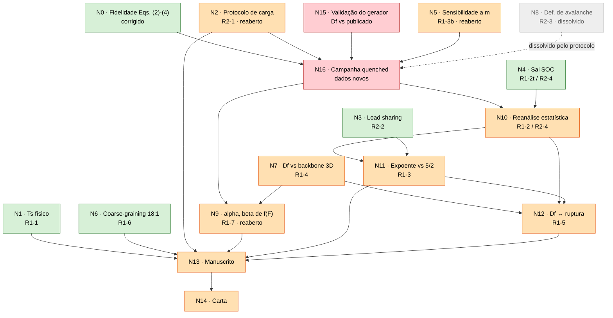

# DAG de dependências entre as críticas dos revisores — ER12738

**Manuscrito:** ER12738, *Scaling behaviors in simulated collagen fibrils*
**Spec de revisão:** [issue #1](https://github.com/michaelsouza/dla-collagen/issues/1)
**Artefatos governados:** `Paper/paper_PRE.tex`, `Carta_Resposta/Response_to_Referees.tex`
**Última atualização:** 2026-08-25 (consolidação, ver §13)

## 1. Objetivo

As onze críticas (R1-1…R1-7, R2-1…R2-4) não são independentes. Responder uma
delas fixa premissas usadas por outras. Este documento registra:

1. os **nós de decisão** (não as críticas: uma crítica pode conter mais de uma
   decisão, e uma decisão pode atender críticas dos dois revisores);
2. as **arestas de dependência**, cada uma com a justificativa de por que é um
   portão real — isto é, por que mudar o nó de origem *invalida* o nó de
   destino, e não apenas o reformula;
3. a **ordem topológica de trabalho**;
4. os **conflitos de artefato compartilhado** (trechos do `.tex` escritos por
   mais de um nó);
5. as **inconsistências já presentes** no material atual, que são exatamente a
   dívida gerada por ter respondido nós a jusante antes de fechar os nós a
   montante.

Convenção: uma aresta `A → B` significa "B não pode ser fechado antes de A, e
reabrir A obriga a reabrir B".

## 2. Nós de decisão

Estado em 2026-08-25. A adoção do protocolo fiber-bundle de desordem congelada
(§12) reabriu nós que estavam fechados e **dissolveu** outros: quando a
resposta deixa de ser um argumento e passa a ser uma propriedade estrutural do
modelo, o nó não é "fechado", é retirado da mesa.

| Nó | Decisão | Críticas | Issue | Estado |
|:--|:--|:--|:--|:--|
| **N0** | Fidelidade da implementação às Eqs. (2)–(4) | a montante de toda a mecânica | #3/#5 | código corrigido (`a834c53`); recomputação sob o protocolo novo |
| **N15** | Validação do gerador otimizado `fast_dla2` ($D_f$ contra o publicado, em escala de campanha) | — (infraestrutura) | #2 | **aberto — porta de entrada dos dados** |
| **N16** | Campanha de dados sob o protocolo quenched | — (infraestrutura) | #5 | bloqueado por N15 |
| **N1** | Interpretação física de $T_s$; remoção das extrapolações de doença | R1-1 | #9 | fechado (§9) |
| **N2** | Protocolo de carga | R2-1 | #3 | **reaberto** — protocolo substituído (§12); falta escrever o texto |
| **N3** | Leitura mecanicista: carga uniforme na seção + resistência local em $K$ | R2-2 | #6 | texto escrito, sobrevive ao novo protocolo |
| **N4** | Remoção da terminologia SOC | R1-2, R2-4 | — | fechado |
| **N5** | Escopo estatístico e sensibilidade ao módulo de Weibull $m$ | R1-3 | #5 | **reaberto** (§11) — mas agora barato de atender |
| **N6** | Limitações de coarse-graining (18:1) | R1-6 | #10 | fechado |
| **N7** | $D_f$ 2D contra descritores do backbone 3D | R1-4 | #7 | aberto — três pendências (I6, perímetro, $D_f$ do gerador novo) |
| **N8** | Definição operacional de avalanche | R2-3, R2-2 | #4 | **dissolvido** — a cascata determinística é a avalanche canônica |
| **N9** | $\alpha$ e $\beta$ da função fenomenológica $f(F)$, Eq. (5) | R1-7 | #10 | **reaberto** — $\varphi(F)$ é específica do protocolo |
| **N10** | Reanálise estatística da cauda | R1-2, R2-4 | #5 | aberto — aguarda N16 |
| **N11** | Interpretação do expoente frente a $5/2$ | R1-3 | #6 | aberto — aguarda N10 |
| **N12** | Estatuto da relação $D_f \leftrightarrow$ estatística de ruptura | R1-5 | #8 | aberto — aguarda N7 e N10 |
| **N13** | Revisão integral do manuscrito | todas | #11 | aberto |
| **N14** | Carta ponto a ponto verificada | todas | #12 | aberto |

**Por que N9 reabriu.** A curva $\varphi(F)$ ajustada pela Eq. (5) é produzida
pelo protocolo. Sob a dinâmica quenched a escala de força muda por uma ordem de
grandeza (piloto: $F_{rup}\simeq1150$ em $T_s=128$, contra $\simeq150$ no
protocolo recozido corrigido), então $\alpha$ e $\beta$ precisam ser
reajustados e a própria forma funcional pode não se sustentar.

**Por que N5 ficou mais fácil.** No protocolo quenched, $m$ é o módulo de
Weibull da distribuição de limiares — o parâmetro canônico de fiber-bundle.
Varrer $m$ deixa de ser um pedido incômodo e vira o eixo natural do modelo,
que é exatamente o que Parkinson1997 fez.

## 3. Grafo

## 4. Arestas e por que cada uma é um portão real

| Aresta | Justificativa |
|:--|:--|
| **N0 → N16** | O $\sigma$ corrigido muda força de ruptura (−13% a −28%) e número de avalanches (−19% a −32%). Gerar dados com a versão antiga produziria números que não correspondem às Eqs. (2)–(3). |
| **N15 → N16** | Se o gerador otimizado não reproduzir o $D_f$ publicado, as fibrilas da campanha não são as do artigo e toda a parte estrutural cai junto. É a porta de entrada. |
| **N2 → N16** | O protocolo define o que é gerado. A troca para dinâmica quenched é o que dá sentido à campanha. |
| **N5 → N16** | A varredura em $m$, se aceita, multiplica a campanha: $m$ passa a ser eixo de produção, não pós-processamento. Decidir depois obriga a re-rodar. |
| **N16 → N10** | A amostra estatística *é* a campanha. Nenhum resultado de N10 sobrevive a uma mudança nos dados. |
| **N16 → N9** | $\varphi(F)$ vem da campanha; $\alpha$ e $\beta$ são ajustes sobre ela. |
| **N7 → N9** | A leitura de $\alpha,\beta$ é escrita em termos de $\langle N\rangle$ e $\langle K\rangle$. Se N7 mudar sinal ou força dessas associações, a leitura cai junto. |
| **N4 → N10** | A retirada de SOC define o alvo estatístico: cauda com corte finito, não ausência de escala. |
| **N10 → N11** | O expoente comparado (ou não) a $5/2$ é o parâmetro estimado em N10. |
| **N3 → N11** | A recusa de atribuir classe de universalidade repousa na leitura mecanicista, não no valor numérico. As duas justificativas precisam concordar. |
| **N7 → N12** | O lado estrutural da associação de R1-5 é o resultado de N7. |
| **N10, N11 → N12** | O lado mecânico é o platô dos parâmetros de cauda. Sem platô, a afirmação de R1-5 perde o objeto. |
| **N2 → N13** | O texto do protocolo no manuscrito precisa descrever a dinâmica nova, incluindo Eq. (4) reinterpretada como distribuição de limiares. |
| **N13 → N14** | A carta cita trechos literais do manuscrito. É o último nó por construção. |

**Arestas extintas.** `N2 → N8`, `N3 → N8`, `N8 → N10` e a aresta editorial
`N10 ⇢ N9` (colisão do símbolo $\beta$) morreram com N8 e com o abandono da
família de corte esticado do protocolo antigo. A colisão de $\beta$ pode
ressurgir se a nova cauda também exigir um expoente de corte — verificar em
N10.

## 5. Ordem topológica de trabalho

1. **Fechado:** N0, N1, N4, N6; N3 no essencial.
2. **Agora, em paralelo:**
   - **N15** — validar $D_f$ do gerador otimizado contra os valores publicados
     ($D_f=1{,}708$ em $T_s=2$ até $1{,}963$ em $T_s=8192$);
   - **N7** — resolver I6 (qual tabela de Spearman é a corrente) e regenerar a
     Fig. 7;
   - **N5** — decidir a varredura em $m$ **antes** da campanha.
3. **N16** — campanha: geração (~1,5 h em 32 núcleos) e fratura quenched.
4. **N10** — reanálise estatística sobre os dados novos (substitui a Issue #5).
5. **N9, N11** — refit de $\varphi(F)$; interpretação do expoente.
6. **N12** — estatuto da associação.
7. **N2** — redigir o protocolo novo no manuscrito (pode começar antes; só o
   texto dos *números* espera).
8. **N13**, depois **N14**.

## 6. Conflitos de artefato compartilhado

Trechos escritos por mais de um nó. Editar por um nó sem checar o outro é a
principal fonte de retrabalho silencioso. Linhas conferidas em 2026-08-25;
reconferir após qualquer edição do manuscrito.

| Trecho | Nós que escrevem | Risco |
|:--|:--|:--|
| Parágrafo pós-Eq. (4) (`paper_PRE.tex:230`) | N2, N3 | A leitura de load sharing e a descrição da regra de falha estão no mesmo bloco; a Eq. (4) passa a ser distribuição de limiares |
| Parágrafo de definição de avalanche (`:312`) | N2, N10 | Definição da cascata e método de estimativa juntos |
| Eq. (6) e parágrafo seguinte | N10, N11 | Forma funcional da cauda e sua interpretação |
| Bloco de valores $\gamma$, $s_c$ (`:331` + legenda da Fig. 9 em `:341`) | N10, N11, N12 | Os mesmos números aparecem em três pontos do manuscrito e dois da carta |
| Eq. (5) e Fig. 8 | N2, N9 | $\varphi(F)$ e seus $\alpha,\beta$ dependem do protocolo |
| Símbolo $\beta$ | N9, N10 | Colisão latente entre Eq. (5) e um eventual expoente de corte |
| Resposta R1-2 da carta | N4, N2, N10 | Terminologia, protocolo e estatística no mesmo ponto |
| Conclusão do manuscrito | N1, N11, N12 | Escopo de $T_s$, do expoente e da associação |

## 7. Inconsistências: estado em 2026-08-25

| # | Inconsistência | Estado |
|:--|:--|:--|
| **I1** | Texto promete avalanche por passo de força; dados analisados são aglomerados conexos | **resolvida** — a cascata determinística do protocolo quenched é a avalanche, sem escolha a fazer |
| **I2** | Eq. (6) com corte simples vs. relatórios com corte esticado | **superada** — a família de cauda será reestimada em N10 sobre dados novos |
| **I3** | $\gamma=2{,}204$, $s_c=101{,}0$ não reproduzidos por nenhum relatório | **superada** — todos os números mecânicos serão substituídos |
| **I4** | Colisão do símbolo $\beta$ (Eq. 5 × corte esticado) | latente — só ressurge se a cauda nova exigir expoente de corte |
| **I5** | Corte esticado não é o modelo mínimo em $T_s=2,8,16,64$ | **superada** — pertence à análise antiga |
| **I6** | Spearman do manuscrito ($0{,}997$; $0{,}997$; $-0{,}778$; $-0{,}979$) divergem do CSV ($0{,}9879$; $1{,}0000$; $-0{,}7818$; $-0{,}9636$) | **aberta** — falta identificar a tabela corrente e regenerar a Fig. 7 |
| **I7** | `% TODO Issue #5` pendente na carta | **aberta** |

Note que I1–I3 e I5 não foram "corrigidas": foram **tornadas irrelevantes** pela
troca de protocolo. A dívida que restava de ter redigido N10/N11 antes de N8
desapareceu junto com N8. As duas que sobrevivem, I6 e I7, são independentes do
protocolo.

## 8. Protocolo para evitar retrabalho

1. **Fonte única de números.** Um só arquivo (`Reviews/numeros_finais.md`)
   contendo cada valor que aparece no manuscrito ou na carta, com o CSV de
   origem. Manuscrito e carta passam a citar essa tabela, nunca um relatório
   diretamente.
2. **Nada a jusante em forma final.** N9, N11 e N12 permanecem em rascunho
   marcado até a campanha (N16) e N10 fecharem.
3. **Toda mudança em um nó dispara a revisão dos seus descendentes.** Ao
   reabrir um nó, listar os descendentes pela §3 e registrar na issue
   correspondente.
4. **Um bloco `.tex`, um nó dono.** Nos trechos da §6, registrar em comentário
   LaTeX qual nó é o dono, para que a próxima edição saiba o que checar.
5. **Carta por último, sempre.** N14 é regenerado a partir do manuscrito
   final, não editado em paralelo.

## 9. Revisão de N1 (2026-08-24)

Auditoria de N1 contra as fontes em `Bibliograph/`. Edições cirúrgicas em
`Paper/paper_PRE.tex` e `Carta_Resposta/Response_to_Referees.tex`; ambos
compilam sem citações indefinidas.

### Princípio adotado

**Corrigir no manuscrito, não narrar na carta.** O revisor não levantou os erros
de citação. Como o texto revisado vai marcado em `\rev`, a correção já é
visível por construção; anunciá-la na carta apenas convidaria R1 — que já
auditou Zapperi/SOC — a reauditar as demais referências. Só se declara erro
próprio quando ele sustentava uma afirmação de que o revisor depende, o que não
é o caso em R1-1.

### Correções de citação (silenciosas)

1. *"driven by electrostatic forces"* citando `Parkinson1995` e `Kadler1987`.
   Ambas dizem o contrário: montagem entrópica por liberação de água ligada
   (está no título de `Kadler1987`). Corrigido para entrópica na origem,
   modulada eletrostaticamente, com `Jiang2004` e `Morozova2018`.
   Nota: a frase **não** estava marcada em `\rev` no commit `5d2d272`, logo é
   texto original — o revisor a leu e não a comentou.
2. Atribuição de $T_s$: a fonte primária é `Garci1991` (García-Ruiz e Otálora),
   que introduz o tempo de difusão $T_s$; `Parkinson1995` o aplica ao colágeno e
   credita `Garci1991`. Acrescentado ao "Following..." — `Garci1991` já era
   citado no mesmo parágrafo, então o reforço é natural.

### Qualificação física de $T_s$ (três frases, seção do modelo)

- $T_s$ = tentativas de difusão lateral por evento de deposição ⇒ razão entre
  os tempos de deposição e de salto superficial.
- Limite sequencial justificado pela estimativa de `Parkinson1995` (Appendix):
  na concentração crítica ~0,5 µg/ml, ~10 moléculas por segundo perto o
  bastante para colidir — número da própria fonte, não nosso.
- Direção do mapeamento, antes ausente, como consequência definicional:
  incorporação mais rápida frente à mobilidade ⇒ $T_s$ efetivo menor.

### Limitação restaurada

O commit `779ee04` apagara a ressalva de regulação celular *in vivo*, sem o
revisor pedir. Restaurada em forma curta com `Kadler1996`, `Canty2005`,
`Kadler2008`.

### Descartado deliberadamente (fragilidades autoinfligidas)

- **Critério $L_s$ vs. perímetro.** Garci1991 ($L_f>2L_s$) e Parkinson1995
  (saturação quando se explora a circunferência) explicariam nosso platô, mas
  não o testamos, e Parkinson satura em $T_s\approx100$ enquanto nós saturamos
  em $T_s\geq512$. Invocá-lo criaria a pergunta "por que 512?" sem resposta.
  Reconsiderar **apenas** se a medição do perímetro por $T_s$ for feita (N7).
- **"3,6 décadas da razão".** `Parkinson1995` define trial como direção
  sorteada *mesmo se rejeitada*, logo os saltos efetivos não são lineares em
  $T_s$ e a contagem de décadas não é de uma razão física.
- **Exemplo 32 °C/37 °C de `Yang2009`.** Mede diâmetro de fibrila e
  arquitetura de rede, não empacotamento intrafibrilar, que é o que $D_f$ mede.
  A direção foi mantida apenas como consequência definicional do modelo.

### Pendência

Medir perímetro/raio da seção transversal por $T_s$ e testar o critério
$L_s\sim P$. Exige as fibrilas brutas, ausentes nesta máquina (`Data_fibrils`
só contém `Avalanche_force_grouped`). Pertence ao pipeline de N7.

## 10. N0 — correção da atualização de $\sigma$ (2026-08-24)

### O defeito

`Rod.prob_break` usava o sinalizador `updated` como porta de correção. Ele só
era limpo quando a **vizinhança da própria haste** mudava
(`Particle.innactive` → `Rod.del_neigh_pid`). Mas uma haste perde área de seção
transversal quando **qualquer** molécula que compartilha uma de suas camadas é
removida, vizinha ou não. Nesses casos `update_force` apenas reescalava o
$\sigma_M$ antigo por $F/F_{old}$.

Consequência: $\sigma_M$ ficava **sistematicamente abaixo** do exato $F/N(i)$,
em 99% das hastes, crescendo com o dano acumulado ($T_s=128$):

| $F$ | desvio médio | p05 | fração subestimada |
|---:|---:|---:|---:|
| 20 | −0,01% | −0,0% | 84% |
| 100 | −2,60% | −10,6% | 99% |
| 160 | −9,02% | −25,5% | 99% |

Com $m=2$, isso subestima $P_R$ em ~17% em carga alta.

### Por que é um defeito, e não uma escolha de modelagem

Parkinson et al. 1997, o protocolo de referência que o artigo cita, é explícito
(`Bibliograph/Parkinson1997.md:84`): *"After the rods had been assessed and the
appropriate particles removed, the skeleton was reassessed and **the stress
re-evaluated**."* Sem elasticidade, essa reavaliação **é** o passo de relaxação
da linhagem de fratura desordenada que ele invoca
(`Parkinson1997.md:41`). O cache omitia parte dele.

### Impacto medido (código antigo vs. recomputação exata, pareado)

| $T_s$ | $F_{rup}$ | nº avalanches | média | p99 | máx |
|---:|---:|---:|---:|---:|---:|
| 2 | −27,8% | −32,1% | −7,5% | +11,8% | −21,3% |
| 128 | −14,9% | −20,8% | −15,3% | −33,3% | −61,3% |
| 8192 | −13,5% | −19,3% | +3,1% | −9,0% | −14,3% |

Robusto: força de ruptura e número de avalanches caem em todos os regimes.
Não robusto: o efeito sobre a distribuição de tamanhos varia em sinal e
magnitude; 1 fibrila e 10–12 realizações não bastam para caracterizá-lo.
A ordenação em $T_s$ sobrevive nas duas versões.

### A correção

`Code/Fracture_fibril/stress_strain_ava.py`:

1. `prob_break` sempre recalcula $\sigma$ (o sinalizador `updated` deixa de ser
   porta de correção);
2. `update_sigma` calcula $\sigma_M = F\langle 1/N(i)\rangle$ diretamente —
   isso também conserta um caso de borda em que $K=0$ fazia `update_force`
   retornar antes de aplicar o reescalonamento por $F$;
3. `layer_ids()` memoiza a lista de camadas da haste, que é constante enquanto
   a haste está ativa.

### Verificação

- Auditoria de $\sigma$ reexecutada: desvio cai de $\sim10^{-2}$ para
  $\sim10^{-16}$ em todas as forças.
- Dois testes de regressão novos em `test_stress_strain_ava.py`;
  confirmado que **falham** em `HEAD` (código antigo dá $\sigma=2{,}5$ onde o
  exato é $3{,}33$). Suíte: 4/4.
- O código corrigido reproduz **dígito a dígito** a referência independente
  calculada antes com o código antigo + recomputação forçada
  ($F_{rup}=149{,}20833\ldots$, 1455 avalanches, média $4{,}410309\ldots$).
- Sem custo de desempenho: 138,4 s contra 138,6 s do código antigo, porque a
  memoização compensa o recálculo. A variante ingênua levava 204 s.

### Pendências

- Recomputar toda a mecânica: Figs. 8, 9, 10, $\alpha$, $\beta$, e a Issue #5
  inteira. Estimativa: 10 $T_s$ × 50 fibrilas × 1000 realizações ≈ 500 mil
  realizações × ~7 s ≈ 40 CPU-dias.
- Antes disso, medir o efeito sobre $\gamma$ e $s_c$ especificamente: se a
  cauda for insensível, a Issue #5 sobrevive e só as Figs. 8 e 10 mudam.
- As medições de N2 (sensibilidade a $\Delta F$ e ao critério de parada) foram
  feitas com o código antigo e precisam ser refeitas.

## 11. Revisão de N5 (2026-08-24)

Parkinson1997 **varreu** o módulo de Weibull (`Parkinson1997.md:80`):
*"since no such experiments have been undertaken on collagen fibrils, it is
necessary to investigate a range of different values for $m$ in order to assess
its impact"*, com cinco valores nas Figs. 6 e 7, e extrai física disso
(`:137`): a resistência cai muito mais rápido que
$\langle\sigma\rangle=n\sigma_c(m+1)/(m+2)$ prevê, logo *"there must be huge
collective effects determined by the architecture of the fibril"*.

Nossa carta recusa a sensibilidade a $m$ pedida em R1-3 **citando Parkinson1997
como justificativa para $m=2$**. A fonte diz o oposto. Um revisor que abrir a
referência vê isso. N5 precisa ser reaberto.

Nota adicional: Parkinson reporta $F_c$ **normalizado** pelo valor em
$T_s=10.000$ (Fig. 7), e fala em *"relative tensile strength"* no resumo. Isso
dá precedente à defesa comparativa que propomos em R2-1.

## 12. Decisão de protocolo e otimização do gerador (2026-08-24)

### Decisão: adoção do protocolo fiber-bundle de desordem congelada

A varredura em $\Delta F$ com o código corrigido provou que a regra recozida
não tem limite quase-estático: $F_{rup}$ é essencialmente linear em
$\log\Delta F$ (92,6 → 188,0 para $\Delta F$ de 0,0625 a 2,0), sem platô em
cinco oitavas; o dano total por realização é conservado (~506–574), e o p99
das avalanches vai de 8 a 89 — a cauda era fixada pelo protocolo, não pela
fibrila. Decisão do autor: adotar o protocolo padrão de fiber-bundle.

**Implementação:** `Code/Fracture_fibril/fiber_bundle_ava.py`.

- Desordem congelada com correspondência exata à Eq. (4): $X_i$ com CDF
  $P(X\le x)=x^m$ em $[0,1]$, limiar $\sigma^{th}_i=K_i(t)\sigma_c X_i$
  ⇒ $P(\sigma^{th}\le\sigma)=(\sigma/(K\sigma_c))^m$ truncado em 1 — a mesma
  expressão, reinterpretada como distribuição de resistência. O canal de
  enfraquecimento por coordenação ($K_i$ corrente) é preservado.
- Carregamento quase-estático extremal: $F$ sobe até o menor
  $F^*_i=K_i\sigma_c X_i/a_i$ (com $a_i=\langle 1/N\rangle$ das seções da
  haste); cascata determinística a $F$ fixo; avalanche = total removido na
  cascata (limiar + estrutural) — exatamente a definição do Revisor 2.
- **Sem $\Delta F$, sem varredura, sem critério de parada** — R2-1 dissolve-se
  estruturalmente; R2-3 vira canônica; a comparação com 5/2 (R1-3) passa a
  ser legítima por protocolo.

**Validações:**
- Motor de cascata contra a distribuição exata de Hemmer & Hansen (ELS,
  limiares uniformes): desvio <2% até $s=8$ na rodada 150×4000.
- Testes unitários: fórmula de $F^*$ conferida à mão, monotonicidade das
  forças, esvaziamento, contagem. Suíte conjunta: 8/8.
- Piloto (1 fibrila/Ts, 15 realizações): ordenação de $F_{rup}$ e a tendência
  das avalanches com $T_s$ preservadas em relação ao protocolo antigo;
  0,2–4,3 s por realização.

### Otimização do gerador DLA

`Code/Dla/fast_dla2.cpp`, mesma CLI e formato de saída.

- **Modo padrão bit-idêntico** ao original (store de colunas $(x,z)\to$ lista
  ordenada em $y$ no lugar da k-d tree, mesma ordem de consumo de `rand()`).
  Verificado: saídas idênticas byte a byte em ts∈{2,100} nb=300 e em
  ts∈{2,64} nb=1200 — cobrindo os dois regimes de custo (volume dominante em
  $T_s$ baixo, superfície dominante em $T_s$ alto).
- **Aceleradores** (`-rng fast -jumps 1 -coverstop 1`), estatisticamente
  equivalentes:
  - `-jumps`: saltos longos gaussianos com a covariância exata por passo
    diag(0,6; 0,2; 0,6) e comprimento $n=\text{gap}-1$ limitado pelo suporte
    ($|\delta|\le n$), de modo que o caminhante provadamente não toca o
    agregado no meio do salto;
  - `-coverstop`: encerra a difusão superficial quando o componente acessível
    de posições ligadas foi todo visitado (lei de colocação exatamente igual);
  - `-rng fast`: xoshiro256++; corrige também o bug `irand(0, 2*PI)` que
    truncava o ângulo de lançamento a $[0,6)$.
- **Medições:** nb=1200: 540 s → 3,2 s (ts=2, 171×) e 300 s → 2,7 s (ts=64,
  111×). Produção nb=30000: 279 s (ts=2) e 381 s (ts=8192) por fibrila —
  campanha de 500 fibrilas ≈ 1,5 h em 32 núcleos.
- **Validação estatística preliminar:** 1 fibrila v2-opt vs ensemble de
  produção (n=8) em nº de moléculas na janela, $\langle N\rangle$ e raio rms:
  todos $|z|\le1{,}45$, em ts=2 e ts=8192. Validação de $D_f$ em escala de
  campanha pendente.

### Consequências na DAG

- N2, N8, N10, N11, N12 passam a depender da **recomputação sob o protocolo
  quenched** (não mais da reanálise do recozido). A Issue #5 será refeita
  sobre os novos dados.
- As respostas de R2-1/R2-3 mudam de defensivas para estruturais.
- Pendências: campanha de geração + fratura quenched; validação de $D_f$ do
  gerador otimizado em escala; texto novo das Eqs. (4)–(5) no manuscrito.

## 13. Consolidação (2026-08-25)

As §9–§12 vinham sendo acrescentadas sem atualizar o cabeçalho, e o documento
passou a se contradizer: a §2 dava N5 como "decisão de escopo tomada" enquanto
a §11 pedia sua reabertura, e descrevia N2 pelo protocolo de varredura com
$\Delta F=0{,}5$ que a §12 havia substituído. Um documento de dependências que
contradiz os próprios apêndices é pior que nenhum.

Reescritos: §2 (tabela de nós), §3 (grafo), §4 (arestas), §5 (ordem
topológica) e §7 (inconsistências). As §9–§12 ficam como registro datado das
decisões e não foram alteradas, exceto pela correção de uma linha da §12 que
dava uma verificação como pendente depois de ela ter concluído.

### Mudanças de estado

| Nó | Antes | Agora | Motivo |
|:--|:--|:--|:--|
| N2 | fechado | **reaberto** | protocolo substituído; falta o texto |
| N5 | escopo decidido | **reaberto** | Parkinson1997 varre $m$ (§11) |
| N8 | divergente/bloqueante | **dissolvido** | cascata determinística é a avalanche |
| N9 | fechado | **reaberto** | $\varphi(F)$ muda de escala com o protocolo |
| N15, N16 | — | **novos** | validação do gerador e campanha viraram portões reais |

### O que a consolidação revelou

Dois achados que só aparecem ao reconciliar cabeçalho e apêndices:

1. **N9 estava fechado indevidamente.** Ninguém havia notado que a troca de
   protocolo invalida $\alpha$ e $\beta$. O piloto mostra $F_{rup}$ uma ordem
   de grandeza maior, então o eixo de força da Fig. 8 muda inteiramente.
2. **N5 precisa ser decidido antes da campanha, não depois.** Se a varredura em
   $m$ for aceita, $m$ vira eixo de produção e multiplica o custo da campanha.
   Decidir depois obriga a re-rodar tudo. Por isso N5 → N16 é aresta, e por
   isso N5 aparece na onda 2 da §5, e não mais adiante.

## 14. Fase A concluída — a grade de $T_s$ não pode ser reduzida (2026-08-25)

Detalhes e dados em `Reviews/PhaseA_ts_saturation/`.

**Pergunta:** se a difusão superficial cobre todo o componente acessível, mais
$T_s$ não muda nada, e com `-coverstop` o gerador para de consumir
aleatoriedade — então duas condições acima da cobertura dariam fibrilas
bit-idênticas, permitindo eliminá-las da campanha.

**Resposta: não.** Em `nb=30000`, a cobertura vai de 0% ($T_s=2$) a 82,9%
($T_s=8192$), sem atingir 100% em nenhuma condição. Com 17% das moléculas ainda
esgotando o orçamento no topo da grade, nenhum par de condições é idêntico.
**A grade permanece com as 10 condições publicadas.**

Três achados colaterais:

1. **A cobertura depende do tamanho.** Em `nb=2000` a cobertura em $T_s=8192$ é
   99,8%; em `nb=30000` cai para 82,9% — o componente cresce com o perímetro e
   o tempo de cobertura de um passeio aleatório vai com $O(n^2)$. Qualquer
   argumento de saturação por cobertura é dependente do tamanho.
2. **A cobertura não explica o platô onde o artigo o situa.** Em $T_s=512$ só
   9,8% das moléculas cobriram.
3. **Os $D_f$ publicados dependem de uma janela de ajuste por condição.**
   Tentei medir $D_f$ com janela comum para testar a saturação; validado contra
   as fibrilas publicadas, o cálculo falhou (1,83/1,93/1,93 contra
   1,708/1,790/1,965). A causa é geométrica: o raio da fibrila cai de ~33 para
   ~14 ao longo da grade, então nenhuma janela fixa serve às duas pontas. É por
   isso que `validate_fractal_proxy.py` lê a janela de um projeto xmgrace por
   $T_s$. **A afirmação de saturação de $D_f$ não pode ser separada dessa
   escolha de janela sem reanálise** — pendência de N7, não da Fase A.

### Correção de registro

Uma leitura preliminar em `nb=2000` sugeria cobertura de 99,8% em $T_s=8192$ e
foi comunicada como confirmação da hipótese de saturação. A medição em escala de
produção reduz isso a 82,9% e a conclusão não se sustenta na forma forte. O que
sobrevive é o mecanismo qualitativo (cobertura cresce com $T_s$ e satura o
efeito da difusão) e a constatação de que ele é dependente do tamanho.

### Estado dos itens do plano

| Item | Estado |
|:--|:--|
| A1 — teste de identidade por cobertura | executado; **não dispara** — grade mantida |
| A2 — estatística de cobertura | executado; tabela arquivada |
| C1 — escritor no esquema legado | **concluído** (`31e8dfe`), parser aceita |
| N7 — janela de ajuste de $D_f$ | **nova pendência** identificada aqui |
