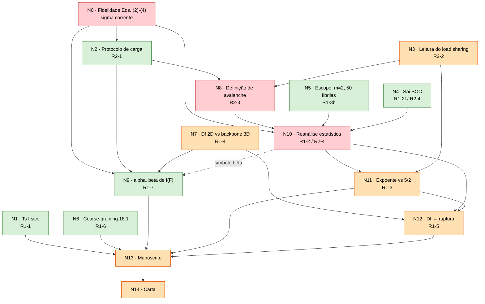

# DAG de dependências entre as críticas dos revisores — ER12738

**Manuscrito:** ER12738, *Scaling behaviors in simulated collagen fibrils*
**Spec de revisão:** [issue #1](https://github.com/michaelsouza/dla-collagen/issues/1)
**Artefatos governados:** `Paper/paper_PRE.tex`, `Carta_Resposta/Response_to_Referees.tex`
**Última atualização:** 2026-08-24

## 1. Objetivo

As onze críticas (R1-1…R1-7, R2-1…R2-4) não são independentes. Responder uma
delas fixa premissas usadas por outras. Este documento registra:

1. os **nós de decisão** (não as críticas: uma crítica pode conter mais de uma
   decisão, e uma decisão pode atender críticas dos dois revisores);
2. as **arestas de dependência**, cada uma com a justificativa de por que é um
   portão real — isto é, por que mudar o nó de origem *invalida* o nó de
   destino, e não apenas o reformula;
3. a **ordem topológica de trabalho**;
4. os **conflitos de artefato compartilhado** (trechos do `.tex` escritos por
   mais de um nó);
5. as **inconsistências já presentes** no material atual, que são exatamente a
   dívida gerada por ter respondido nós a jusante antes de fechar os nós a
   montante.

Convenção: uma aresta `A → B` significa "B não pode ser fechado antes de A, e
reabrir A obriga a reabrir B".

## 2. Nós de decisão

| Nó | Decisão | Críticas atendidas | Issue | Estado |
|:--|:--|:--|:--|:--|
| **N0** | Fidelidade da implementação às Eqs. (2)–(4): $\sigma_M$ deve seguir as ocupações correntes das seções | R2-1 (mecanismo), e a montante de toda a mecânica | #3/#5 | **código corrigido 2026-08-24; recomputação pendente** |
| **N1** | Interpretação física de $T_s$ como parâmetro cinético efetivo, sem calibração experimental; remoção das extrapolações evolutivas e de doença | R1-1 | #9 | revisado 2026-08-24 (ver §9) |
| **N2** | Protocolo de carga: varredura de dano, critério de parada por varredura sem remoção, $\Delta F=0{,}5$; $P_R$ é probabilidade por avaliação, não taxa temporal | R2-1 | #3 | fechado |
| **N3** | Leitura mecanicista das Eqs. (2)–(4): carga uniforme dentro da seção + resistência local dependente de $K$; o modelo não é LLS nem ELS convencional | R2-2 | #6 | texto escrito, issue aberta |
| **N4** | Remoção da terminologia SOC e adoção de "avalanches em fratura desordenada dirigida" | R1-2 (parte terminológica), R2-4 | — | fechado |
| **N5** | Escopo estatístico: $m=2$ fixo, 50 geometrias por $T_s$, 1000 realizações por geometria; recusa explícita de varredura em $m$ | R1-3 (sensibilidade a $m$) | #5 | decisão de escopo tomada |
| **N6** | Limitações de coarse-graining: razão de aspecto 18:1, ausência de difusão rotacional e de deformação elástica | R1-6 | #10 | fechado |
| **N7** | Validação do $D_f$ 2D contra quatro descritores do backbone 3D, via correlação de Spearman | R1-4 | #7 | quase fechado |
| **N8** | Definição operacional de avalanche (por passo de força × por aglomerado conexo) | R2-3, R2-2 | #4 | **decisão registrada diverge dos dados analisados** |
| **N9** | Interpretação de $\alpha$ e $\beta$ na função fenomenológica $f(F)$, Eq. (5) | R1-7 | #10 | fechado |
| **N10** | Reanálise estatística: família da cauda, seleção de $s_{\min}$, estimativas, incertezas e testes de ajuste | R1-2, R2-4 | #5 | **aberto — portão principal** |
| **N11** | Interpretação do expoente frente ao valor ELS $5/2$ e recusa de atribuição de classe de universalidade | R1-3 | #6 | aberto |
| **N12** | Estatuto da relação $D_f \leftrightarrow$ estatística de ruptura: associação empírica, sem causalidade | R1-5 | #8 | aberto |
| **N13** | Revisão integral e consistente do manuscrito | todas | #11 | aberto |
| **N14** | Carta ponto a ponto verificada contra o manuscrito | todas | #12 | aberto |

## 3. Grafo

## 4. Arestas e por que cada uma é um portão real

| Aresta | Justificativa |
|:--|:--|
| **N2 → N8** | A avalanche "por passo de força" só existe porque o protocolo define um passo de força terminado pela primeira varredura sem remoção. Alterar o critério de parada redefine as fronteiras dos eventos e reamostra toda a distribuição. |
| **N3 → N8** | O argumento de R2-3 é condicional: *"como a carga é global na seção, não há concentração de tensão em torno das falhas, logo aglomerados conexos não se justificam"*. Se N3 concluísse que existe algum mecanismo de localização, a definição por aglomerado voltaria a ser defensável. |
| **N2 → N9** | A curva $\varphi(F)$ ajustada pela Eq. (5) é produzida pelo protocolo de carga. Mudar o critério de parada muda $\varphi$ em cada $F$ e, portanto, $\alpha$ e $\beta$. |
| **N7 → N9** | A interpretação de $\alpha$ e $\beta$ na carta e no manuscrito é escrita em termos de $\langle N\rangle$ e $\langle K\rangle$ ("áreas maiores diluem tensões, logo $\alpha$ cai"). Se N7 mudasse o sinal ou a força dessas associações, a leitura de $\alpha$ e $\beta$ cairia junto. |
| **N8 → N10** | Portão mais forte do grafo. A amostra estatística *é* a definição de avalanche. Trocar entre aglomerado conexo e passo de força muda o número de eventos, a escala típica, $s_{\min}$, o expoente e a família de cauda selecionada. Nenhum resultado de N10 sobrevive a uma mudança em N8. |
| **N5 → N10** | Tamanho de ensemble e $m$ fixam a variância e o alcance da cauda; a recusa de varredura em $m$ é o que permite reportar um único conjunto de parâmetros por $T_s$. |
| **N4 → N10** | A retirada de SOC define o que N10 precisa demonstrar: uma cauda com corte finito, e não ausência de escala característica. Se SOC voltasse à mesa, o alvo estatístico seria outro. |
| **N10 → N11** | O expoente comparado (ou não) a $5/2$ é o parâmetro estimado em N10, e o argumento central da resposta a R1-3 é que ele é parâmetro de uma família com corte, não expoente assintótico puro. Depende da família escolhida em N10. |
| **N3 → N11** | A recusa de atribuir classe de universalidade repousa na leitura mecanicista de N3, não no valor numérico. As duas justificativas precisam concordar. |
| **N7 → N12** | O lado estrutural da associação de R1-5 é exatamente o resultado de N7. |
| **N10, N11 → N12** | O lado mecânico da associação é o platô dos parâmetros de cauda. Se N10 não produzir platô para $T_s\geq512$, a afirmação central de R1-5 ("$D_f$ e a estatística saturam juntas") perde o objeto. |
| **N10 ⇢ N9** (aresta fraca, editorial) | Se N10 adotar o corte esticado $\exp[-(s/s_c)^\beta]$, o símbolo $\beta$ colide com o $\beta$ da Eq. (5) (N9). Um dos dois precisa ser renomeado, e a renomeação atravessa manuscrito, legendas e carta. |
| **N13 → N14** | A carta cita trechos literais do manuscrito. A carta é o último nó por construção. |

**Nós-raiz seguros para trabalhar em paralelo agora:** N1, N6 (fechados), e o
lado puramente estrutural de N7. Nada em N10/N11/N12 deve ser redigido em
forma final antes de N8 e N10 estarem fechados.

## 5. Ordem topológica de trabalho

1. **Onda A (fechada):** N1, N2, N4, N5, N6.
2. **Onda B:** N3, N7 — fechar N7 exige a fibrila faltante em $T_s=16$ e a
   regeneração da Fig. 7.
3. **Onda C:** N8 — decidir formalmente qual definição de avalanche é a
   primária e **regerar os dados sob essa definição**.
4. **Onda D:** N10 — refazer/consolidar a estatística sobre a amostra de N8.
5. **Onda E:** N9 (revisão de símbolo), N11.
6. **Onda F:** N12.
7. **Onda G:** N13, depois N14.

## 6. Conflitos de artefato compartilhado

Trechos escritos por mais de um nó. Editar por um nó sem checar o outro é a
principal fonte de retrabalho silencioso.

| Trecho | Nós que escrevem | Risco |
|:--|:--|:--|
| Parágrafo pós-Eq. (4) do manuscrito (linha 228) | N3, N8 | A leitura de load sharing e a justificativa da definição de avalanche estão no mesmo bloco |
| Parágrafo de definição de avalanche (linha 310) | N8, N10 | Definição e método de estimativa juntos |
| Eq. (6) e parágrafo seguinte | N10, N11 | Forma funcional e sua interpretação |
| Símbolo $\beta$ | N9, N10 | Colisão de notação entre Eq. (5) e o corte esticado |
| Bloco de valores $\gamma$, $s_c$ (linhas ~325–335 + legenda da Fig. 9) | N10, N11, N12 | Os mesmos números aparecem em três lugares no manuscrito e em dois na carta |
| Resposta R1-2 da carta | N4, N8, N10 | Terminologia, definição e estatística no mesmo ponto |
| Conclusão do manuscrito | N1, N11, N12 | Escopo de $T_s$, escopo do expoente e escopo da associação |

## 7. Inconsistências já presentes (dívida da ordem invertida)

Estas divergências existem hoje entre `Paper/paper_PRE.tex`,
`Carta_Resposta/Response_to_Referees.tex` e os relatórios em `Reviews/`.
Todas decorrem de N10/N11 terem sido redigidos antes de N8 estar realmente
fechado.

### I1 — A definição de avalanche do texto não é a dos dados analisados

- Manuscrito (`Paper/paper_PRE.tex:310`) e carta (R1-2, R2-3): avalanche é
  *tudo o que é removido em um passo de força*, independentemente de
  conectividade espacial.
- Todos os relatórios de N10 (`Report_all_Ts_Clauset.md:53`,
  `Report_stretched_cutoff_all_Ts.md`,
  `Report_stretched_cutoff_individual_all_Ts_concise.md`,
  `xmgrace_export/README.md`) ajustam **avalanches locais**, isto é,
  componentes espacialmente conexos.
- Todo o código de suporte é local: `local_avalanche_counts.py`,
  `prepare_local_avalanche_sizes.py`, `compare_local_discrete_models.py`,
  `fit_local_power_law.py`.

**Consequência:** a carta afirma ao Revisor 2 que a definição sugerida por ele
foi adotada, mas os números apresentados ao Revisor 1 vêm da definição que ele
questionou. Este é o item bloqueante.

### I2 — Família de cauda divergente

- Manuscrito Eq. (6) e carta R1-2: corte exponencial simples,
  $P(s)\propto s^{-\gamma}\exp(-s/s_c)$.
- Relatórios atuais: corte **esticado**,
  $p(s)\propto s^{-\alpha}\exp[-(s/s_c)^{\beta}]$, com $\beta$ estimado e
  claramente distinto de 1 em várias condições ($\beta\simeq2{,}4$–$4{,}0$
  para $T_s\geq512$).

### I3 — Números desatualizados

| Grandeza | No manuscrito e na carta | Nos relatórios atuais |
|:--|:--|:--|
| Expoente, $T_s\geq512$ | $\gamma=2{,}204\pm0{,}034$ | $\alpha=2{,}484$–$2{,}674$ |
| Corte, $T_s\geq512$ | $s_c=101{,}0\pm5{,}6$ | $s_c=211$–$273$ |
| $\gamma$ em $T_s=2$ | $1{,}019\pm0{,}010$ | $\alpha=1{,}815$ |
| $\gamma$ em $T_s=8192$ | $2{,}253\pm0{,}009$ | $\alpha=2{,}484$ |
| $s_{\min}$, regime compacto | $18\leq s_{\min}\leq21$ | $8$, $13$, $18$, $21$ |

Nenhum relatório em `Reviews/` reproduz o par $(2{,}204;\,101{,}0)$.

### I4 — Colisão do símbolo $\beta$

O $\beta$ do corte esticado colide com o $\beta$ da Eq. (5). Se N10 adotar o
corte esticado, é preciso renomear um dos dois em manuscrito, figuras e carta.

### I5 — A parcimônia não é uniforme entre condições

`Report_stretched_cutoff_individual_all_Ts_concise.md` §5: o corte esticado é
a única família não rejeitada em todas as condições, mas **não é o modelo
mínimo** em $T_s=2$, $8$, $16$ e $64$ (corte simples, lognormal ou até
potência pura bastam). A afirmação atual da carta em R1-2 — "a cauda é
descrita por uma potência com corte exponencial" — precisa dessa qualificação,
sob pena de o revisor apontar que a potência pura não foi rejeitada em
$T_s=8$. O próprio relatório já registra a defesa correta: em $T_s=8$ a cauda
cobre 0,86 década e 0,071% dos eventos.

### I6 — Coeficientes de Spearman divergentes (N7)

| Descritor | Manuscrito e carta | `Issue7_fractal_proxy/proxy_correlations.csv` |
|:--|:--|:--|
| $\langle N\rangle$ | $0{,}997$ | $0{,}9879$ |
| $\langle K\rangle$ | $0{,}997$ | $1{,}0000$ |
| $\mathrm{CV}(N)$ | $-0{,}778$ | $-0{,}7818$ |
| $\langle\sigma_M\rangle_{F=1}$ | $-0{,}979$ | $-0{,}9636$ |

Segundo `HANDOFF.md`, os valores do CSV são anteriores à inclusão da fibrila
faltante em $T_s=16$. Falta identificar qual das duas tabelas é a corrente e
regenerar a Fig. 7 a partir dela.

### I7 — Marcador pendente na carta

`Carta_Resposta/Response_to_Referees.tex` ainda contém o comentário
`% TODO Issue #5: insert the finalized same-support likelihood comparison and
block-bootstrap confidence intervals.`

## 8. Protocolo para evitar retrabalho

1. **Fonte única de números.** Um só arquivo (`Reviews/numeros_finais.md`)
   contendo cada valor que aparece no manuscrito ou na carta, com o CSV de
   origem. Manuscrito e carta passam a citar essa tabela, nunca um relatório
   diretamente.
2. **Nada a jusante em forma final.** N11 e N12 permanecem em rascunho
   marcado até N10 fechar.
3. **Toda mudança em um nó dispara a revisão dos seus descendentes.** Ao
   reabrir um nó, listar os descendentes pela §3 e registrar na issue
   correspondente.
4. **Um bloco `.tex`, um nó dono.** Nos trechos da §6, registrar em comentário
   LaTeX qual nó é o dono, para que a próxima edição saiba o que checar.
5. **Carta por último, sempre.** N14 é regenerado a partir do manuscrito
   final, não editado em paralelo.

## 9. Revisão de N1 (2026-08-24)

Auditoria de N1 contra as fontes em `Bibliograph/`. Edições cirúrgicas em
`Paper/paper_PRE.tex` e `Carta_Resposta/Response_to_Referees.tex`; ambos
compilam sem citações indefinidas.

### Princípio adotado

**Corrigir no manuscrito, não narrar na carta.** O revisor não levantou os erros
de citação. Como o texto revisado vai marcado em `\rev`, a correção já é
visível por construção; anunciá-la na carta apenas convidaria R1 — que já
auditou Zapperi/SOC — a reauditar as demais referências. Só se declara erro
próprio quando ele sustentava uma afirmação de que o revisor depende, o que não
é o caso em R1-1.

### Correções de citação (silenciosas)

1. *"driven by electrostatic forces"* citando `Parkinson1995` e `Kadler1987`.
   Ambas dizem o contrário: montagem entrópica por liberação de água ligada
   (está no título de `Kadler1987`). Corrigido para entrópica na origem,
   modulada eletrostaticamente, com `Jiang2004` e `Morozova2018`.
   Nota: a frase **não** estava marcada em `\rev` no commit `5d2d272`, logo é
   texto original — o revisor a leu e não a comentou.
2. Atribuição de $T_s$: a fonte primária é `Garci1991` (García-Ruiz e Otálora),
   que introduz o tempo de difusão $T_s$; `Parkinson1995` o aplica ao colágeno e
   credita `Garci1991`. Acrescentado ao "Following..." — `Garci1991` já era
   citado no mesmo parágrafo, então o reforço é natural.

### Qualificação física de $T_s$ (três frases, seção do modelo)

- $T_s$ = tentativas de difusão lateral por evento de deposição ⇒ razão entre
  os tempos de deposição e de salto superficial.
- Limite sequencial justificado pela estimativa de `Parkinson1995` (Appendix):
  na concentração crítica ~0,5 µg/ml, ~10 moléculas por segundo perto o
  bastante para colidir — número da própria fonte, não nosso.
- Direção do mapeamento, antes ausente, como consequência definicional:
  incorporação mais rápida frente à mobilidade ⇒ $T_s$ efetivo menor.

### Limitação restaurada

O commit `779ee04` apagara a ressalva de regulação celular *in vivo*, sem o
revisor pedir. Restaurada em forma curta com `Kadler1996`, `Canty2005`,
`Kadler2008`.

### Descartado deliberadamente (fragilidades autoinfligidas)

- **Critério $L_s$ vs. perímetro.** Garci1991 ($L_f>2L_s$) e Parkinson1995
  (saturação quando se explora a circunferência) explicariam nosso platô, mas
  não o testamos, e Parkinson satura em $T_s\approx100$ enquanto nós saturamos
  em $T_s\geq512$. Invocá-lo criaria a pergunta "por que 512?" sem resposta.
  Reconsiderar **apenas** se a medição do perímetro por $T_s$ for feita (N7).
- **"3,6 décadas da razão".** `Parkinson1995` define trial como direção
  sorteada *mesmo se rejeitada*, logo os saltos efetivos não são lineares em
  $T_s$ e a contagem de décadas não é de uma razão física.
- **Exemplo 32 °C/37 °C de `Yang2009`.** Mede diâmetro de fibrila e
  arquitetura de rede, não empacotamento intrafibrilar, que é o que $D_f$ mede.
  A direção foi mantida apenas como consequência definicional do modelo.

### Pendência

Medir perímetro/raio da seção transversal por $T_s$ e testar o critério
$L_s\sim P$. Exige as fibrilas brutas, ausentes nesta máquina (`Data_fibrils`
só contém `Avalanche_force_grouped`). Pertence ao pipeline de N7.

## 10. N0 — correção da atualização de $\sigma$ (2026-08-24)

### O defeito

`Rod.prob_break` usava o sinalizador `updated` como porta de correção. Ele só
era limpo quando a **vizinhança da própria haste** mudava
(`Particle.innactive` → `Rod.del_neigh_pid`). Mas uma haste perde área de seção
transversal quando **qualquer** molécula que compartilha uma de suas camadas é
removida, vizinha ou não. Nesses casos `update_force` apenas reescalava o
$\sigma_M$ antigo por $F/F_{old}$.

Consequência: $\sigma_M$ ficava **sistematicamente abaixo** do exato $F/N(i)$,
em 99% das hastes, crescendo com o dano acumulado ($T_s=128$):

| $F$ | desvio médio | p05 | fração subestimada |
|---:|---:|---:|---:|
| 20 | −0,01% | −0,0% | 84% |
| 100 | −2,60% | −10,6% | 99% |
| 160 | −9,02% | −25,5% | 99% |

Com $m=2$, isso subestima $P_R$ em ~17% em carga alta.

### Por que é um defeito, e não uma escolha de modelagem

Parkinson et al. 1997, o protocolo de referência que o artigo cita, é explícito
(`Bibliograph/Parkinson1997.md:84`): *"After the rods had been assessed and the
appropriate particles removed, the skeleton was reassessed and **the stress
re-evaluated**."* Sem elasticidade, essa reavaliação **é** o passo de relaxação
da linhagem de fratura desordenada que ele invoca
(`Parkinson1997.md:41`). O cache omitia parte dele.

### Impacto medido (código antigo vs. recomputação exata, pareado)

| $T_s$ | $F_{rup}$ | nº avalanches | média | p99 | máx |
|---:|---:|---:|---:|---:|---:|
| 2 | −27,8% | −32,1% | −7,5% | +11,8% | −21,3% |
| 128 | −14,9% | −20,8% | −15,3% | −33,3% | −61,3% |
| 8192 | −13,5% | −19,3% | +3,1% | −9,0% | −14,3% |

Robusto: força de ruptura e número de avalanches caem em todos os regimes.
Não robusto: o efeito sobre a distribuição de tamanhos varia em sinal e
magnitude; 1 fibrila e 10–12 realizações não bastam para caracterizá-lo.
A ordenação em $T_s$ sobrevive nas duas versões.

### A correção

`Code/Fracture_fibril/stress_strain_ava.py`:

1. `prob_break` sempre recalcula $\sigma$ (o sinalizador `updated` deixa de ser
   porta de correção);
2. `update_sigma` calcula $\sigma_M = F\langle 1/N(i)\rangle$ diretamente —
   isso também conserta um caso de borda em que $K=0$ fazia `update_force`
   retornar antes de aplicar o reescalonamento por $F$;
3. `layer_ids()` memoiza a lista de camadas da haste, que é constante enquanto
   a haste está ativa.

### Verificação

- Auditoria de $\sigma$ reexecutada: desvio cai de $\sim10^{-2}$ para
  $\sim10^{-16}$ em todas as forças.
- Dois testes de regressão novos em `test_stress_strain_ava.py`;
  confirmado que **falham** em `HEAD` (código antigo dá $\sigma=2{,}5$ onde o
  exato é $3{,}33$). Suíte: 4/4.
- O código corrigido reproduz **dígito a dígito** a referência independente
  calculada antes com o código antigo + recomputação forçada
  ($F_{rup}=149{,}20833\ldots$, 1455 avalanches, média $4{,}410309\ldots$).
- Sem custo de desempenho: 138,4 s contra 138,6 s do código antigo, porque a
  memoização compensa o recálculo. A variante ingênua levava 204 s.

### Pendências

- Recomputar toda a mecânica: Figs. 8, 9, 10, $\alpha$, $\beta$, e a Issue #5
  inteira. Estimativa: 10 $T_s$ × 50 fibrilas × 1000 realizações ≈ 500 mil
  realizações × ~7 s ≈ 40 CPU-dias.
- Antes disso, medir o efeito sobre $\gamma$ e $s_c$ especificamente: se a
  cauda for insensível, a Issue #5 sobrevive e só as Figs. 8 e 10 mudam.
- As medições de N2 (sensibilidade a $\Delta F$ e ao critério de parada) foram
  feitas com o código antigo e precisam ser refeitas.

## 11. Revisão de N5 (2026-08-24)

Parkinson1997 **varreu** o módulo de Weibull (`Parkinson1997.md:80`):
*"since no such experiments have been undertaken on collagen fibrils, it is
necessary to investigate a range of different values for $m$ in order to assess
its impact"*, com cinco valores nas Figs. 6 e 7, e extrai física disso
(`:137`): a resistência cai muito mais rápido que
$\langle\sigma\rangle=n\sigma_c(m+1)/(m+2)$ prevê, logo *"there must be huge
collective effects determined by the architecture of the fibril"*.

Nossa carta recusa a sensibilidade a $m$ pedida em R1-3 **citando Parkinson1997
como justificativa para $m=2$**. A fonte diz o oposto. Um revisor que abrir a
referência vê isso. N5 precisa ser reaberto.

Nota adicional: Parkinson reporta $F_c$ **normalizado** pelo valor em
$T_s=10.000$ (Fig. 7), e fala em *"relative tensile strength"* no resumo. Isso
dá precedente à defesa comparativa que propomos em R2-1.

## 12. Decisão de protocolo e otimização do gerador (2026-08-24)

### Decisão: adoção do protocolo fiber-bundle de desordem congelada

A varredura em $\Delta F$ com o código corrigido provou que a regra recozida
não tem limite quase-estático: $F_{rup}$ é essencialmente linear em
$\log\Delta F$ (92,6 → 188,0 para $\Delta F$ de 0,0625 a 2,0), sem platô em
cinco oitavas; o dano total por realização é conservado (~506–574), e o p99
das avalanches vai de 8 a 89 — a cauda era fixada pelo protocolo, não pela
fibrila. Decisão do autor: adotar o protocolo padrão de fiber-bundle.

**Implementação:** `Code/Fracture_fibril/fiber_bundle_ava.py`.

- Desordem congelada com correspondência exata à Eq. (4): $X_i$ com CDF
  $P(X\le x)=x^m$ em $[0,1]$, limiar $\sigma^{th}_i=K_i(t)\sigma_c X_i$
  ⇒ $P(\sigma^{th}\le\sigma)=(\sigma/(K\sigma_c))^m$ truncado em 1 — a mesma
  expressão, reinterpretada como distribuição de resistência. O canal de
  enfraquecimento por coordenação ($K_i$ corrente) é preservado.
- Carregamento quase-estático extremal: $F$ sobe até o menor
  $F^*_i=K_i\sigma_c X_i/a_i$ (com $a_i=\langle 1/N\rangle$ das seções da
  haste); cascata determinística a $F$ fixo; avalanche = total removido na
  cascata (limiar + estrutural) — exatamente a definição do Revisor 2.
- **Sem $\Delta F$, sem varredura, sem critério de parada** — R2-1 dissolve-se
  estruturalmente; R2-3 vira canônica; a comparação com 5/2 (R1-3) passa a
  ser legítima por protocolo.

**Validações:**
- Motor de cascata contra a distribuição exata de Hemmer & Hansen (ELS,
  limiares uniformes): desvio <2% até $s=8$ na rodada 150×4000.
- Testes unitários: fórmula de $F^*$ conferida à mão, monotonicidade das
  forças, esvaziamento, contagem. Suíte conjunta: 8/8.
- Piloto (1 fibrila/Ts, 15 realizações): ordenação de $F_{rup}$ e a tendência
  das avalanches com $T_s$ preservadas em relação ao protocolo antigo;
  0,2–4,3 s por realização.

### Otimização do gerador DLA

`Code/Dla/fast_dla2.cpp`, mesma CLI e formato de saída.

- **Modo padrão bit-idêntico** ao original (store de colunas $(x,z)\to$ lista
  ordenada em $y$ no lugar da k-d tree, mesma ordem de consumo de `rand()`).
  Verificado: saídas idênticas byte a byte em ts∈{2,100} nb=300 e ts=2
  nb=1200 (ts=64 nb=1200 em verificação).
- **Aceleradores** (`-rng fast -jumps 1 -coverstop 1`), estatisticamente
  equivalentes:
  - `-jumps`: saltos longos gaussianos com a covariância exata por passo
    diag(0,6; 0,2; 0,6) e comprimento $n=\text{gap}-1$ limitado pelo suporte
    ($|\delta|\le n$), de modo que o caminhante provadamente não toca o
    agregado no meio do salto;
  - `-coverstop`: encerra a difusão superficial quando o componente acessível
    de posições ligadas foi todo visitado (lei de colocação exatamente igual);
  - `-rng fast`: xoshiro256++; corrige também o bug `irand(0, 2*PI)` que
    truncava o ângulo de lançamento a $[0,6)$.
- **Medições:** nb=1200: 540 s → 3,2 s (ts=2, 171×) e 300 s → 2,7 s (ts=64,
  111×). Produção nb=30000: 279 s (ts=2) e 381 s (ts=8192) por fibrila —
  campanha de 500 fibrilas ≈ 1,5 h em 32 núcleos.
- **Validação estatística preliminar:** 1 fibrila v2-opt vs ensemble de
  produção (n=8) em nº de moléculas na janela, $\langle N\rangle$ e raio rms:
  todos $|z|\le1{,}45$, em ts=2 e ts=8192. Validação de $D_f$ em escala de
  campanha pendente.

### Consequências na DAG

- N2, N8, N10, N11, N12 passam a depender da **recomputação sob o protocolo
  quenched** (não mais da reanálise do recozido). A Issue #5 será refeita
  sobre os novos dados.
- As respostas de R2-1/R2-3 mudam de defensivas para estruturais.
- Pendências: campanha de geração + fratura quenched; validação de $D_f$ do
  gerador otimizado em escala; texto novo das Eqs. (4)–(5) no manuscrito.
