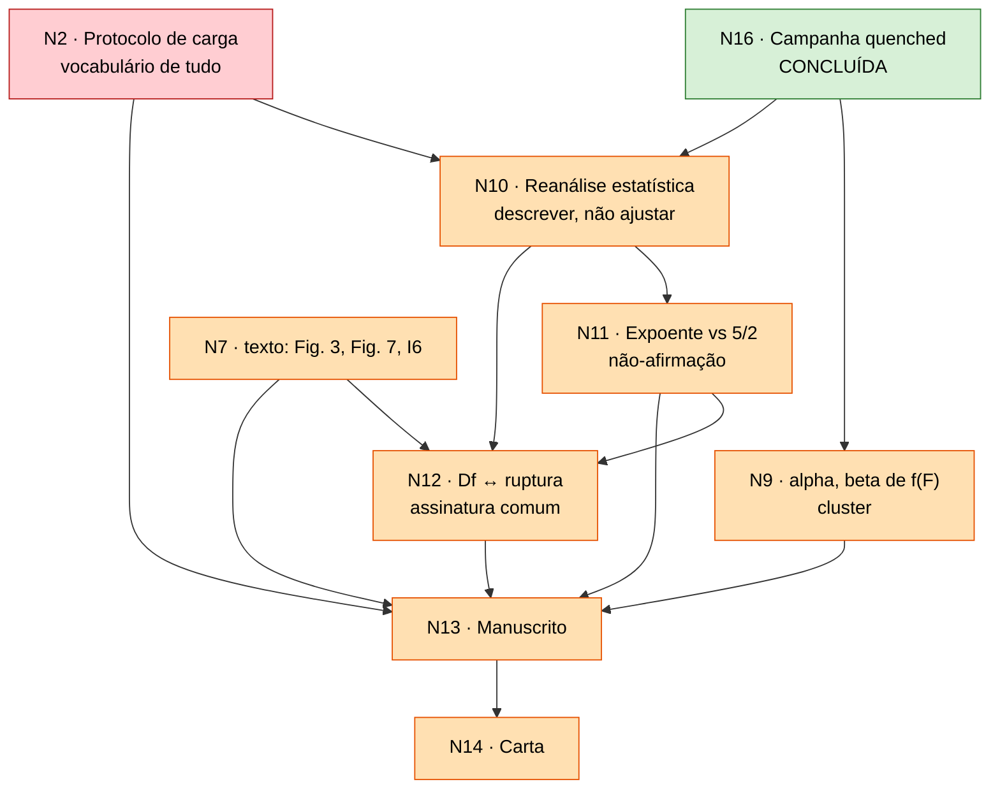

# Estado da revisão — ER12738

**Manuscrito:** *Scaling behaviors in simulated collagen fibrils*
**Governa:** `Paper/paper_PRE.tex`, `Carta_Resposta/Response_to_Referees.tex`
**Referência congelada:** `Paper/submitted_ER12738/paper_PRE.tex` — o que os revisores leram (commit `5d2d272`)
**Base do manuscrito revisado:** `Paper/submitted_ER12738/paper_PRE.tex`, sob a regra de intervenção mínima (decisão de 2026-09-03). `Paper/paper_PRE.tex` deixou de ser base; o texto de N1, N4 e N6 que estava nele fica no commit `179f7ea`, de onde é reaplicado.
**Conferido em:** 2026-09-03

> **Este arquivo é editado, nunca acrescido.** Ele diz o que é verdade agora.
> O *porquê* de cada decisão está em `decision_log/`, que é append-only.
> Confira as afirmações com `Code/Data_analysis/validate_review_state.py`.

Convenção: `A → B` significa "B não fecha antes de A, e reabrir A reabre B".

## Nós

| Nó | Decisão | Críticas | Estado |
|:--|:--|:--|:--|
| **N0** | Fidelidade às Eqs. (2)–(4) | a montante da mecânica | fechado — `a834c53` |
| **N1** | Interpretação física de $T_s$ | R1-1 | **decisão fechada, texto a reaplicar** — estava em `179f7ea` (`:137`, conclusão); entra nas linhas 118 e 271 da base |
| **N3** | Carga uniforme na seção + resistência local em $K$ | R2-2 | **decisão fechada, texto a reaplicar** — o parágrafo dos dois canais está em `179f7ea` (`:230`) e não no submetido; entra como inserção após a linha 185 da base |
| **N4** | Remoção da terminologia SOC | R1-2, R2-4 | **decisão fechada, texto a reaplicar** — a base tem SOC nas linhas 81 e 100 (duas vezes a sigla, duas a forma extensa); e **positivo**: três invariâncias medidas |
| **N6** | Limitações de coarse-graining (18:1) | R1-6 | **decisão fechada, texto a reaplicar** — os dois parágrafos estão em `179f7ea` (`:347`); entram na linha 261 da base |
| **N8** | Definição operacional de avalanche | R2-3, R2-2 | **dissolvido** — a cascata determinística é a avalanche |
| **N16** | Campanha sob protocolo quenched | infraestrutura | **concluído** — 10.000 arquivos, 2.000 fibrilas |
| **N5** | Sensibilidade ao módulo de Weibull $m$ | R1-3 | **fechado nos dados** — varredura $\{1,2,3,5,10\}$; $m=2$ como caso ilustrativo. **A carta R1-3 ainda diz o contrário** ("só $m=2$, sem robustez") — corrige-se em N14 |
| **N15** | Validação do gerador | infraestrutura | **fechado** — reproduz a estrutura local das fibrilas publicadas (registro de 2026-09-02) |
| **N7** | $D_f$ 2D contra descritores do backbone 3D | R1-4 | **fechado na decisão, aberto no texto** — *crossover* DLA (1,68) → sólido (2,0), não dimensão variável. Depois do corte de 2026-09-03 isso **não entra no manuscrito**: a Fig. 3 e os valores publicados ficam, e o texto ganha só a declaração de descritor morfológico mais uma frase de limitação (linhas 138–146 da base). O *crossover* segue como resultado interno |
| **N17** | Fase C — o corte é físico ou de tamanho? | sustenta N10–N12 | **fechado** — 25× em $N$, duas arquiteturas, forma invariante (registros de 2026-09-02) |
| **N2** | Protocolo de carga | R2-1, R2-3 | **aberto — o maior débito de texto.** `:240-242` e `:312` ainda descrevem varreduras e $\Delta F$; a carta R2-1 ainda os defende. Escrever: Eq. (4) como limiar $X_i\sim x^m$, $F^*_i$, cascata; Fig. 6; carta R2-1/R2-3 |
| **N9** | $\alpha,\beta$ da Eq. (5) | R1-7 | **dados prontos** — curvas de dano das 50 condições extraídas (job 590854; `Reviews/N9_damage_curves/damage_condition_table.csv`): a Eq. (5) não descreve o protocolo novo ($\beta \le 0$); dano preterminal 9–34% e cascata terminal. Falta o texto e a Fig. 7 nova |
| **N10** | Reanálise estatística da cauda | R1-2, R2-4 | aberto — **alvo confirmado**: descrever a distribuição (estável em $m$, $T_s\geq16$ e tamanho); não ajustar expoente. `:312-342` e Fig. 9 ainda trazem os números do recozido |
| **N11** | Expoente frente a $5/2$ | R1-3 | **encerra como não-afirmação** — uma década, invariante ao tamanho, e $\gamma$ depende de $m$ tanto quanto de $T_s$. Falta o texto e a carta R1-3 |
| **N12** | Estatuto de $D_f \leftrightarrow$ ruptura | R1-5 | aberto — **confundimento de $N$ desfeito** (N17). Conclusão: não existe $\gamma(D_f)$; sobrevive uma assinatura comum em $T_s\approx128$. Falta o texto (`:336`, conclusão), a carta R1-5, e decidir o teste por fibrila (precisa do cluster) |
| **N13** | Revisão integral do manuscrito | todas | aberto — o plano de edição é a §13 de `Reviews/Respostas_ER12738.qmd`: 22 blocos mudam, dois ficam, e a única inserção de parágrafo é a da linha 185. Os seis itens voluntários foram **cortados** em 2026-09-03 (§13.2) |
| **N14** | Carta ponto a ponto verificada | todas | aberto — **onze respostas rascunhadas** em `Reviews/Respostas_ER12738.qmd` (2026-09-03), à espera da revisão de Michael. **sete de onze respostas mudam de conteúdo** (R1-2, R1-3, R1-4, R1-5, R1-7, R2-1, R2-3); só R1-1, R1-6 e R2-2 ficam. Base congelada em `Paper/submitted_ER12738/` |

## Grafo

Nós fechados (N0, N1, N3, N4, N5, N6, N15, N17) e dissolvidos (N8) saíram do
grafo. N7 volta só pela parte de texto (`N7t`), e depois do corte de 2026-09-03
essa parte é uma declaração e uma frase de limitação nas linhas 138–146 da base:
nenhuma figura e nenhum número mudam por N7t. Ver `decision_log/`.

## Arestas — por que cada uma é um portão

| Aresta | Justificativa |
|:--|:--|
| **N16 → N10, N9** | A amostra estatística *é* a campanha; $\varphi(F)$ sai dela. |
| **N2 → N10** | Eq. (6) e a definição de avalanche usam o vocabulário de limiar e cascata; escrever N10 antes de N2 obriga a reescrevê-lo. |
| **N17 → N10, N12** | Se o corte fosse de tamanho finito, N10 seria artefato e N12 mudaria de objeto. Fechado: não é. |
| **N7 → N9** | $\alpha,\beta$ são lidos em termos de $\langle N\rangle$ e $\langle K\rangle$. |
| **N7t → N12** | O lado estrutural de R1-5 é a leitura de *crossover*; N12 não pode citar a Fig. 7 antiga. |
| **N10 → N11 → N12** | O que se diz do expoente decide o que se pode dizer da associação. |
| **N13 → N14** | A carta cita trechos literais do manuscrito. Último nó por construção. |

## Trechos que ainda mudam

A lista está na **§13 de `Reviews/Respostas_ER12738.qmd`** (@tbl-plano lá),
ordenada pela linha de `Paper/submitted_ER12738/paper_PRE.tex`, que é a base e
não se move. Não se repete aqui: duas cópias de uma lista de 25 linhas apodrecem
em ritmos diferentes.

A tabela anterior desta seção citava linhas de `Paper/paper_PRE.tex`, que deixou
de ser base em 2026-09-03. Ela está no histórico do git.

## Figuras do manuscrito revisado (numeração provisória, N13)

| # | O quê | Nó |
|:--|:--|:--|
| 1–5 | inalteradas — a Fig. 3 mantém os valores publicados de $D_f$ | — |
| 6 | inalterada; só a legenda se adapta ao protocolo quenched | N2 |
| **7** | $F_{rup}(T_s)$ por $m$ e $\varphi(F/F_{rup})$ | N9 |
| **8** | sobrevivência das cascatas por $T_s$ e as invariâncias, **sem expoente** | N10, N11 |

Duas figuras de nove trocam de conteúdo. Sai a Fig. 8 do submetido ($\Psi$) e a
9 assume seu número. Depois do corte dos seis itens voluntários (§13.2 de
`Respostas_ER12738.qmd`), a Fig. 3 não é refeita, a escada de tamanho fica só na
carta e nenhuma figura reporta expoente ajustado. Restam **dois** conjuntos
`.dat` a exportar, não três, pela regra do `AGENTS.md` §8.

## Inconsistências abertas

| # | O quê | Estado |
|:--|:--|:--|
| **I7** | `% TODO Issue #5` pendente na carta | aberta — some com a reescrita de R1-2 (N10) |
| **I11** | A carta cita, em R1-6, uma versão do parágrafo de limitações **anterior à auditoria N1**: falta a ressalva de regulação celular *in vivo* (`Kadler1996`, `Canty2005`, `Kadler2008`) e a leitura de $T_s$ como parâmetro de controle efetivo | aberta — citar no ponto a ponto um trecho ausente do `.tex` final é o erro que N14 existe para pegar. Some ao reescrever a carta R1-6 |

Só duas seguem bloqueando. **I6**, **I13** e **I14** deixaram de bloquear em
2026-09-03, não por resolução e sim porque o corte dos seis itens voluntários
tirou do texto o que dependia delas — ver a @tbl-i-fechadas da §13.2 de
`Respostas_ER12738.qmd`. Em resumo: o Spearman de I6 nunca esteve no artigo
submetido (zero ocorrências) e a tabela de correlações ficou fora; a frase de
limitação de $D_f$ diz "menos de uma década", verdade sob os dois critérios de
I13; e a carta não cita mais os números da varredura em $\Delta F$, cujo CSV
segue ausente. Se algum dos cortes for revertido, a inconsistência
correspondente volta a bloquear.

Resolvidas ou superadas: I1, I2, I3, I5 (troca de protocolo); **I12** (a tabela de `2026-08-30_N5_modulo_de_weibull.md` apresentava $2{,}2$–$5{,}4$ de Svensson2013 e $7{,}2$ de Yang2012 como módulos de Weibull reportados pelas fontes; **nenhuma das duas os reporta** — Yang2012 não contém a palavra, e os valores são derivados por nós de $m \approx 1{,}2/\mathrm{CV}$. Corrigido em `2026-09-03_correcao_atribuicao_weibull_literatura.md` e na resposta R1-3); **I8** (decidido em 2026-08-30 não declarar escala física; conferido em 2026-09-03 que o `.tex` não converte unidade de rede em nm); **I9** nas duas metades ($D_f$ era falta de tamanho, corrigido ao engordar; a faixa das avalanches é intrínseca); **I10** (o ajuste publicado de $T_s=16$ usou mesmo 49 fibrilas e 539 seções — `Reviews/N7_fractal_proxy/ensemble_curve_validation.csv` reproduz 1,735 com elas; o manuscrito é que diz "50" — corrige-se em N13). I4 é latente.

## Precisa de dado novo? (auditado em 2026-09-03)

**Não há campanha nova a gerar nem a fraturar.** Do que está aberto:

| precisa de | nós |
|:--|:--|
| só texto, dados em mãos | N2, N9, N10, N11, N12 (texto), N13, N14, I7 — rascunhos das onze respostas em `Reviews/Respostas_ER12738.qmd` |
| análise sobre dado existente, **local** | **nada.** O corte dos seis itens voluntários dispensou a Fig. 3 sob regra uniforme e a tabela de correlações; N7t reduz-se a texto |
| análise sobre dado existente, **no cluster** | ~~N9~~ (feito em 2026-09-03); **N12, teste por fibrila** — os arquivos de avalanche por fibrila estão só em `$DLA_PROJECT`; *ensemble* completo de 200 fibrilas para §§3.1/3.3 do relatório |

O cluster ficou acessível em 2026-09-03 (VPN religada); o clone remoto está em dia com `origin/main`.

## Próximo passo

1. **N2** — o protocolo quenched no manuscrito: Eq. (4) como distribuição de limiares, $F^*_i$, cascata a $F$ fixo, Fig. 6; e reescrever as respostas R2-1 e R2-3. É o vocabulário de tudo o que segue.
2. **N10 / N11** — a distribuição como ela é, com as três invariâncias ($m$, $T_s$, tamanho); a não-comparação com $5/2$, agora também porque $\gamma$ depende de $m$; Fig. 9 da campanha; respostas R1-2, R1-3, R2-4.
3. **N7t / I6** — em paralelo com 1 e 2: Fig. 3 sob regra uniforme, Fig. 7 na leitura de *crossover* (ou removida), resumo e conclusão; resposta R1-4.
4. **N12** — depois de 2 e 3: a assinatura comum em $T_s\approx128$, sem $\gamma(D_f)$; resposta R1-5. O teste por fibrila fica para quando o cluster voltar, junto com N9.
5. **N9** — dados em mãos: escrever o texto de $F_{rup}$, fração preterminal e colapso; resposta R1-7 já rascunhada.
6. **N13 → N14**, conferindo cada citação da carta contra o `.tex` final e contra `Paper/submitted_ER12738/`.
