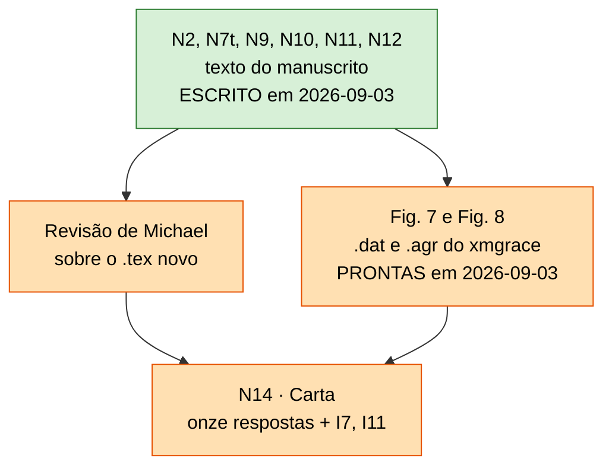

# Estado da revisão — ER12738

**Manuscrito:** *Scaling behaviors in simulated collagen fibrils*
**Governa:** `Paper/paper_PRE.tex`, `Carta_Resposta/Response_to_Referees.tex`
**Referência congelada:** `Paper/submitted_ER12738/paper_PRE.tex` — o que os revisores leram (commit `5d2d272`)
**Base do manuscrito revisado:** `Paper/submitted_ER12738/paper_PRE.tex`, sob a regra de intervenção mínima (decisão de 2026-09-03). `Paper/paper_PRE.tex` foi reconstruído a partir dela em 2026-09-03 e está **90 linhas de diff** à frente (a revisão descartada tinha 187); compila em 20 páginas, sem referência nem citação indefinida. O texto de N1, N3 e N6 veio do commit `179f7ea`.
**Conferido em:** 2026-09-03

> **Este arquivo é editado, nunca acrescido.** Ele diz o que é verdade agora.
> O *porquê* de cada decisão está em `decision_log/`, que é append-only.
> Confira as afirmações com `Code/Data_analysis/validate_review_state.py`.

Convenção: `A → B` significa "B não fecha antes de A, e reabrir A reabre B".

## Nós

| Nó | Decisão | Críticas | Estado |
|:--|:--|:--|:--|
| **N0** | Fidelidade às Eqs. (2)–(4) | a montante da mecânica | fechado — `a834c53` |
| **N1** | Interpretação física de $T_s$ | R1-1 | fechado — texto reaplicado em 2026-09-03 nas linhas 118 (parágrafo das escalas de tempo) e 271 (conclusão sem a especulação) |
| **N3** | Carga uniforme na seção + resistência local em $K$ | R2-2 | fechado — parágrafo dos dois canais reaplicado em 2026-09-03, em vocabulário de limiar, após a Eq. (4) |
| **N4** | Remoção da terminologia SOC | R1-2, R2-4 | fechado — zero ocorrências de SOC no `.tex` novo (conferido); e **positivo**: a invariância em $T_s\ge16$ e a permanência do corte sob toda a grade de $m$ estão escritas |
| **N6** | Limitações de coarse-graining (18:1) | R1-6 | fechado — razão de aspecto $18{:}1$ contra $\approx 200{:}1$ escrita na linha 261, junto da ressalva de regulação celular |
| **N8** | Definição operacional de avalanche | R2-3, R2-2 | **dissolvido** — a cascata determinística é a avalanche |
| **N16** | Campanha sob protocolo quenched | infraestrutura | **concluído** — 10.000 arquivos, 2.000 fibrilas |
| **N5** | Sensibilidade ao módulo de Weibull $m$ | R1-3 | **fechado nos dados** — varredura $\{1,2,3,5,10\}$; $m=2$ como caso ilustrativo. **A carta R1-3 ainda diz o contrário** ("só $m=2$, sem robustez") — corrige-se em N14 |
| **N15** | Validação do gerador | infraestrutura | **fechado** — reproduz a estrutura local das fibrilas publicadas (registro de 2026-09-02) |
| **N7** | $D_f$ 2D contra descritores do backbone 3D | R1-4 | **fechado na decisão, aberto no texto** — *crossover* DLA (1,68) → sólido (2,0), não dimensão variável. Depois do corte de 2026-09-03 isso **não entra no manuscrito**: a Fig. 3 e os valores publicados ficam, e o texto ganha só a declaração de descritor morfológico mais uma frase de limitação (linhas 138–146 da base). O *crossover* segue como resultado interno |
| **N17** | Fase C — o corte é físico ou de tamanho? | sustenta N10–N12 | **fechado** — 25× em $N$, duas arquiteturas, forma invariante (registros de 2026-09-02) |
| **N2** | Protocolo de carga | R2-1, R2-3 | **fechado no manuscrito** — escrito em 2026-09-03: Eq. (4) como distribuição de limiares $X_i\sim x^m$, $F^*_i$, carga extremal, cascata determinística, legenda da Fig. 6 e corpo de prova de $200\times50$. Falta a carta (N14) |
| **N9** | $\alpha,\beta$ da Eq. (5) | R1-7 | **texto fechado** — Eq. (5) retirada em 2026-09-03; escritos $F_{rup}$, a fração preterminal de 9–34%, a cascata terminal e o colapso de $\varphi(F/F_{rup})$. Falta o `.dat` da Fig. 7 nova e a carta |
| **N10** | Reanálise estatística da cauda | R1-2, R2-4 | **texto fechado** — escrito em 2026-09-03: Eqs. (5) e (6) fora, forma da distribuição, teste de Clauset (48/50 rejeitam), invariância em $T_s\ge16$ e a dependência sistemática em $m$, sem expoente. A invariância de tamanho ficou fora do artigo (corte 2). Falta o `.dat` da Fig. 9 nova |
| **N11** | Expoente frente a $5/2$ | R1-3 | **fechado no manuscrito** — os parágrafos do $5/2$ e do *crossover* LLS→GLS foram retirados em 2026-09-03, e nenhum expoente é reportado. Falta a carta R1-3 |
| **N12** | Estatuto de $D_f \leftrightarrow$ ruptura | R1-5 | **fechado no manuscrito** — a ponte quantitativa e o *crossover* de universalidade saíram; as linhas 261 e 267 dizem associação empírica e nomeiam o que uma teoria preditiva exigiria. A assinatura comum em $\approx 128$ ficou fora (corte 1). Falta a carta R1-5 |
| **N13** | Revisão integral do manuscrito | todas | **fechado no texto e nas figuras** — os 22 blocos da @tbl-plano foram aplicados em 2026-09-03 e o `.tex` compila limpo; `figure_7.pdf` e `figure_8.pdf` saem dos `.agr` de `Reviews/N9_damage_curves/xmgrace/` e `Reviews/N10_cascade_survival/xmgrace/`. Falta a leitura de Michael |
| **N14** | Carta ponto a ponto verificada | todas | **escrita** em 2026-09-03: `Carta_Resposta/Response_to_Referees.tex`, 15 páginas, compila sem citação indefinida. As onze citações literais dos revisores vieram da versão anterior sem alteração; as **20 frases citadas do manuscrito conferem contra o `.tex` final**, verificadas por script |

## Grafo

Com o texto escrito, o grafo de dependências deixou de ter forma: sobrou uma
fila. Todos os nós de conteúdo (N0–N12, N15–N17) estão fechados; o que resta são
duas exportações de figura, a revisão de Michael sobre o `.tex` e a carta, que
cita o `.tex` já pronto. Ver `decision_log/`.

## Arestas — por que cada uma é um portão

| Aresta | Justificativa |
|:--|:--|
| **N16 → N10, N9** | A amostra estatística *é* a campanha; $\varphi(F)$ sai dela. |
| **N2 → N10** | Eq. (6) e a definição de avalanche usam o vocabulário de limiar e cascata; escrever N10 antes de N2 obriga a reescrevê-lo. |
| **N17 → N10, N12** | Se o corte fosse de tamanho finito, N10 seria artefato e N12 mudaria de objeto. Fechado: não é. |
| **N7 → N9** | $\alpha,\beta$ são lidos em termos de $\langle N\rangle$ e $\langle K\rangle$. |
| **N7t → N12** | O lado estrutural de R1-5 é a leitura de *crossover*; N12 não pode citar a Fig. 7 antiga. |
| **N10 → N11 → N12** | O que se diz do expoente decide o que se pode dizer da associação. |
| **N13 → N14** | A carta cita trechos literais do manuscrito. Último nó por construção. |

## Trechos que ainda mudam

**Nenhum.** Os 22 blocos da @tbl-plano da §13 de `Reviews/Respostas_ER12738.qmd`
foram aplicados em 2026-09-03 sobre uma cópia limpa da base. O `.tex` está 90
linhas de diff à frente do submetido, com 31 blocos `\rev{}`, e compila em 20
páginas sem referência nem citação indefinida.

Aquela tabela continua sendo a autoridade sobre o que mudou e por quê, e é contra
ela que a carta se confere. Duas coisas do plano não foram feitas ao pé da letra,
ambas registradas lá: os rótulos de figura não foram renomeados (o LaTeX
renumera sozinho), e os oito caminhos `Figures/figure_N.pdf` viraram
`figure_N.pdf`, porque é onde as figuras moram em `Paper/` — caminho, não
revisão.

## Figuras do manuscrito revisado (numeração provisória, N13)

| # | O quê | Nó |
|:--|:--|:--|
| 1–5 | inalteradas — a Fig. 3 mantém os valores publicados de $D_f$ | — |
| 6 | inalterada; só a legenda se adapta ao protocolo quenched | N2 |
| **7** | $F_{rup}(T_s)$ por $m$ e $\varphi(F/F_{rup})$ | N9 — **pronta**: `.dat`, `.agr` e `Paper/figure_7.pdf` |
| **8** | sobrevivência das cascatas por $T_s$ e por $m$, **sem expoente** | N10 — **pronta**: `.dat`, `.agr` e `Paper/figure_8.pdf` |

Duas figuras de nove trocam de conteúdo. Sai a Fig. 8 do submetido ($\Psi$) e a
9 assume seu número. Depois do corte dos seis itens voluntários (§13.2 de
`Respostas_ER12738.qmd`), a Fig. 3 não é refeita, a escada de tamanho fica só na
carta e nenhuma figura reporta expoente ajustado.

Os nomes concordam: rótulo `fig_8`, arquivo `figure_8.pdf`, Figura 8 impressa.
Foram renomeados de 9 para 8 em 2026-09-03; a figura de $\Psi$ que ocupava o nome
`figure_8.pdf` saiu do manuscrito e existe nos commits `dad428e` e `ecc4ac7`.

## Inconsistências abertas

| # | O quê | Estado |
|:--|:--|:--|
**Nenhuma bloqueia.** I7 e I11 fecharam com a carta escrita em 2026-09-03: o
`% TODO Issue #5` saiu com a reescrita de R1-2, e a citação de R1-6 passou a ser
o parágrafo do `.tex` final, conferido frase a frase. **I6**, **I13** e **I14** deixaram de bloquear em
2026-09-03, não por resolução e sim porque o corte dos seis itens voluntários
tirou do texto o que dependia delas — ver a @tbl-i-fechadas da §13.2 de
`Respostas_ER12738.qmd`. Em resumo: o Spearman de I6 nunca esteve no artigo
submetido (zero ocorrências) e a tabela de correlações ficou fora; a frase de
limitação de $D_f$ diz "menos de uma década", verdade sob os dois critérios de
I13; e a carta não cita mais os números da varredura em $\Delta F$, cujo CSV
segue ausente. Se algum dos cortes for revertido, a inconsistência
correspondente volta a bloquear.

Resolvidas ou superadas: I1, I2, I3, I5 (troca de protocolo); **I12** (a tabela de `2026-08-30_N5_modulo_de_weibull.md` apresentava $2{,}2$–$5{,}4$ de Svensson2013 e $7{,}2$ de Yang2012 como módulos de Weibull reportados pelas fontes; **nenhuma das duas os reporta** — Yang2012 não contém a palavra, e os valores são derivados por nós de $m \approx 1{,}2/\mathrm{CV}$. Corrigido em `2026-09-03_correcao_atribuicao_weibull_literatura.md` e na resposta R1-3); **I8** (decidido em 2026-08-30 não declarar escala física; conferido em 2026-09-03 que o `.tex` não converte unidade de rede em nm); **I9** nas duas metades ($D_f$ era falta de tamanho, corrigido ao engordar; a faixa das avalanches é intrínseca); **I10** (o ajuste publicado de $T_s=16$ usou mesmo 49 fibrilas e 539 seções — `Reviews/N7_fractal_proxy/ensemble_curve_validation.csv` reproduz 1,735 com elas; o manuscrito é que diz "50" — corrige-se em N13). I4 é latente.

## Precisa de dado novo? (auditado em 2026-09-03)

**Não há campanha nova a gerar nem a fraturar.** Do que está aberto:

| precisa de | o quê |
|:--|:--|
| só texto | N14, a carta, e I7 e I11, que morrem nela |
| xmgrace, **local** | ~~feito em 2026-09-03~~: os dois `.agr` e os dois PDFs estão no lugar (`grace` instalado) |
| cópia do cluster | ~~feita em 2026-09-03~~: as cinquenta `casc_ts<TS>_m<M>_pre.npz` (5,9 MB) em `Reviews/N10_cascade_survival/cascades_npz/` |
| análise no cluster | **nada obrigatório.** O teste por fibrila de N12 saiu do caminho crítico: o manuscrito já não afirma $\gamma(D_f)$, então ele é extensão futura |

O cluster ficou acessível em 2026-09-03 (VPN religada); o clone remoto está em dia com `origin/main`.

## Próximo passo

1. **Ler o `.tex` revisado.** Os 22 blocos estão aplicados, em azul via `\rev`, e o PDF sai em 20 páginas. É a revisão de Michael que decide se o texto fica.
2. **Rever as duas figuras.** Estão prontas — `.dat`, `.agr` e PDF —, montadas por `build_xmgrace_projects.py` e conferidas contra os CSVs de origem. O que falta é o olho de Michael sobre elas no xmgrace: escala, legenda e o que mais o gosto dos coautores pedir.
3. ~~**N14, a carta.**~~ Escrita em 2026-09-03. Falta a leitura de Michael e dos coautores, e a decisão de submeter.
