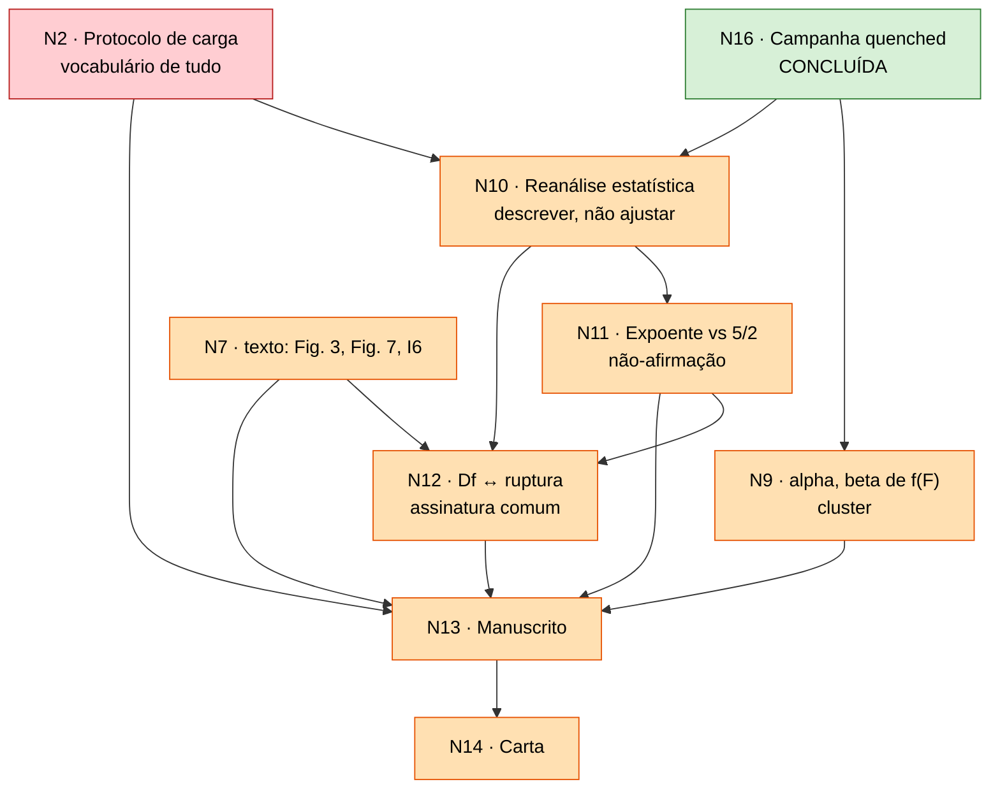

# Estado da revisão — ER12738

**Manuscrito:** *Scaling behaviors in simulated collagen fibrils*
**Governa:** `Paper/paper_PRE.tex`, `Carta_Resposta/Response_to_Referees.tex`
**Referência congelada:** `Paper/submitted_ER12738/paper_PRE.tex` — o que os revisores leram (commit `5d2d272`)
**Conferido em:** 2026-09-03

> **Este arquivo é editado, nunca acrescido.** Ele diz o que é verdade agora.
> O *porquê* de cada decisão está em `decision_log/`, que é append-only.
> Confira as afirmações com `Code/Data_analysis/validate_review_state.py`.

Convenção: `A → B` significa "B não fecha antes de A, e reabrir A reabre B".

## Nós

| Nó | Decisão | Críticas | Estado |
|:--|:--|:--|:--|
| **N0** | Fidelidade às Eqs. (2)–(4) | a montante da mecânica | fechado — `a834c53` |
| **N1** | Interpretação física de $T_s$ | R1-1 | fechado — texto conferido no `.tex` (`:137`, conclusão) |
| **N3** | Carga uniforme na seção + resistência local em $K$ | R2-2 | fechado — parágrafo de `:230` vale; só troca vocabulário com N2 |
| **N4** | Remoção da terminologia SOC | R1-2, R2-4 | fechado — zero ocorrências no `.tex`; e **positivo**: três invariâncias medidas |
| **N6** | Limitações de coarse-graining (18:1) | R1-6 | fechado — `:347` |
| **N8** | Definição operacional de avalanche | R2-3, R2-2 | **dissolvido** — a cascata determinística é a avalanche |
| **N16** | Campanha sob protocolo quenched | infraestrutura | **concluído** — 10.000 arquivos, 2.000 fibrilas |
| **N5** | Sensibilidade ao módulo de Weibull $m$ | R1-3 | **fechado nos dados** — varredura $\{1,2,3,5,10\}$; $m=2$ como caso ilustrativo. **A carta R1-3 ainda diz o contrário** ("só $m=2$, sem robustez") — corrige-se em N14 |
| **N15** | Validação do gerador | infraestrutura | **fechado** — reproduz a estrutura local das fibrilas publicadas (registro de 2026-09-02) |
| **N7** | $D_f$ 2D contra descritores do backbone 3D | R1-4 | **fechado na decisão, aberto no texto** — *crossover* DLA (1,68) → sólido (2,0) em $T_s\approx128$, não dimensão variável. Muda a Fig. 3 **e** a Fig. 7, o resumo (`:86`), `:170-176`, `:255-287`, `:354`; a carta R1-4 inverte de sinal. Resta I6 |
| **N17** | Fase C — o corte é físico ou de tamanho? | sustenta N10–N12 | **fechado** — 25× em $N$, duas arquiteturas, forma invariante (registros de 2026-09-02) |
| **N2** | Protocolo de carga | R2-1, R2-3 | **aberto — o maior débito de texto.** `:240-242` e `:312` ainda descrevem varreduras e $\Delta F$; a carta R2-1 ainda os defende. Escrever: Eq. (4) como limiar $X_i\sim x^m$, $F^*_i$, cascata; Fig. 6; carta R2-1/R2-3 |
| **N9** | $\alpha,\beta$ da Eq. (5) | R1-7 | **dados prontos** — curvas de dano das 50 condições extraídas (job 590854; `Reviews/N9_damage_curves/damage_condition_table.csv`): a Eq. (5) não descreve o protocolo novo ($\beta \le 0$); dano preterminal 9–34% e cascata terminal. Falta o texto e a Fig. 7 nova |
| **N10** | Reanálise estatística da cauda | R1-2, R2-4 | aberto — **alvo confirmado**: descrever a distribuição (estável em $m$, $T_s\geq16$ e tamanho); não ajustar expoente. `:312-342` e Fig. 9 ainda trazem os números do recozido |
| **N11** | Expoente frente a $5/2$ | R1-3 | **encerra como não-afirmação** — uma década, invariante ao tamanho, e $\gamma$ depende de $m$ tanto quanto de $T_s$. Falta o texto e a carta R1-3 |
| **N12** | Estatuto de $D_f \leftrightarrow$ ruptura | R1-5 | aberto — **confundimento de $N$ desfeito** (N17). Conclusão: não existe $\gamma(D_f)$; sobrevive uma assinatura comum em $T_s\approx128$. Falta o texto (`:336`, conclusão), a carta R1-5, e decidir o teste por fibrila (precisa do cluster) |
| **N13** | Revisão integral do manuscrito | todas | aberto — a lista de trechos está na tabela crítica a crítica do registro de 2026-09-03 |
| **N14** | Carta ponto a ponto verificada | todas | aberto — **onze respostas rascunhadas** em `Reviews/Respostas_ER12738.qmd` (2026-09-03), à espera da revisão de Michael. **sete de onze respostas mudam de conteúdo** (R1-2, R1-3, R1-4, R1-5, R1-7, R2-1, R2-3); só R1-1, R1-6 e R2-2 ficam. Base congelada em `Paper/submitted_ER12738/` |

## Grafo

Nós fechados (N0, N1, N3, N4, N5, N6, N15, N17) e dissolvidos (N8) saíram do
grafo. N7 volta só pela parte de texto (`N7t`): a decisão está tomada, mas
quatro trechos e duas figuras ainda dizem o contrário. Ver `decision_log/`.

## Arestas — por que cada uma é um portão

| Aresta | Justificativa |
|:--|:--|
| **N16 → N10, N9** | A amostra estatística *é* a campanha; $\varphi(F)$ sai dela. |
| **N2 → N10** | Eq. (6) e a definição de avalanche usam o vocabulário de limiar e cascata; escrever N10 antes de N2 obriga a reescrevê-lo. |
| **N17 → N10, N12** | Se o corte fosse de tamanho finito, N10 seria artefato e N12 mudaria de objeto. Fechado: não é. |
| **N7 → N9** | $\alpha,\beta$ são lidos em termos de $\langle N\rangle$ e $\langle K\rangle$. |
| **N7t → N12** | O lado estrutural de R1-5 é a leitura de *crossover*; N12 não pode citar a Fig. 7 antiga. |
| **N10 → N11 → N12** | O que se diz do expoente decide o que se pode dizer da associação. |
| **N13 → N14** | A carta cita trechos literais do manuscrito. Último nó por construção. |

## Trechos do `.tex` que ainda mudam (linhas de 2026-09-03)

| Trecho | Linhas | Nós |
|:--|:--|:--|
| Resumo: números de $D_f$ e da estatística | `:86`, `:88` | N7t, N10, N13 |
| $D_f$ e Fig. 3 | `:170-176` | N7t |
| Eq. (4) e parágrafo dos dois canais | `:214-230` | N2, N3 |
| Protocolo (varreduras, $\Delta F$) e Fig. 6 | `:240-252` | N2 |
| Descritores do backbone, Fig. 7, Spearman | `:255-287` | N7t, I6 |
| Tamanho do *ensemble* | `:289` | N5, N13 |
| Eq. (5), Fig. 8, $\alpha,\beta$ | `:293-309` | N9 |
| Definição de avalanche | `:312` | N2, N10 |
| Eq. (6), $\gamma$, $s_c$, Fig. 9 | `:312-342` | N10, N11, N12 |
| Conclusão | `:351-360` | N7t, N11, N12 |

Reconferir as linhas após qualquer edição.

## Figuras do manuscrito revisado (numeração provisória, N13)

| # | O quê | Nó |
|:--|:--|:--|
| 1–2 | inalteradas | — |
| **3** | $D_f$ sob regra uniforme, mais a inclinação local | N7t |
| 4–6 | inalteradas; só a legenda da 6 se adapta ao protocolo quenched | N2 |
| **7** | $F_{rup}$ e $\varphi(F/F_{rup})$ | N9 |
| **8** | sobrevivência das cascatas por $T_s$ e escada de tamanho | N10, N11 |
| **9** | parâmetros do ajuste descritivo por $m$ — ou fundida na 8 | N11 |

Saem a Fig. 7 (correlações) e a Fig. 8 ($\Psi$) do submetido. Os `.dat` e o
`.agr` de cada figura seguem a regra do `AGENTS.md` §8.

## Inconsistências abertas

| # | O quê | Estado |
|:--|:--|:--|
| **I6** | Spearman do manuscrito ($0{,}997$; $0{,}997$; $-0{,}778$; $-0{,}979$) diverge do CSV ($0{,}9879$; $1{,}0000$; $-0{,}7818$; $-0{,}9636$) | aberta — o 0,997 entrou em `521a284` sem script; o CSV é o reprodutível, mas seu $p$ para $\rho=1$ é artefato numérico ($6{,}6\times10^{-64}$; mínimo real para $n=10$ é $5{,}5\times10^{-7}$). Provável fechamento **por remoção** da tabela, com a leitura de *crossover* |
| **I7** | `% TODO Issue #5` pendente na carta | aberta — some com a reescrita de R1-2 (N10) |
| **I11** | A carta cita, em R1-6, uma versão do parágrafo de limitações **anterior à auditoria N1**: falta a ressalva de regulação celular *in vivo* (`Kadler1996`, `Canty2005`, `Kadler2008`) e a leitura de $T_s$ como parâmetro de controle efetivo | aberta — citar no ponto a ponto um trecho ausente do `.tex` final é o erro que N14 existe para pegar. Some ao reescrever a carta R1-6 |
| **I13** | Duas contagens nossas do alcance do ajuste de $D_f$ discordam: $0{,}57$–$0{,}90$ década em `2026-08-30_diametro_e_dimensao_fractal.md` §4 (com $R_{max}$) contra $0{,}38$–$0{,}74$ no relatório da campanha §4 (com $R/2$) | aberta — critérios diferentes, não erro; falta escolher **um** antes de o número entrar na carta R1-4 |
| **I14** | Os números da varredura em $\Delta F$ ($F_{rup}$ $92{,}6 \to 188{,}0$; p99 $8 \to 89$) estão só na prosa de `2026-08-24_adocao_protocolo_quenched.md`; o CSV que os produziu não está no repositório | aberta — viola a rastreabilidade da §5 do `AGENTS.md`. Localizar o CSV ou retirar os números da resposta R2-1 |

Resolvidas ou superadas: I1, I2, I3, I5 (troca de protocolo); **I12** (a tabela de `2026-08-30_N5_modulo_de_weibull.md` apresentava $2{,}2$–$5{,}4$ de Svensson2013 e $7{,}2$ de Yang2012 como módulos de Weibull reportados pelas fontes; **nenhuma das duas os reporta** — Yang2012 não contém a palavra, e os valores são derivados por nós de $m \approx 1{,}2/\mathrm{CV}$. Corrigido em `2026-09-03_correcao_atribuicao_weibull_literatura.md` e na resposta R1-3); **I8** (decidido em 2026-08-30 não declarar escala física; conferido em 2026-09-03 que o `.tex` não converte unidade de rede em nm); **I9** nas duas metades ($D_f$ era falta de tamanho, corrigido ao engordar; a faixa das avalanches é intrínseca); **I10** (o ajuste publicado de $T_s=16$ usou mesmo 49 fibrilas e 539 seções — `Reviews/N7_fractal_proxy/ensemble_curve_validation.csv` reproduz 1,735 com elas; o manuscrito é que diz "50" — corrige-se em N13). I4 é latente.

## Precisa de dado novo? (auditado em 2026-09-03)

**Não há campanha nova a gerar nem a fraturar.** Do que está aberto:

| precisa de | nós |
|:--|:--|
| só texto, dados em mãos | N2, N9, N10, N11, N12 (texto), N13, N14, I7 — rascunhos das onze respostas em `Reviews/Respostas_ER12738.qmd` |
| análise sobre dado existente, **local** | N7t (Fig. 3 sob regra uniforme — medido em `Reviews/N7_fractal_proxy/df_published_fibrils_by_window.csv`; Fig. 7 ou sua remoção; I6) |
| análise sobre dado existente, **no cluster** | ~~N9~~ (feito em 2026-09-03); **N12, teste por fibrila** — os arquivos de avalanche por fibrila estão só em `$DLA_PROJECT`; *ensemble* completo de 200 fibrilas para §§3.1/3.3 do relatório |

O cluster ficou acessível em 2026-09-03 (VPN religada); o clone remoto está em dia com `origin/main`.

## Próximo passo

1. **N2** — o protocolo quenched no manuscrito: Eq. (4) como distribuição de limiares, $F^*_i$, cascata a $F$ fixo, Fig. 6; e reescrever as respostas R2-1 e R2-3. É o vocabulário de tudo o que segue.
2. **N10 / N11** — a distribuição como ela é, com as três invariâncias ($m$, $T_s$, tamanho); a não-comparação com $5/2$, agora também porque $\gamma$ depende de $m$; Fig. 9 da campanha; respostas R1-2, R1-3, R2-4.
3. **N7t / I6** — em paralelo com 1 e 2: Fig. 3 sob regra uniforme, Fig. 7 na leitura de *crossover* (ou removida), resumo e conclusão; resposta R1-4.
4. **N12** — depois de 2 e 3: a assinatura comum em $T_s\approx128$, sem $\gamma(D_f)$; resposta R1-5. O teste por fibrila fica para quando o cluster voltar, junto com N9.
5. **N9** — dados em mãos: escrever o texto de $F_{rup}$, fração preterminal e colapso; resposta R1-7 já rascunhada.
6. **N13 → N14**, conferindo cada citação da carta contra o `.tex` final e contra `Paper/submitted_ER12738/`.
