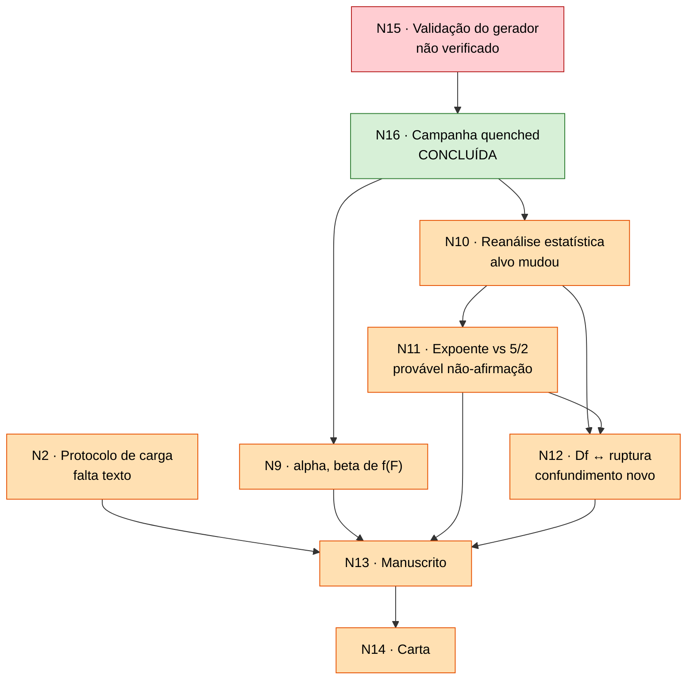

# Estado da revisão — ER12738

**Manuscrito:** *Scaling behaviors in simulated collagen fibrils*
**Governa:** `Paper/paper_PRE.tex`, `Carta_Resposta/Response_to_Referees.tex`
**Conferido em:** 2026-09-02

> **Este arquivo é editado, nunca acrescido.** Ele diz o que é verdade agora.
> O *porquê* de cada decisão está em `decision_log/`, que é append-only.
> Confira as afirmações com `Code/Data_analysis/validate_review_state.py`.

Convenção: `A → B` significa "B não fecha antes de A, e reabrir A reabre B".

## Nós

| Nó | Decisão | Críticas | Estado |
|:--|:--|:--|:--|
| **N0** | Fidelidade às Eqs. (2)–(4) | a montante da mecânica | fechado — `a834c53` |
| **N1** | Interpretação física de $T_s$ | R1-1 | fechado |
| **N3** | Carga uniforme na seção + resistência local em $K$ | R2-2 | fechado |
| **N4** | Remoção da terminologia SOC | R1-2, R2-4 | fechado — e agora **positivo**, não concessivo |
| **N6** | Limitações de coarse-graining (18:1) | R1-6 | fechado |
| **N8** | Definição operacional de avalanche | R2-3, R2-2 | **dissolvido** — a cascata determinística é a avalanche |
| **N16** | Campanha sob protocolo quenched | infraestrutura | **concluído** — 10.000 arquivos, 2.000 fibrilas |
| **N5** | Sensibilidade ao módulo de Weibull $m$ | R1-3 | **fechado** — $m=2$ como caso ilustrativo da varredura $\{1,2,3,5,10\}$; forças normalizadas |
| **N2** | Protocolo de carga | R2-1 | **dados prontos**; falta escrever o protocolo novo no manuscrito |
| **N15** | Validação do gerador | infraestrutura | **alvo trocado** — o $D_f$ publicado é escolha de janela, não referência. Validar pela estrutura local (K, encaixes) e pelos $D_f$ sob regra uniforme do relatório. O gerador periódico já passou nisso (Fase C §4b) |
| **N7** | $D_f$ 2D contra descritores do backbone 3D | R1-4 | **fechado** — `quenched_campaign_report` §4: o $D_f$ publicado depende da janela; é *crossover* DLA (1,68) → sólido (2,0), não dimensão variável. Corroborado em cilindros 17× mais gordos, 5 sementes (registro de 2026-09-01). Resta I6 |
| **N9** | $\alpha,\beta$ da Eq. (5) | R1-7 | aberto — refit sobre a campanha |
| **N10** | Reanálise estatística da cauda | R1-2, R2-4 | aberto — **alvo confirmado**: descrever a distribuição (estável em $m$, $T_s\geq16$ e tamanho); não ajustar expoente. Só falta redigir |
| **N11** | Expoente frente a $5/2$ | R1-3 | **encerra como não-afirmação** — uma década, invariante ao tamanho, não sustenta expoente nem a comparação. Falta só o texto |
| **N12** | Estatuto de $D_f \leftrightarrow$ ruptura | R1-5 | aberto — **confundimento novo** ($N$ varia junto com $D_f$) |
| **N17** | Fase C — o corte é físico ou de tamanho? | sustenta N10–N12 | **fechado** — o corte é do modelo: 25× em $N$ (1,4 década) e duas arquiteturas ($T_s$ 128 e 8192) não movem p99, fração unitária nem fração terminal (registros de 2026-09-02) |
| **N13** | Revisão integral do manuscrito | todas | aberto |
| **N14** | Carta ponto a ponto verificada | todas | aberto |

## Grafo

Nós fechados (N0, N1, N3, N4, N5, N6, N7, N17) e dissolvidos (N8) saíram do grafo: já não
são portões. Ver `decision_log/`.

## Arestas — por que cada uma é um portão

| Aresta | Justificativa |
|:--|:--|
| **N15 → N16** | Se o gerador não reproduz o $D_f$ publicado, as fibrilas da campanha não são as do artigo. **A campanha já rodou sem essa confirmação** — é o risco aberto mais caro. |
| **N16 → N10, N9** | A amostra estatística *é* a campanha; $\varphi(F)$ sai dela. |
| **N17 → N10, N12** | Se o corte das avalanches for de tamanho finito, os números de N10 são artefato e a associação de N12 muda de objeto. |
| **N7 → N9** | $\alpha,\beta$ são lidos em termos de $\langle N\rangle$ e $\langle K\rangle$. |
| **N7 → N12** | O lado estrutural de R1-5 é o resultado de N7. |
| **N10 → N11 → N12** | O expoente comparado a $5/2$ é o estimado em N10; sem platô, R1-5 perde o objeto. |
| **N13 → N14** | A carta cita trechos literais do manuscrito. Último nó por construção. |

## Conflitos de artefato compartilhado

Trechos do `.tex` escritos por mais de um nó. Reconferir após qualquer edição.

| Trecho | Nós | Risco |
|:--|:--|:--|
| Pós-Eq. (4) (`paper_PRE.tex:230`) | N2, N3 | load sharing e regra de falha no mesmo bloco |
| Definição de avalanche (`:312`) | N2, N10 | definição e método de estimativa juntos |
| Eq. (6) e parágrafo seguinte | N10, N11 | forma da cauda e sua interpretação |
| Valores $\gamma$, $s_c$ (`:331`, legenda Fig. 9 em `:341`) | N10, N11, N12 | mesmos números em três pontos do manuscrito e dois da carta |
| Eq. (5) e Fig. 8 | N2, N9 | $\varphi(F)$ depende do protocolo |
| Símbolo $\beta$ | N9, N10 | colisão latente com um eventual expoente de corte |
| Conclusão | N1, N11, N12 | escopo de $T_s$, do expoente e da associação |

## Inconsistências abertas

| # | O quê | Estado |
|:--|:--|:--|
| **I6** | Spearman do manuscrito ($0{,}997$; $0{,}997$; $-0{,}778$; $-0{,}979$) diverge do CSV ($0{,}9879$; $1{,}0000$; $-0{,}7818$; $-0{,}9636$) | aberta — falta identificar a tabela corrente |
| **I7** | `% TODO Issue #5` pendente na carta | aberta |
| **I8** | O modelo não fixa escala física: casar a largura do bastão dá 1 l.u. = 1,5 nm (fibrila de **42–99 nm**), casar o comprimento dá 16,7 nm (fibrila de **470–1100 nm**). Fibrilas reais medidas: 101–313 nm (Quigley2018), 140–490 nm (Yamamoto2017), ~200 nm (Yang2012). **Nenhuma das duas calibrações cai na faixa medida** — uma fica abaixo, a outra acima | **aberta** — decide como o manuscrito descreve a fibrila |

| **I9** | O manuscrito vai argumentar que 0,7 décadas não sustentam um expoente de avalanche, e reporta $D_f$ ajustado sobre 0,57–0,90 décadas | **resolvida nas duas metades**, por causas diferentes: o $D_f$ era falta de tamanho (corrigido ao engordar); a faixa das avalanches é intrínseca (não muda ao engordar). O manuscrito diz as duas coisas |

Resolvidas ou superadas: I1, I2, I3, I5 (troca de protocolo). I4 é latente.

## Precisa de dado novo? (auditado em 2026-09-02)

**Não há campanha nova a gerar nem a fraturar.** Do que está aberto:

| precisa de | nós |
|:--|:--|
| só texto, dados em mãos | N2, N10, N11, N13, N14, I7, I8 |
| análise sobre dado existente, **local** | N15 (estrutura local: publicadas × campanha, em curso), I6 (tabela de Spearman), N12 (a associação do relatório §6; o confundimento de $N$ foi desfeito pela Fase C: 25× em $N$ não move a estatística) |
| análise sobre dado existente, **no cluster** | **N9** — refit de $\varphi(F)$ e da Eq. (5) sobre as 10.000 saídas legadas da campanha (coluna `f` e fração removida acumulada já estão lá); e o *ensemble* completo de 200 fibrilas para §§3.1/3.3 do relatório (segundos de CPU) |

O cluster está inacessível até a VPN ser religada (`sudo -E Code/cluster/sdumont2nd/vpn_connect.sh`).

## Próximo passo

1. **N10 / N11** — redigir: a distribuição como ela é, com as três invariâncias medidas ($m$, $T_s$, tamanho); e a não-comparação com $5/2$ pelo mesmo motivo. Os dados estão todos em mãos.
2. **N2** — o texto do protocolo quenched no manuscrito (Eq. 4 como distribuição de limiares).
3. **N12** — alargar o corte até a fibrila inteira para separar arquitetura de tamanho. Só reprocessar o que já está no cluster.
4. **N7 / I6** — identificar a tabela de Spearman corrente e regenerar a Fig. 7 com a leitura de *crossover*.
