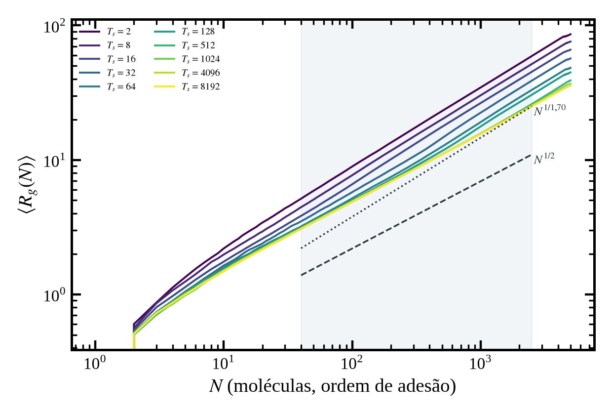
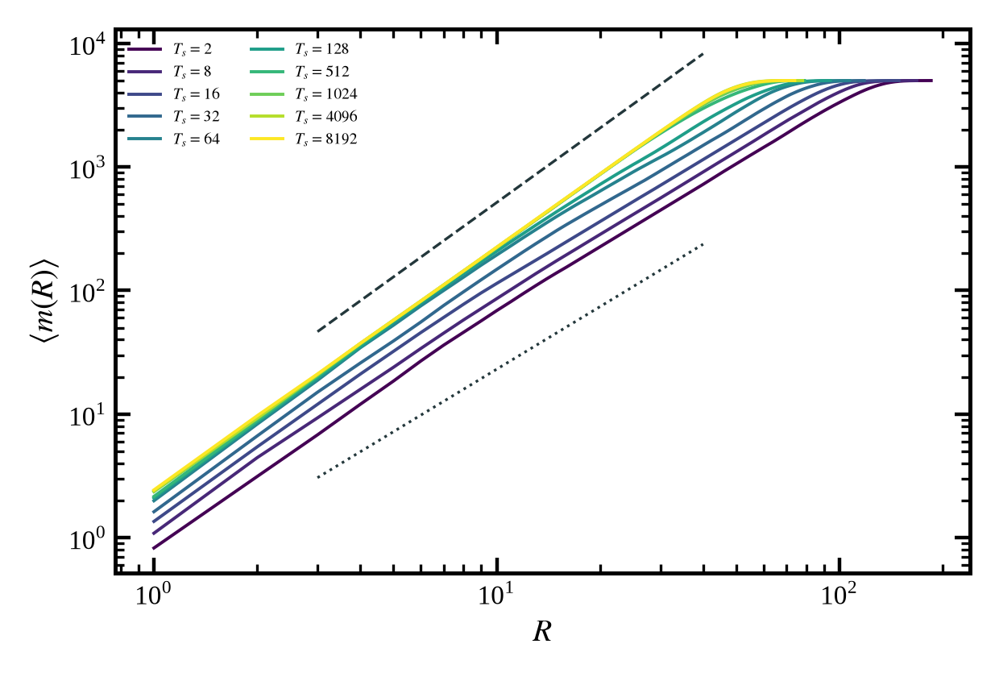
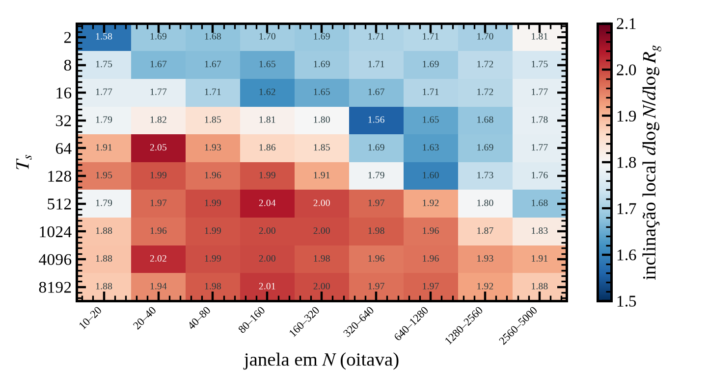
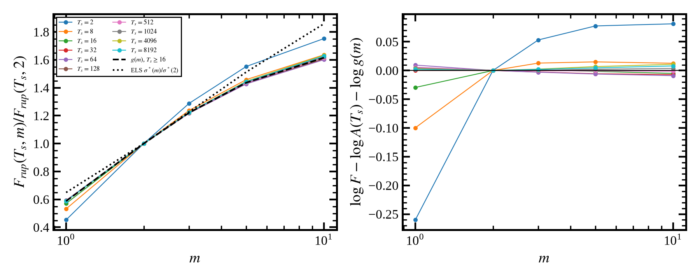
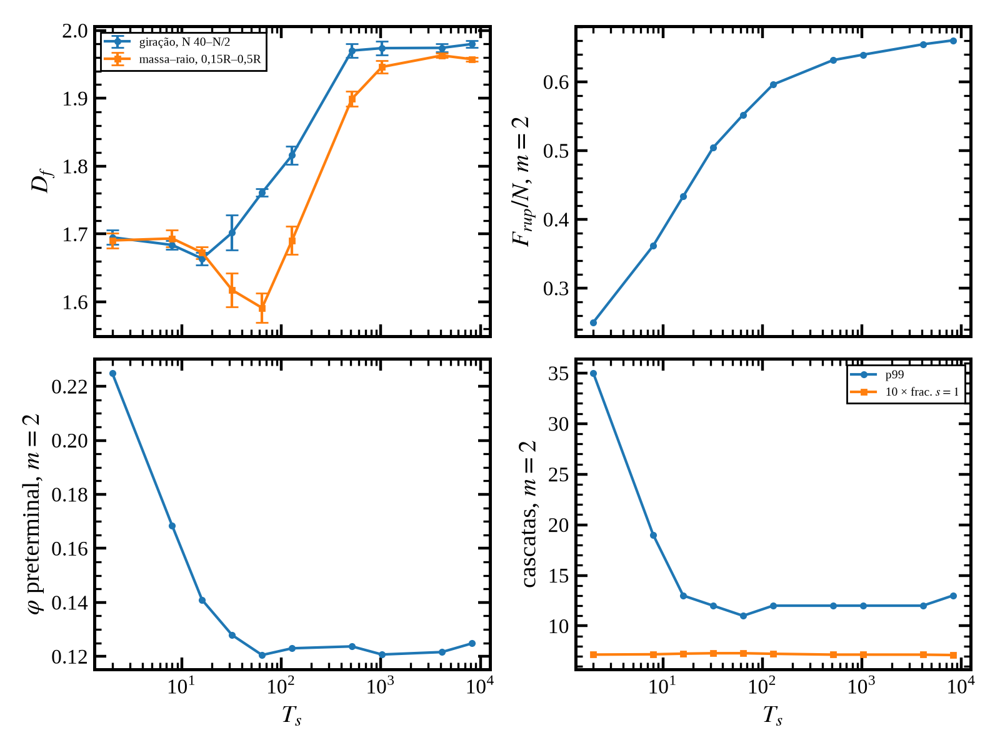
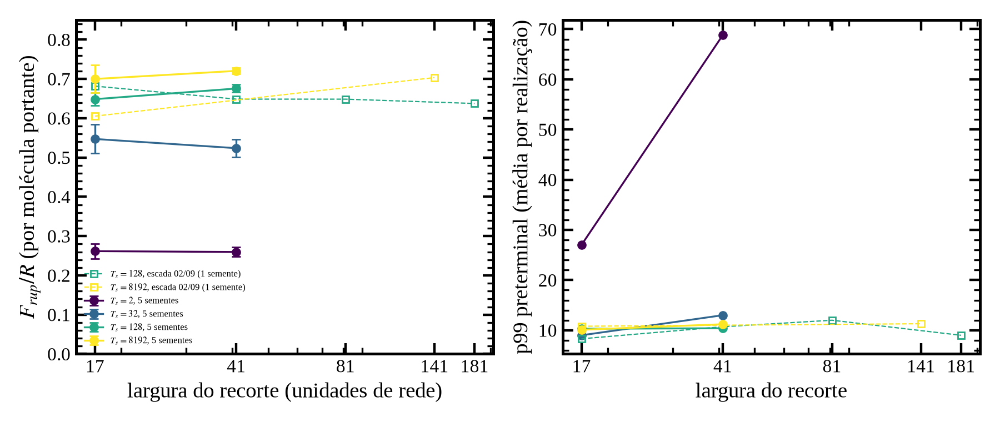

# As três perguntas e a resposta curta

Michael pediu, em 2026-09-10:

1. A dimensão fractal $D_f$ para todos os $T_s$, pelos métodos massa–raio e raio de giração, no tronco estendido com fronteira periódica; e uma reflexão sobre qual intervalo de $r$ usar.
2. Se $D_f$ converge junto com as propriedades mecânicas (força de ruptura $F_{rup}$, distribuição de avalanches, dano); e se, para um mesmo $T_s$, existe uma escala das propriedades mecânicas que permita remover $m$ como variável.
3. A distribuição de avalanches não depende da largura da fibrila (30.000 moléculas ou tronco estendido periódico dão a mesma coisa). Vale o mesmo para a força de ruptura?

As respostas, em uma frase cada:

1. **$D_f = 1{,}69 \pm 0{,}02$ até $T_s = 32$ e $1{,}97 \pm 0{,}01$ de $T_s = 512$ em diante; em 64 e 128 não há dimensão, há um cotovelo.** A seção tem um miolo compacto que cresce com $T_s$ e uma periferia ramificada, e uma janela de ajuste mede a fração de miolo que cobre. O intervalo que se sustenta é o raio de giração na ordem de crescimento, com $N$ de 40 até metade da seção e peso uniforme em $\log N$; a dimensão de correlação da seção final, corrigida pela borda, é o controle (1,74 e 1,92).
2. **Sim para a força e o dano, não para as avalanches.** $F_{rup}(T_s, m)$ separa em produto $A(T_s)\,g(m)$ com erro de 2% para $T_s \ge 32$, então $m$ sai como fator; a forma da distribuição de cascatas não separa. $D_f$ e $F_{rup}$ por molécula saturam juntos em $T_s = 512$, porque medem a mesma coisa (compactação); o dano satura em 32 e a cauda das cascatas em 16.
3. **Sim: $F_{rup}$ é proporcional ao número de moléculas portantes, e a força por molécula não muda com a largura** (±4% entre recortes de 17×17 e 41×41; -7% em 25× na escada anterior). Mas apareceu uma ressalva: a invariância da cauda das avalanches com a largura vale na seção compacta ($T_s = 128$, $8192$) e **não** na aberta ($T_s = 2$), onde o corte das cascatas cresce com a largura.

O resto do relatório explica de onde vem cada uma.

# O corpo de prova: a fibrila engrossada com fronteira periódica

## Por que engrossar

A fibrila que o modelo gera com 30.000 moléculas tem cerca de 300 moléculas por seção transversal e raio de 15 a 40 unidades de rede. Isso é pouco para medir uma dimensão fractal: entre a rede (raios menores que 3) e a borda (raios maiores que metade do raio da fibrila) sobra menos de uma década. Lançar mais moléculas não resolve, porque a fibrila livre cresce sobretudo em comprimento: o raio vai com $n_b^{0{,}29}$ (série de tamanhos de 2026-08-27), e chegar a raio 100 custaria milhões de moléculas.

O construto da Fase C (2026-09-01) resolve isso gastando as moléculas na seção, não no comprimento. O eixo $y$ da fibrila é fechado num anel de período 216 unidades: uma molécula que sai por $y = 216$ entra por $y = 0$. Nesse anel, toda molécula lançada engorda a seção, e o raio cresce com $n_b^{0{,}55}$. Com 60.000 moléculas chega-se a 5.000 por seção e raios de 66 a 161, conforme $T_s$.

## O que é a "blindagem lateral", e por que ela importa

O DLA (agregação limitada por difusão) produz estruturas ramificadas por um mecanismo simples. A molécula chega por caminhada aleatória, vinda de fora. Quando encontra o agregado, adere onde tocou primeiro. Como ela vem de fora, é muito mais provável que toque uma ponta saliente do que o fundo de um vale entre dois ramos: para chegar ao vale ela teria de passar entre os ramos sem tocar nenhum. As pontas, portanto, **capturam** as moléculas que iam para o interior; dizemos que as pontas blindam o interior. É essa blindagem que faz as pontas crescerem mais rápido que os vales, e é ela que produz a ramificação e a dimensão fractal de 1,71 em duas dimensões.

Isso importa para o construto porque há duas formas de fechar o eixo: um anel com lançamento **externo**, em que a molécula ainda vem de fora radialmente e a blindagem é a mesma da fibrila livre; ou um tubo fechado com a molécula lançada de dentro, em que ela alcançaria os vales tanto quanto as pontas e a blindagem desapareceria. O gerador usa o anel com lançamento externo. Foi validado em 2026-09-01: a coordenação média $\langle K\rangle$ da fibrila engrossada fica a menos de 2% da fibrila livre, e a distribuição dos encaixes 0D–4D a menos de 2,4 pontos percentuais. A emenda do anel não deixa marca: em 12 faixas de 18 camadas, a que contém a emenda está a 1 desvio-padrão da média.

## Os cilindros desta rodada

| item | valor |
|:--|:--|
| gerador | `Code/Dla/fast_dla2.cpp`, commit `17cfc1f` (sem diferença local), `g++ 13.3 -O2` |
| receita | `fast_dla2 -ts T -mode s -num_bind 60000 -seed S -rng fast -period 216` |
| $T_s$ | 2, 8, 16, 32, 64, 128, 512, 1024, 4096, 8192 |
| sementes | 900001–900005 (cinco por $T_s$; as mesmas de 2026-09-01) |
| total | 50 cilindros, 25 em paralelo, 40 min; mais 50 (10 sementes extras em $T_s = 2, 8, 16, 4096, 8192$) em 14,5 min à noite |
| tempo por cilindro | 85 s ($T_s = 1024$) a 470 s ($T_s = 2$) |
| script | `Code/Data_analysis/run_periodic_cylinder_grid.sh` |

: Geração dos cilindros. {#tbl-cilindros}

Os arquivos `.dat` (60.000 linhas cada) não são versionados; a receita e o sha256 de cada um estão no `README.md` desta pasta, e uma cópia fica em `Data_fibrils/periodic_cylinders_216_nb60000_10Ts_5to40seeds.tar.gz` (fora do git). A reprodução é bit a bit: os 15 cilindros de $T_s = 2$, $128$ e $8192$ reproduziram os 75 valores de $D_f$ registrados em `../PhaseC_periodic_cylinder/df_wide_cylinders.csv` e `df_gyration_wide_cylinders.csv` a $10^{-3}$ (arquivo `identity_check_15_cylinders.csv`; o script de medida se recusa a escrever se isso falhar).

## A seção transversal

Cada molécula é um bastão de 18 unidades ao longo de $y$, com posição $(x, z)$ fixa. A seção transversal na camada $L$ é o conjunto das moléculas cujo bastão cruza o plano $y = L$; cada uma entra com um ponto, o seu $(x, z)$. As camadas amostradas ficam a 18 de distância, $L = 0, 18, \dots, 198$, doze por anel. Como o espaçamento é igual ao comprimento do bastão, **toda molécula cai em exatamente uma seção**, e as doze seções repartem as 60.000 moléculas em cerca de 5.000 cada. É a mesma regra do artigo (linha 141 do manuscrito) e de todos os scripts anteriores; Michael confirmou em 2026-09-10 que era essa a regra desejada, e não uma partição por faixas de 18 camadas.

Toda média é feita primeiro sobre as doze seções de um cilindro e depois sobre as cinco sementes; o erro reportado é o erro-padrão entre sementes.

{#fig-secoes}

# Dimensão fractal: dois estimadores e a questão da janela

## Massa–raio

É o método do artigo. Em cada seção, toma-se o centro de massa dos pontos e conta-se quantos pontos estão a distância no máximo $R$ do centro; isso é $m(R)$. Faz-se a média sobre seções e sementes. Se a seção fosse um fractal, $\langle m(R)\rangle \propto R^{D_f}$, e $D_f$ é a inclinação de $\log \langle m\rangle$ contra $\log R$.

A limitação é o alcance. Abaixo de $R \approx 3$ manda a rede (poucos pontos, contagem granular). Acima de cerca de metade do raio da seção, a massa satura: o círculo já contém quase tudo, e a curva dobra para a horizontal. Entre os dois há, nos cilindros, cerca de 1,2 década em $R$; na fibrila livre, 0,4 a 0,7.

## Raio de giração na ordem de crescimento

O arquivo do gerador guarda as moléculas na ordem em que aderiram (`uid`). Isso permite reconstruir o crescimento: tomam-se as $N$ primeiras moléculas que cruzam a seção e calcula-se o raio de giração $R_g(N)$ dessas $N$ posições, isto é, a raiz da distância quadrática média ao centro delas. Num agregado que cresce como fractal, $N \propto R_g^{D_f}$ (Witten e Sander, 1981), e $D_f$ é a inclinação de $\log N$ contra $\log R_g$.

A vantagem sobre o massa–raio: $N$ vai de 1 até 5.000, e o estimador não depende de $R_{\max}$ nem da borda. A janela principal, $40 \le N \le N_{\max}/2 = 2500$, cobre 1,8 década.

**O peso do ajuste.** A primeira versão deste relatório ajustava a reta sobre todos os $N$ inteiros da janela. Isso parece inocente e não é: há 2.200 pontos acima de $N = 300$ e 260 abaixo, então o mínimo quadrado media quase só a década de cima, a periferia. Corrigido em 10/09 à tarde: a reta é ajustada sobre 30 pontos por oitava, igualmente espaçados em $\log N$. Nos extremos da grade a mudança é de 0,01 a 0,02; no cotovelo chega a 0,07 ($T_s = 128$: 1,74 → 1,82). A coluna "todos os $N$" da tabela guarda o valor antigo para comparação.

## Dimensão de correlação

Os dois métodos acima têm um ponto fraco cada: o massa–raio depende de um centro, e a giração depende da ordem de adesão, que é a história do crescimento e não a geometria final. O terceiro estimador não depende de nenhum dos dois. Toma-se **cada par** de pontos da seção final, mede-se a distância entre eles, e conta-se a fração dos pares a distância no máximo $r$; isso é a integral de correlação $C(r)$. Num fractal, $C(r) \propto r^{D_2}$, e $D_2$ é a inclinação de $\log C$ contra $\log r$. Usa-se $4 \le r \le \bar R/3$, cerca de uma década, com $r$ em grade log-uniforme de 20 pontos por década.

Ele tem um efeito de borda que os outros não têm: perto da borda da seção, um ponto tem menos vizinhos a distância $r$ do que teria no interior, e a inclinação cai abaixo de 2 mesmo num disco cheio. Para medir isso, o script gera, para cada seção, um disco uniforme com o mesmo número de pontos e o mesmo raio, e calcula $C(r)$ nele. O disco dá 1,93 a 1,95 em vez de 2. A coluna "$D_2$ corrigida" da tabela é o valor medido menos o do disco mais 2.

::: {#fig-curvas layout-ncol=2}
{#fig-rg}

{#fig-mr}

As duas curvas para os dez $T_s$. As retas-guia marcam o DLA plano ($N^{1/1{,}70}$, $R^{1{,}68}$) e o disco cheio ($N^{1/2}$, $R^2$). Nenhuma curva é uma reta em todo o alcance, e é por isso que a janela decide o número.
:::

## As janelas

Uma dimensão fractal é a inclinação de uma dessas curvas **onde a inclinação é constante**. Toda janela é uma aposta sobre onde isso acontece. As usadas aqui:

| janela | trecho | o que mede |
|:--|:--|:--|
| giração, principal | $40 \le N \le 2500$, 30 pontos por oitava | 1,8 década; sem depender de $R_{\max}$ |
| correlação $D_2$ | $4 \le r \le \bar R/3$, borda corrigida pelo disco | geometria da seção final, todos os pares, ~1 década |
| giração, miolo | $40 \le N \le 320$ | as primeiras 320 moléculas a chegar |
| giração, periferia | $320 \le N \le 5000$ | as últimas |
| massa–raio relativa | $0{,}15\bar R \le r \le 0{,}5\bar R$ | acompanha o tamanho; a regra que se sustentou na Fase C |
| massa–raio fixa | $4 \le r \le 8$ | o miolo geométrico, 0,3 década |
| massa–raio cheia | $5 \le r \le R_{\max}$ | a do texto do artigo; inclui a saturação |

: Janelas de ajuste. {#tbl-janelas}

Além delas, o script calcula a **inclinação local** por oitava em $N$ (10–20, 20–40, …, 2560–5000), por meia década em $r$ para a correlação (2–4, …, 128–256) e por faixa em $r$ para o massa–raio. A inclinação local é calculada em cada uma das 60 seções de um $T_s$ (12 por cilindro, 5 cilindros), e a barra é o erro-padrão sobre as 60. É a inclinação local que diz se existe uma dimensão ou não.

# Resultado 1: $D_f$ nos dez $T_s$

## A tabela

| $T_s$ | $\bar R$ | giração 40–2500 (30/oitava) | (todos os $N$) | giração 40–320 | giração 320–5000 | $D_2$ corrigida | m–r relativa |
|--:|--:|--:|--:|--:|--:|--:|--:|
| 2 | 161 | **1,692 ± 0,018** | 1,701 | 1,68 ± 0,06 | 1,72 ± 0,02 | 1,751 ± 0,005 | 1,675 ± 0,010 |
| 8 | 140 | **1,691 ± 0,007** | 1,697 | 1,68 ± 0,03 | 1,71 ± 0,01 | 1,738 ± 0,007 | 1,689 ± 0,019 |
| 16 | 123 | **1,675 ± 0,028** | 1,676 | 1,71 ± 0,04 | 1,69 ± 0,02 | 1,731 ± 0,004 | 1,677 ± 0,018 |
| 32 | 105 | **1,702 ± 0,026** | 1,662 | 1,82 ± 0,02 | 1,65 ± 0,02 | 1,741 ± 0,007 | 1,617 ± 0,025 |
| 64 | 94 | **1,761 ± 0,006** | 1,704 | 1,89 ± 0,03 | 1,67 ± 0,02 | 1,769 ± 0,004 | 1,591 ± 0,021 |
| 128 | 86 | **1,816 ± 0,013** | 1,742 | 1,96 ± 0,01 | 1,69 ± 0,02 | 1,808 ± 0,004 | 1,690 ± 0,021 |
| 512 | 75 | **1,970 ± 0,010** | 1,931 | 2,01 ± 0,02 | 1,84 ± 0,01 | 1,893 ± 0,004 | 1,899 ± 0,011 |
| 1024 | 69 | **1,974 ± 0,010** | 1,956 | 1,99 ± 0,01 | 1,91 ± 0,01 | 1,915 ± 0,006 | 1,946 ± 0,009 |
| 4096 | 66 | **1,970 ± 0,009** | 1,962 | 1,97 ± 0,02 | 1,95 ± 0,01 | 1,929 ± 0,002 | 1,966 ± 0,007 |
| 8192 | 68 | **1,974 ± 0,013** | 1,954 | 1,98 ± 0,01 | 1,92 ± 0,01 | 1,920 ± 0,005 | 1,955 ± 0,005 |

: $D_f$ por $T_s$ e janela; cinco sementes por linha, ± = erro-padrão entre sementes. "Todos os $N$" é a giração com o peso antigo; $D_2$ já corrigida pelo disco (valores brutos e do disco no CSV). Fonte: `df_periodic_summary.csv`. {#tbl-df}

{#fig-df width=80%}

## O que a tabela diz

**Há dois patamares e um cotovelo, não uma curva suave.** De $T_s = 2$ a $32$ a regra principal dá o valor do DLA plano, 1,68 a 1,70, com barra de 0,01 a 0,03 e 1,8 década de ajuste. De $512$ em diante dá 1,97, o disco quase cheio. Em 64 e 128 dá 1,76 e 1,82, e esses dois números **não são dimensões**: são a média de uma curva com cotovelo, e mudam 0,06 só de trocar o peso do ajuste. As janelas do miolo e da periferia mostram o que acontece nesse intervalo: o miolo já é compacto em $T_s = 128$ (1,96) enquanto a periferia ainda é DLA (1,69), e em $T_s = 512$ a periferia começa a compactar (1,84).

**A correlação conta a mesma história por outro caminho.** $D_2$ corrigida dá 1,73 a 1,75 na estrutura aberta e 1,92 na compacta, e fica sempre entre o miolo e a periferia da giração. Não é coincidência: $C(r)$ pesa todos os pares da seção final, e a periferia é DLA até $T_s = 8192$ (giração 320–5000 dá 1,92 mesmo lá). A giração na ordem de adesão separa o miolo da periferia; a correlação é a média dos dois. É o estimador mais reprodutível entre cilindros (barra de 0,001 a 0,007), mas essa barra não diz nada sobre a janela.

A leitura física é a seguinte. Com pouca difusão superficial, toda a seção cresce como DLA. Com mais difusão, as primeiras moléculas a chegar têm tempo de se acomodar e formam um miolo compacto; as que chegam depois, quando o agregado já é grande, encontram uma superfície onde a blindagem lateral volta a dominar, e crescem como DLA. O tamanho do miolo compacto, $N_c$, cresce com $T_s$.

## O tamanho do miolo, medido

A inclinação local por oitava em $N$ dá $N_c(T_s)$ diretamente: é a primeira oitava, a partir de $N = 40$, em que a inclinação cai abaixo de 1,85. A @fig-curvas-locais mostra as curvas de inclinação local dos dois estimadores, com barra sobre as 60 seções. No painel (a), $T_s \le 16$ fica em 1,7 em todo o intervalo; $T_s \ge 512$ fica em 2,0 até $N \approx 1000$ e só então desce; e 32, 64 e 128 começam em 1,9–2,0 e cruzam para 1,7 em $N$ cada vez maior. No painel (b), o efeito de borda é visível: até o disco uniforme (cinza) cai abaixo de 1,5 a partir de $r \approx 30$, e por isso a janela de $D_2$ para em $\bar R/3$. Entre $r = 4$ e $16$, onde a borda ainda não manda, a estrutura compacta fica em 1,84, o que dá 1,92 corrigido: a periferia DLA puxa para baixo.

{#fig-curvas-locais}

{#fig-locais width=85%}

| $T_s$ | 2–16 | 32 | 64 | 128 | 512 | 1024 | 4096 | 8192 |
|:--|:--|:--|:--|:--|:--|:--|:--|:--|
| miolo compacto até $N \approx$ | < 40 | 320 | 320 | 320–640 | 1280 | 1280 | > 2560 | 2560 |

: $N_c(T_s)$ lido de `df_periodic_local_slopes.csv`. {#tbl-nc}

Isso explica todos os "valores intermediários" de $D_f$ que apareceram neste projeto. Uma janela fixa em $N$ ou em $r$ mede uma média entre o miolo (2) e a periferia (1,7), ponderada pela fração de miolo que ela cobre. Na fibrila livre, com 300 moléculas por seção, as janelas cabem inteiras no miolo a partir de $T_s \approx 64$, e por isso lá o platô parece começar em 128 (relatório da campanha, §4). No cilindro, com 5.000 por seção, a janela 40–2500 só é toda miolo a partir de $T_s = 512$. O objeto não mudou de natureza; a janela é que cobre partes diferentes dele.

## Qual intervalo de $r$ usar

- **Raio de giração, $40 \le N \le N_{\max}/2$, com peso uniforme em $\log N$**, é a regra que se sustenta: não depende de $R_{\max}$, cobre 1,8 década, tem barra de 0,01 a 0,03, e concorda com a janela relativa do massa–raio nos extremos (1,69 contra 1,675; 1,97 contra 1,955). É a regra principal deste relatório, **nos dois patamares**. No cotovelo ($T_s$ de 64 a 128) nenhuma janela dá uma dimensão, e o que se reporta é $N_c$.
- **Correlação $D_2$, $4 \le r \le \bar R/3$, corrigida pelo disco**, é o controle independente de centro e de ordem. Concorda com a giração na estrutura aberta (1,73–1,75 contra 1,68–1,70; a diferença de 0,05 é o miolo pequeno que a giração exclui abaixo de $N = 40$) e fica abaixo dela na compacta (1,92 contra 1,97), porque inclui a periferia DLA. Uma década só.
- **Massa–raio relativa, $0{,}15\bar R$–$0{,}5\bar R$**, concorda com a giração nos extremos e no salto, mas cai a 1,59–1,62 em $T_s = 32$–$64$, porque ali a janela cruza $N_c$ e mistura os dois regimes. Serve como controle.
- **Fixa $4 \le r \le 8$** vê só o miolo geométrico e dá 1,95 já em $T_s = 32$; em $T_s = 2$ a barra é 0,10, porque oito unidades de raio numa estrutura aberta contêm poucas dezenas de pontos. Não serve para a estrutura aberta.
- **Faixa cheia $5 \le r \le R_{\max}$**, a do texto do artigo, inclui a saturação e fica abaixo de tudo (1,54–1,78). Como Michael já tinha visto ontem, ela depende de $R_{\max}$, que é um extremo entre seções, e muda quando se troca a fibrila.

Em $32 \le T_s \le 128$ nenhuma janela dá "a" dimensão fractal, porque ali não há uma só. O que há é $N_c$.

# Resultado 2: o módulo $m$ e a convergência em $T_s$

Esta parte usa só dados existentes: `../N9_damage_curves/damage_summary.csv` e `damage_condition_table.csv` (força e dano, 200 fibrilas × 50 realizações por condição, 10 $T_s$ × 5 $m$) e os 50 arquivos `.npz` de `../N10_cascade_survival/cascades_npz/` (contagem de cascatas por tamanho). Script: `Code/Data_analysis/analyze_frup_m_scaling.py`.

## O que significa "tirar $m$ como variável"

O módulo de Weibull $m$ controla a largura da distribuição dos limiares moleculares: $m = 1$ é desordem larga, $m = 10$ é estreita. A pergunta é se a dependência de uma propriedade em $m$ é apenas um fator de escala, isto é, se $F_{rup}(T_s, m) = A(T_s)\,g(m)$. Se for, basta dividir por $g(m)$ e todas as curvas em $T_s$ colapsam numa só; $m$ deixa de ser uma variável independente e vira uma unidade de força.

O teste é direto. Calcula-se a razão $F_{rup}(T_s, m)/F_{rup}(T_s, 2)$; se a separação vale, essa razão não depende de $T_s$. Define-se $g(m)$ como a média geométrica dessa razão sobre o regime compacto ($T_s \ge 16$) e mede-se o que sobra.

## O resultado

| $m$ | 1 | 2 | 3 | 5 | 10 |
|:--|--:|--:|--:|--:|--:|
| $g(m)$ empírico | 0,588 | 1 | 1,221 | 1,437 | 1,616 |
| nulo ELS, $\sigma^*(m)/\sigma^*(2)$ | 0,650 | 1 | 1,228 | 1,513 | 1,858 |

: O fator $g(m)$ e a previsão do fiber bundle de carga igual. Fonte: `frup_m_separability.csv`. {#tbl-g}

{#fig-g width=95%}

O espalhamento máx/mín de $F_{rup}$ sobre os cinco $m$ é de 2,7 a 3,9 antes de dividir. Depois de dividir por $g(m)$ fica em **1,41 em $T_s = 2$, 1,12 em 8, 1,03 em 16 e no máximo 1,02 de 32 a 8192**. Os resíduos em $\log F$ ficam dentro do erro-padrão (cerca de 0,01) para $T_s \ge 32$. Ou seja: **no regime compacto, $m$ sai como fator da força**.

O "nulo ELS" merece explicação. Num feixe de fibras com carga igual (ELS), em que todas as fibras sobreviventes carregam a mesma tensão e os limiares têm distribuição $P(X \le x) = x^m$ em $[0, 1]$, a tensão que o feixe suporta é o máximo de $x(1 - x^m)$, que vale $\sigma^*(m) = \frac{m}{m+1}(m+1)^{-1/m}$. É a previsão de campo médio para $g(m)$. Ela chega perto (acerta $m = 3$ em 0,3%) mas erra 10% em $m = 1$ e 13% em $m = 10$, e dividir por ela deixa espalhamento de 1,14–1,16. O nosso modelo não é ELS puro: a tensão de cada molécula depende da sua coordenação $K_i$, que é local, e é esse canal que faz a força mais sensível à desordem do que o ELS prevê. O relatório da campanha já dizia isso na §5; aqui está medido.

## O que separa e o que não separa

A mesma pergunta se aplica a cada estatística. Um jeito de medi-la de uma vez é a decomposição em dois fatores: escreve-se $\log x(T_s, m) = \mu + a(T_s) + b(m) + e(T_s, m)$ e mede-se que fração da variância total fica no termo de interação $e$. Se for pequena, a estatística separa.

| estatística | parcela da interação | máx $|e|$, $T_s \ge 16$ | razão máx/mín em $m$ ($T_s = 8192$) |
|:--|--:|--:|--:|
| $F_{rup}$ | 0,2% | 0,045 | 2,76 |
| $F_{rup}/N$ | 0,7% | 0,045 | 2,76 |
| $\varphi$ preterminal | 0,4% | 0,036 | 2,30 |
| fração terminal | 2,3% | 0,015 | 1,15 |
| fração de cascatas de tamanho 1 | **26%** | 0,079 | 1,42 |
| p90 das cascatas | **40%** | 0,30 | 3,0 |
| p99 das cascatas | **19%** | 0,29 | 2,75 |
| tamanho médio das cascatas | **29%** | 0,15 | 1,85 |

: Decomposição em dois fatores, escala log. Fonte: `statistics_two_way_decomposition.csv`. {#tbl-interacao}

Força e dano separam: $m$ é um fator. A forma da distribuição de cascatas não separa: estreitar a desordem muda a forma, não só a escala, e isso é consistente com a correção de 2026-09-03, que já tinha desfeito a afirmação de invariância em $m$.

## Convergência em $T_s$

Para cada grandeza, o $T_s$ de saturação é o menor a partir do qual todos os $T_s$ maiores ficam a 5% do valor em 8192.

{#fig-conv width=90%}

| grandeza ($m = 2$) | satura em $T_s$ |
|:--|--:|
| $D_f$, giração | 512 |
| $D_f$, massa–raio relativa | 1024 |
| moléculas no tronco 17×17 | 512 |
| $F_{rup}/N$ | 512 |
| $\varphi$ preterminal | 32 |
| p99 das cascatas | 16 (cai de 35 em $T_s = 2$ a 13; depois 11–13) |
| fração de cascatas de tamanho 1 | 2 (varia 2,6% em toda a grade) |

: Onde cada grandeza satura. Fonte: `df_vs_mechanics_by_ts.csv`. {#tbl-satura}

$D_f$ e a força por molécula saturam juntos, em 512. Isso não é uma relação causal entre os dois: ambos seguem a compactação da seção, e $N \sim R^{D_f}$ por construção (o confundimento registrado em N12). O dano preterminal satura muito antes, em 32, e a cauda das cascatas em 16. A estatística de avalanches já é a mesma de $T_s = 16$ em diante, enquanto $D_f$ ainda é DLA até 128. "Convergir junto" vale para $D_f$ e força; não vale para dano nem avalanches.

# Resultado 3: a força de ruptura e a largura

## O experimento

A pergunta exige fraturar o mesmo material em recortes de larguras diferentes. Os cilindros de $T_s \in \{2, 32, 128, 8192\}$ (cinco sementes) foram abertos em $y = \pm 108$ (o anel vira uma fibrila de 216 de comprimento com duas pontas livres), estendidos em partículas e fraturados pelo motor da campanha (`fiber_bundle_ava.py`), com $m = 2$ e dez realizações da desordem por cilindro. A única coisa que muda entre as duas séries é o recorte lateral do tronco: **17×17** (o tronco publicado, `-half-width 8`) e **41×41** (`-half-width 20`). Semente de fratura 101, para não repetir as realizações da escada de 02/09, que usou 1.

Custo: 17×17 em segundos; 41×41 de 73 s ($T_s = 32$) a 280 s ($T_s = 128$) por realização, porque a extração do esqueleto cresce com o quadrado do número de moléculas; 12 processos em paralelo, 1 h 10 no total. Determinismo conferido: a primeira realização de 128/900001 em 17×17 com semente 1 é byte a byte igual ao primeiro bloco de `../PhaseC_periodic_cylinder/avalanche_ladder_raw/ts128_w17.txt`, o que prova que cilindro regenerado, abertura, extensão e motor reproduzem 2026-09-02 exatamente.

O número de moléculas portantes $R$ é a soma exata das moléculas removidas até a ruptura (o motor só para quando não sobra nenhuma); a escada de 02/09 o estimava por $P_0/16{,}6$.

## O resultado

| $T_s$ | recorte | $R$ | $F_{rup}$ | $F_{rup}/R$ | fração terminal | p99 preterminal | máx. preterminal |
|--:|--:|--:|--:|--:|--:|--:|--:|
| 2 | 17×17 | 649 | 170 ± 14 | 0,262 ± 0,019 | 0,815 | 27 | 34 |
| 2 | 41×41 | 2.108 | 544 ± 30 | 0,260 ± 0,012 | 0,701 | 69 | 150 |
| 32 | 17×17 | 1.811 | 992 ± 75 | 0,547 ± 0,037 | 0,896 | 9,0 | 16 |
| 32 | 41×41 | 7.263 | 3.802 ± 156 | 0,524 ± 0,022 | 0,887 | 13,0 | 57 |
| 128 | 17×17 | 2.281 | 1.480 ± 40 | 0,649 ± 0,016 | 0,898 | 10,3 | 21 |
| 128 | 41×41 | 11.369 | 7.684 ± 201 | 0,676 ± 0,010 | 0,896 | 10,4 | 49 |
| 8192 | 17×17 | 2.405 | 1.683 ± 86 | 0,700 ± 0,036 | 0,895 | 10,1 | 20 |
| 8192 | 41×41 | 13.575 | 9.779 ± 93 | 0,721 ± 0,008 | 0,898 | 11,2 | 50 |

: Fratura por recorte, $m = 2$, cinco sementes × dez realizações; ± = erro-padrão sobre as médias por semente; p99 e máximo são médias por realização. Fonte: `width_fracture_summary.csv`. {#tbl-largura}

{#fig-largura width=95%}

**$F_{rup}$ é extensiva.** De 17×17 para 41×41, $R$ cresce 3,3 a 5,7 vezes e $F_{rup}$ cresce 3,2 a 5,8 vezes; a força por molécula muda de -4% a +4%, dentro do erro, nos quatro $T_s$. A escada de 02/09 estende isso a 25× em $R$ para $T_s = 128$, com -7% na força por molécula. A resposta à pergunta 3 é **sim**: como a distribuição de avalanches, $F_{rup}/R$ não depende da largura. O que depende da largura é $R$, e $R$ é justamente o que $T_s$ muda dentro do tronco 17×17 (de 602 a 2.321 moléculas na campanha). É por isso que a força por molécula, e não $F_{rup}$, é a grandeza a comparar entre condições.

## A ressalva que apareceu

A invariância da **cauda** das cascatas com a largura tinha sido medida em $T_s = 128$ e $8192$, e aqui ela se confirma com cinco sementes: p99 de 10 nos dois recortes. Mas em $T_s = 2$ o p99 vai de 27 para 69, o máximo preterminal de 34 para 150, e a fração terminal cai de 0,82 para 0,70 (mais dano antes da ruptura). Em $T_s = 32$ o p99 sobe 1,4×. Na estrutura aberta, **o corte da distribuição de cascatas cresce com a largura**: é um efeito de tamanho finito.

Isso não contradiz o manuscrito, que afirma o corte intrínseco na grade de tronco 17×17 e cita a invariância em tamanho para $T_s = 128$, nem a carta, que descreve a escada em $T_s = 128$ sem generalizar. Mas delimita a afirmação "o corte é dinâmico, não de tamanho finito": ela está demonstrada para a seção compacta, não para a aberta. Um passo de largura (3,3×) e cinco sementes bastam para ver o sinal, não para medir como o corte cresce. Fica registrado em `../decision_log/2026-09-10_N18_df_dez_ts_e_escalas_mecanicas.md`.

# O que fica, e o que não entra no manuscrito

- N7 e N12 seguem fechados no manuscrito pela regra de intervenção mínima (2026-09-03). O que este relatório acrescenta sustenta a frase de limitação de $D_f$ e a resposta a R1-4 com mais força: o *crossover* DLA → compacto agora tem $N_c(T_s)$ medido em cinco sementes.
- $m$ pode ser removido como variável da força e do dano por $g(m)$, com o ELS como referência e o desvio como assinatura do canal local. Se um dia entrar no artigo, é uma frase e uma coluna, não uma figura.
- A delimitação de N17 (invariância em tamanho só na seção compacta) fica no registro de decisão para não ser redescoberta.

# Reprodutibilidade

| arquivo | conteúdo | gerado por |
|:--|:--|:--|
| `README.md` | receita, sha256 dos 125 cilindros, tempos | — |
| `identity_check_15_cylinders.csv` | 75 valores de 01/09 reproduzidos a $10^{-3}$ | `measure_df_periodic_ten_ts.py` |
| `df_periodic_by_seed.csv`, `df_periodic_summary.csv`, `df_periodic_local_slopes.csv`, `curves_corr_by_ts.csv` | $D_f$ por semente, por $T_s$ (giração com peso uniforme e com todos os $N$; $D_2$ bruta, disco e corrigida), inclinações locais por seção, $C(r)$ média | idem |
| `curves_rg_by_ts.csv`, `curves_mr_by_ts.csv` | as curvas médias das figuras | `plot_n18_figures.py` |
| `cascade_stats_by_condition.csv`, `frup_m_separability.csv`, `statistics_two_way_decomposition.csv` | questão 2 | `analyze_frup_m_scaling.py` |
| `df_vs_mechanics_by_ts.csv` | saturação em $T_s$ | `compare_df_with_mechanical_scales.py` |
| `width_fracture_raw/`, `width_fracture_by_realization.csv`, `width_fracture_summary.csv` | questão 3 | `run_local_width_fracture.sh`, `summarize_width_fracture.py` |
| `xmgrace/df_by_ts_xydy.dat`, `xmgrace/frup_per_rod_by_width_xydy.dat` | tabelas prontas para o xmgrace | — |
| `figures/*.png` | as figuras deste relatório | `plot_n18_figures.py` e os scripts acima |

: Arquivos de `Reviews/N18_df_ten_ts/`. Todos os scripts estão em `Code/Data_analysis/` com cabeçalho Lê/Escreve/Chamado. {#tbl-arquivos}

Os 125 cilindros (`.dat`) e os arquivos estendidos com seus `.db` ficaram fora do git; a receita os reproduz bit a bit em 40 min, e uma cópia está em `Data_fibrils/periodic_cylinders_216_nb60000_10Ts_5to40seeds.tar.gz`.
