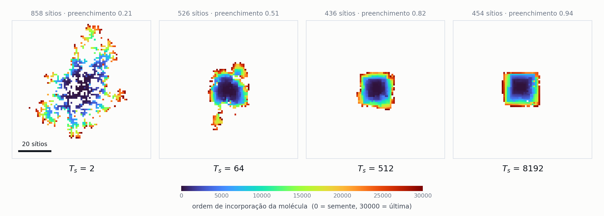
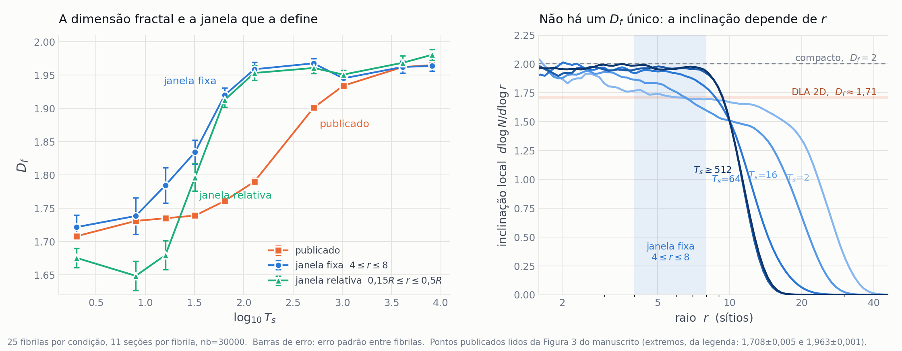

# Relatório — campanha quenched (ER12738)

Resultados do conjunto de dados gerado sob o protocolo de fibra em feixe com
desordem congelada, depois da correção do cálculo de $\sigma$ (`a834c53`) e da
troca do protocolo de carga (§12 da DAG).

| | |
|:--|:--|
| Fibrilas | 2 000 (10 $T_s$ × 200) |
| Realizações | 500 000 (10 $T_s$ × 200 fibrilas × 5 valores de $m$ × 50) |
| Eventos | 79 719 965, dos quais 19 508 453 selecionados |
| Geração | job 576131 no SDumont2, 1 h 43 min, 384 núcleos |
| Verificação | 10 000/10 000 por conteúdo; 0 falhas; 0 claims órfãos |
| Dados | `$DLA_PROJECT/campaign/` (1,7 GB de fratura, 21 GB de fibrilas) |

Este documento cresce por figura. Cada seção traz a imagem, os números, o código
que a produziu, o algoritmo em resumo e as ressalvas.

---

## Figura 1 — o diâmetro da fibrila ao longo do seu eixo


*Painel esquerdo: diâmetro de giração em função da posição ao longo do eixo,
para $T_s$ = 2, 16, 64 e $\geq$ 512. Painel direito: diâmetro na região central
em função de $T_s$. 25 fibrilas por condição; camadas sustentadas por menos de 20
fibrilas (as pontas) foram omitidas. As curvas de $T_s$ = 512 a 8192 se sobrepõem
e por isso recebem um rótulo único.*

### O que o gráfico mostra

**A fibrila não é um cilindro — é um fuso.** Mais grossa na semente ($y = 0$) e
afinando monotonicamente até as pontas, ao longo de ~3 900 sítios de rede. O
perfil é simétrico em torno da semente, o que é esperado para agregação por
difusão a partir de um germe central: a semente teve todo o tempo de deposição
para engrossar, as pontas são recentes.

**A difusão superficial compacta a fibrila.** Do menor ao maior $T_s$ o diâmetro
no miolo cai por um fator de 2,15, enquanto o comprimento cresce apenas 9%. Como
o número de moléculas é fixo em 30 000, o volume ocupado cai por um fator de
$\approx 4{,}2$ — a mesma massa num envelope quatro vezes menor.

**A queda para.** De $T_s = 512$ a 8192, um fator 16 na difusão superficial, o
diâmetro varia 1,2%. As quatro condições do platô são estatisticamente
indistinguíveis entre si, separadas por menos de um erro padrão.

### Valores medidos

Média sobre 25 fibrilas por condição, na região central $|y| \leq 100$. O erro é
o erro padrão **entre fibrilas** — a incerteza correta para comparar condições.
Todas as grandezas em sítios de rede.

| $T_s$ | $d_{gyr}$ | $d_{max}$ | $d_{max}/d_{gyr}$ | comprimento |
|---:|---:|---:|---:|---:|
| 2 | 35,33 ± 0,35 | 66,29 ± 0,92 | 1,876 | 3 571 |
| 8 | 30,75 ± 0,37 | 57,83 ± 0,84 | 1,881 | 3 668 |
| 16 | 26,78 ± 0,38 | 50,90 ± 0,73 | 1,901 | 3 742 |
| 32 | 22,15 ± 0,23 | 43,21 ± 0,76 | 1,951 | 3 768 |
| 64 | 18,95 ± 0,19 | 37,56 ± 0,69 | 1,982 | 3 839 |
| 128 | 17,63 ± 0,18 | 32,90 ± 0,85 | 1,866 | 3 849 |
| **512** | **16,34 ± 0,08** | **28,02 ± 0,29** | **1,714** | 3 922 |
| **1024** | **16,42 ± 0,09** | **28,01 ± 0,21** | **1,706** | 3 892 |
| **4096** | **16,54 ± 0,18** | **29,36 ± 0,72** | **1,774** | 3 864 |
| **8192** | **16,46 ± 0,05** | **28,59 ± 0,22** | **1,737** | 3 894 |

O comprimento é a extensão total em $y$, incluindo as pontas omitidas do gráfico.

**A razão $d_{max}/d_{gyr}$ não é monotônica.** Ela é um índice de irregularidade
da seção: quanto maior, mais a envolvente é ditada por protuberâncias isoladas em
vez do corpo da seção. Sobe até 1,98 em $T_s = 64$ e **cai** para $\approx 1{,}72$
no platô. A superfície fica relativamente mais lisa exatamente onde o tamanho
para de mudar — dois indícios independentes apontando para a mesma transição.

### Código utilizado

| arquivo | papel |
|:--|:--|
| `Code/Data_analysis/fibril_diameter_profile.py` | percorre os compactos e escreve um CSV com uma linha por ($T_s$, camada $y$) |
| `Code/Data_analysis/plot_fibril_diameter.py` | lê o CSV e desenha os dois painéis |
| `Code/Data_analysis/test_fibril_diameter_profile.py` | quatro verificações de geometria com resposta conhecida |

```bash
python3 Code/Data_analysis/fibril_diameter_profile.py \
    --compact-dir $DLA_PROJECT/campaign/fibrils/compact \
    --out-csv     $DLA_PROJECT/campaign/analysis/diameter/profile.csv \
    --fibrils 25

python3 Code/Data_analysis/plot_fibril_diameter.py
```

Commit `2b1ad4c`. A execução completa sobre as dez condições leva **5 segundos**
no nó de login do SDumont2.

### Algoritmo

**Entrada.** A saída *compacta* do gerador, uma linha por molécula
(`uid: id x y z`, com $y$ = base da haste). Cada molécula ocupa 18 camadas
consecutivas, de $y$ a $y+17$, sempre no mesmo par $(x, z)$. Os arquivos
estendidos têm a mesma informação com 18× o tamanho — 1,2 GB contra 20 GB — então
não há motivo para lê-los.

**Acumulação.** Para cada camada é preciso o centroide e a dispersão das
partículas que a ocupam. Materializar as 540 000 partículas de cada fibrila é
desnecessário, porque a variância só depende de somas. O algoritmo faz **18
passagens** — uma por deslocamento dentro da haste — acumulando por camada a
contagem e as somas de $x$, $z$, $x^2$ e $z^2$. Daí saem, em forma fechada:

$$
c = (\langle x\rangle,\ \langle z\rangle), \qquad
\langle |r-c|^2 \rangle = \langle x^2\rangle - \langle x\rangle^2
                        + \langle z^2\rangle - \langle z\rangle^2
$$

$$
d_{gyr} = 2\sqrt{\langle |r-c|^2 \rangle}, \qquad
d_{max} = 2\max|r-c|
$$

O $d_{max}$ exige os extremos e não sai de somas, então custa mais 18 passagens de
máximo. Toda a acumulação usa indexação dispersa do NumPy (`np.add.at`,
`np.maximum.at`), sem laço em Python sobre moléculas.

**Duas definições, de propósito.** O $d_{gyr}$ é um segundo momento: pesa o corpo
da seção e é insensível a uma partícula distante. O $d_{max}$ é fixado pela
partícula mais distante e é a grandeza que os ajustes massa–raio publicados usam.
Para um agregado fractal as duas discordam, e a razão entre elas é informativa
por si — como se vê na coluna $d_{max}/d_{gyr}$.

**Agregação entre fibrilas.** Por coordenada $y$ absoluta. A semente ocupa
$y \in [-9, 8]$ em toda fibrila, então $y = 0$ é uma origem comum genuína, não um
alinhamento imposto.

### Ressalvas

1. **São 25 fibrilas por condição, não as 200 disponíveis.** Suficiente para o
   gráfico e para o erro padrão da tabela, mas o platô merece o ensemble completo
   antes de virar afirmação no manuscrito. O custo é trivial: 5 s viram ~40 s.
2. **Saturação do diâmetro não implica saturação de $D_f$.** São grandezas
   diferentes — uma é tamanho, a outra é dimensão fractal. A coincidência do
   ponto de saturação é sugestiva, não demonstrativa.

### Por que isto importa para a revisão

O manuscrito situa o platô de $D_f$ em $T_s \approx 512$. A Fase A mediu a
cobertura de difusão superficial e mostrou que ela **não** satura ali: apenas 9,8%
das moléculas cobrem o componente acessível em $T_s = 512$, contra 82,9% em 8192
(ver `Reviews/PhaseA_ts_saturation/README.md`). O mecanismo de cobertura,
portanto, não explica o platô — o que enfraquecia a resposta a R1-5 / N12.

Aqui está um observável estrutural independente que satura exatamente onde o
artigo diz, e que **não depende de janela de ajuste por condição** — justamente a
fragilidade identificada nos $D_f$ publicados (§14 da DAG).

---

## Figura 2 — morfologia da seção central e ordem de incorporação



*Segmentos centrais ($|y| \leq 25$) projetados no plano $x$–$z$, para $T_s$ = 2, 64, 512 e 8192. Cada sítio ocupado é pintado com o índice da primeira molécula que o ocupou, de modo que a cor lê "quando esta coluna foi construída". **Os quatro painéis compartilham a mesma escala espacial**; a barra no primeiro painel mede 20 sítios de rede. Sementes 100000, 104000, 106000 e 109000.*

Reproduz a Figura 2 do manuscrito a partir das fibrilas da campanha nova.

### O que o gráfico mostra

A transição descrita no artigo aparece igual: morfologia **esparsa e irregular**
em $T_s$ baixo, passando por densa com protuberâncias, até **empacotamento denso
e radialmente simétrico** em $T_s$ alto. A fração de preenchimento da caixa
envolvente quantifica isso.

| $T_s$ | sítios ocupados | preenchimento |
|---:|---:|---:|
| 2 | 858 | 0,21 |
| 64 | 526 | 0,51 |
| 512 | 436 | 0,82 |
| 8192 | 454 | 0,94 |

O gradiente de cor mostra o mecanismo. Em $T_s = 2$ as moléculas antigas (azul)
formam um esqueleto ramificado e as recentes (vermelho) se depositam nas pontas
dos braços, sem preencher os vãos — é blindagem difusiva clássica. Em
$T_s = 8192$ o núcleo antigo é compacto e as moléculas recentes formam uma
**casca externa contínua**: a difusão superficial permite que a molécula desça
para os vãos antes de fixar, então o crescimento é camada a camada em vez de
dendrítico.

### Diferença deliberada em relação à figura publicada

Na figura do artigo cada painel parece normalizado ao próprio tamanho, o que faz
os quatro aparentarem largura semelhante e **esconde a compactação**. Aqui a
escala é comum: $T_s = 2$ preenche o quadro e $T_s = 8192$ ocupa cerca de um
terço dele.

Isso mantém a Figura 2 consistente com a Figura 1, que mede a mesma compactação
como número. Com escala independente por painel, as duas figuras diriam coisas
diferentes sobre o mesmo fenômeno.

### Código utilizado

| arquivo | papel |
|:--|:--|
| `Code/Data_analysis/plot_central_sections.py` | lê os compactos, recorta a fatia central e desenha os quatro painéis |

```bash
python3 Code/Data_analysis/plot_central_sections.py
```

Reusa `read_compact` de `fibril_diameter_profile.py`.

### Algoritmo

**Recorte.** Molécula entra no painel se a base da haste satisfaz
$|y| \leq 25$. Cada molécula guarda o seu índice de chegada — a ordem em que o
gerador a ligou ao agregado, de 0 (semente) a 30 000.

**Projeção.** Uma coluna $(x, z)$ pode ser ocupada por várias moléculas em
alturas diferentes. O sítio recebe o índice da **primeira** a ocupá-lo. Na
implementação, os índices são ordenados de forma decrescente antes da escrita na
grade, de modo que o menor é o último a ser gravado e vence.

**Preenchimento.** Razão entre sítios ocupados e a área da caixa envolvente da
fatia, $(\Delta x + 1)(\Delta z + 1)$.

### Escolhas que precisam ser declaradas se a figura for para o manuscrito

1. **A espessura da fatia não é neutra.** A legenda original diz "segmento
   central" sem quantificar. Em $|y| \leq 25$ o preenchimento vai de 0,21 a 0,94;
   em $|y| \leq 400$ vai de 0,52 a 0,90 e os braços dendríticos desaparecem —
   uma fatia grossa empasta a projeção e destrói justamente o contraste que a
   figura existe para mostrar. Foi por isso que se escolheu 25.
2. **As sementes são as primeiras de cada condição, não escolhidas.** Convém
   verificar se são representativas do ensemble antes da publicação; se forem
   selecionadas, a seleção precisa ser declarada.
3. **Mapa de cores.** Usa-se `turbo` em vez de `jet` — mesma aparência azul→
   vermelho, sem as bandas falsas que o `jet` introduz.

---

## Figura 3 — dimensão fractal e a janela que a define



*Painel (a): $D_f$ em função de $\log_{10} T_s$, calculado a partir das fibrilas da campanha sob duas regras de janela de ajuste, contra os pontos publicados. Painel (b): inclinação local $d\log N/d\log r$ da curva massa–raio média, para cinco condições; a faixa marca a janela fixa usada em (a). 25 fibrilas por condição, 11 seções por fibrila. Barras de erro: erro padrão entre fibrilas.*

Análoga à Figura 3 do manuscrito. **O resultado não é uma reprodução limpa**, e a
diferença é o conteúdo desta seção.

### O que o gráfico mostra

**Os extremos reproduzem; o meio da curva, não.**

| $T_s$ | publicado | janela fixa $4\leq r\leq 8$ | janela relativa $0{,}15R\leq r\leq 0{,}5R$ |
|---:|---:|---:|---:|
| 2 | 1,708 | 1,722 ± 0,018 | 1,676 ± 0,014 |
| 8 | 1,731 | 1,738 ± 0,028 | 1,649 ± 0,022 |
| 16 | 1,735 | 1,784 ± 0,026 | 1,680 ± 0,021 |
| 32 | 1,739 | 1,834 ± 0,018 | 1,797 ± 0,021 |
| 64 | 1,761 | **1,920 ± 0,011** | **1,913 ± 0,011** |
| 128 | 1,790 | **1,959 ± 0,010** | **1,953 ± 0,011** |
| 512 | 1,901 | 1,968 ± 0,007 | 1,961 ± 0,008 |
| 1024 | 1,934 | 1,945 ± 0,006 | 1,951 ± 0,007 |
| 4096 | 1,962 | 1,962 ± 0,009 | 1,968 ± 0,011 |
| 8192 | 1,965 | 1,964 ± 0,007 | 1,981 ± 0,008 |

Em $T_s = 64$ e 128 a diferença chega a **0,16 — dezesseis vezes a barra de
erro**. As duas regras de janela que testei concordam entre si e discordam da
publicada exatamente na mesma região.

**A consequência é o ponto de saturação.** Com janela fixa ou relativa, $D_f$
satura por volta de $T_s = 128$; os pontos publicados só saturam perto de 4096.
A afirmação de onde o platô começa muda conforme a janela.

### Por que acontece — painel (b)

A inclinação local da curva massa–raio **não é constante**. Há um patamar em $r$
pequeno e um colapso quando $r$ se aproxima do raio da seção. E esse raio cai de
33 para 14 sítios ao longo da grade (coluna $R$ da tabela de diagnóstico).

Uma janela de ajuste, portanto, **amostra partes diferentes da curva em condições
diferentes**. Em $T_s$ alto, $r = 8$ já está na borda do colapso; em $T_s = 2$,
ainda está no patamar. Um ajuste linear único sobre curvas que mudam de forma só
produz um número estável se a janela for reescolhida por condição — que é
precisamente o que o projeto xmgrace do artigo faz.

Medida por oitava de $r$, a inclinação deixa claro que não existe um expoente
único a ser extraído:

| $T_s$ | $R$ | 2–4 | 4–8 | 8–16 | 16–32 |
|---:|---:|---:|---:|---:|---:|
| 2 | 32,2 | 1,82 | 1,72 | 1,72 | 1,11 |
| 64 | 18,8 | 1,96 | 1,91 | 1,23 | 0,05 |
| 8192 | 14,2 | 1,94 | 1,98 | 1,09 | 0,00 |

Em $T_s = 2$ há de fato um platô de escala entre $r = 4$ e 16, e ele cai em 1,72
— o valor de DLA bidimensional. Em $T_s = 8192$ não há platô algum: a curva sai
de 2,0 direto para o colapso, porque a fibrila tem raio 14 e não sobra década de
escala nenhuma.

### Código utilizado

| arquivo | papel |
|:--|:--|
| `Code/Data_analysis/df_fit_windows.py` | calcula $D_f$ por fibrila sob três regras de janela e salva as curvas médias |
| `Code/Data_analysis/plot_df_vs_ts.py` | desenha os dois painéis |

```bash
python3 Code/Data_analysis/df_fit_windows.py 25
python3 Code/Data_analysis/plot_df_vs_ts.py
```

Reusa `parse_grown_sections` e `mass_radius_for_sections` de
`validate_fractal_proxy.py`, de modo que a amostragem de seções e a contagem de
massa são **idênticas às do pipeline publicado**. A execução leva 7 s.

### Algoritmo

**Seções.** 11 seções transversais por fibrila, em $y = -90, -72, \ldots, 90$.
Como as seções distam 18 e as hastes têm comprimento 18, cada molécula
intersecta exatamente uma seção.

**Curva massa–raio.** Para cada seção, calcula-se o centroide e ordenam-se as
distâncias das partículas a ele; $N(r)$ é o número de partículas dentro do raio
$r$, obtido por busca binária no vetor ordenado. A curva da fibrila é a média das
11 seções, sobre uma grade de 96 raios log-espaçados de 1 a 64.

**Ajuste.** $D_f$ é a inclinação de $\log N$ contra $\log r$ por mínimos
quadrados dentro da janela. Três regras foram avaliadas:

- **fixa estreita**, $4 \leq r \leq 8$ — a mesma para todas as condições;
- **fixa larga**, $2 \leq r \leq 16$ — igualmente uniforme, mas atravessando o
  colapso nas condições compactas; produz uma curva quase plana (1,74 a 1,81) e
  nenhuma transição visível;
- **relativa**, $0{,}15R \leq r \leq 0{,}5R$, com $R$ o raio médio das seções
  daquela fibrila — escala com o tamanho, então amostra a mesma parte da curva em
  toda condição.

**Agregação.** Média e erro padrão **entre fibrilas**, não entre seções — é a
incerteza que permite comparar condições.

### Ressalvas

1. **Nenhuma destas janelas é "a correta".** Elas são defensáveis por serem
   aplicadas uniformemente. O ponto desta seção não é que se encontrou o $D_f$
   verdadeiro, e sim que **não existe um**: a escolha de janela move a conclusão
   sobre onde o platô começa.
2. **Os pontos publicados intermediários foram lidos da imagem da Figura 3**, com
   incerteza de transcrição de ~0,005. Apenas os extremos (1,708 ± 0,005 e
   1,963 ± 0,001) vêm da legenda e são exatos. A discrepância de 0,16 é grande
   demais para ser transcrição, mas os valores intermediários merecem conferência
   contra a fonte antes de entrarem na resposta aos revisores.
3. **As fibrilas são novas.** Sementes diferentes das publicadas, gerador com o
   viés azimutal corrigido. A comparação é de ensembles, não fibrila a fibrila.

### Por que isto importa para a revisão

Fecha a pendência **N7** com evidência quantitativa em vez de suspeita. A §14 da
DAG registrou que os $D_f$ publicados dependem de uma janela por condição e que a
afirmação de saturação não poderia ser separada dessa escolha sem reanálise. A
reanálise está feita: a escolha de janela desloca o ponto de saturação de ~128
para ~4096.

E o resultado é **consistente com a Figura 1**. O diâmetro satura em
$T_s = 512$; $D_f$ sob janela uniforme satura em $T_s \approx 128$. Duas medidas
estruturais independentes apontam para a região 128–512. A curva publicada, que
satura perto de 4096, é a que destoa.

---

*Próximas figuras entram abaixo.*
