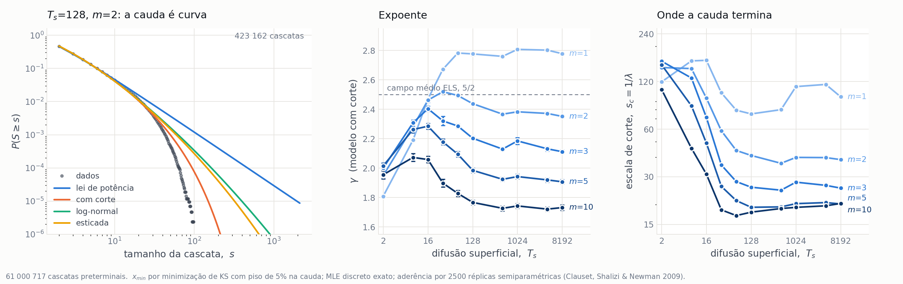

# Relatório — campanha quenched (ER12738)

Resultados do conjunto de dados gerado sob o protocolo de fibra em feixe com desordem congelada, depois da correção do cálculo de $\sigma$ (`a834c53`) e da troca do protocolo de carga (§12 da DAG).

| | |
|:--|:--|
| Fibrilas | 2 000 (10 $T_s$ × 200) |
| Realizações | 500 000 (10 $T_s$ × 200 fibrilas × 5 valores de $m$ × 50) |
| Eventos | 79 719 965, dos quais 19 508 453 selecionados |
| Geração | job 576131 no SDumont2, 1 h 43 min, 384 núcleos |
| Verificação | 10 000/10 000 por conteúdo; 0 falhas; 0 claims órfãos |
| Dados | `$DLA_PROJECT/campaign/` (1,7 GB de fratura, 21 GB de fibrilas) |

Este documento cresce por figura. Cada seção traz a imagem, os números, o código que a produziu, o algoritmo em resumo e as ressalvas.

---

## Figura 1 — o diâmetro da fibrila ao longo do seu eixo


*Painel esquerdo: diâmetro de giração em função da posição ao longo do eixo, para $T_s$ = 2, 16, 64 e $\geq$ 512. Painel direito: diâmetro na região central em função de $T_s$. 25 fibrilas por condição; camadas sustentadas por menos de 20 fibrilas (as pontas) foram omitidas. As curvas de $T_s$ = 512 a 8192 se sobrepõem e por isso recebem um rótulo único.*

### O que o gráfico mostra

**A fibrila não é um cilindro — é um fuso.** Mais grossa na semente ($y = 0$) e afinando monotonicamente até as pontas, ao longo de ~3 900 sítios de rede. O perfil é simétrico em torno da semente, o que é esperado para agregação por difusão a partir de um germe central: a semente teve todo o tempo de deposição para engrossar, as pontas são recentes.

**A difusão superficial compacta a fibrila.** Do menor ao maior $T_s$ o diâmetro no miolo cai por um fator de 2,15, enquanto o comprimento cresce apenas 9%. Como o número de moléculas é fixo em 30 000, o volume ocupado cai por um fator de $\approx 4{,}2$ — a mesma massa num envelope quatro vezes menor.

**A queda para.** De $T_s = 512$ a 8192, um fator 16 na difusão superficial, o diâmetro varia 1,2%. As quatro condições do platô são estatisticamente indistinguíveis entre si, separadas por menos de um erro padrão.

### Valores medidos

Média sobre 25 fibrilas por condição, na região central $|y| \leq 100$. O erro é o erro padrão **entre fibrilas** — a incerteza correta para comparar condições. Todas as grandezas em sítios de rede.

| $T_s$ | $d_{gyr}$ | $d_{max}$ | $d_{max}/d_{gyr}$ | comprimento |
|---:|---:|---:|---:|---:|
| 2 | 35,33 ± 0,35 | 66,29 ± 0,92 | 1,876 | 3 571 |
| 8 | 30,75 ± 0,37 | 57,83 ± 0,84 | 1,881 | 3 668 |
| 16 | 26,78 ± 0,38 | 50,90 ± 0,73 | 1,901 | 3 742 |
| 32 | 22,15 ± 0,23 | 43,21 ± 0,76 | 1,951 | 3 768 |
| 64 | 18,95 ± 0,19 | 37,56 ± 0,69 | 1,982 | 3 839 |
| 128 | 17,63 ± 0,18 | 32,90 ± 0,85 | 1,866 | 3 849 |
| **512** | **16,34 ± 0,08** | **28,02 ± 0,29** | **1,714** | 3 922 |
| **1024** | **16,42 ± 0,09** | **28,01 ± 0,21** | **1,706** | 3 892 |
| **4096** | **16,54 ± 0,18** | **29,36 ± 0,72** | **1,774** | 3 864 |
| **8192** | **16,46 ± 0,05** | **28,59 ± 0,22** | **1,737** | 3 894 |

O comprimento é a extensão total em $y$, incluindo as pontas omitidas do gráfico.

**A razão $d_{max}/d_{gyr}$ não é monotônica.** Ela é um índice de irregularidade da seção: quanto maior, mais a envolvente é ditada por protuberâncias isoladas em vez do corpo da seção. Sobe até 1,98 em $T_s = 64$ e **cai** para $\approx 1{,}72$ no platô. A superfície fica relativamente mais lisa exatamente onde o tamanho para de mudar — dois indícios independentes apontando para a mesma transição.

### Código utilizado

| arquivo | papel |
|:--|:--|
| `Code/Data_analysis/fibril_diameter_profile.py` | percorre os compactos e escreve um CSV com uma linha por ($T_s$, camada $y$) |
| `Code/Data_analysis/plot_fibril_diameter.py` | lê o CSV e desenha os dois painéis |
| `Code/Data_analysis/test_fibril_diameter_profile.py` | quatro verificações de geometria com resposta conhecida |

```bash
python3 Code/Data_analysis/fibril_diameter_profile.py \
    --compact-dir $DLA_PROJECT/campaign/fibrils/compact \
    --out-csv     $DLA_PROJECT/campaign/analysis/diameter/profile.csv \
    --fibrils 25

python3 Code/Data_analysis/plot_fibril_diameter.py
```

Commit `2b1ad4c`. A execução completa sobre as dez condições leva **5 segundos**
no nó de login do SDumont2.

### Algoritmo

**Entrada.** A saída *compacta* do gerador, uma linha por molécula (`uid: id x y z`, com $y$ = base da haste). Cada molécula ocupa 18 camadas consecutivas, de $y$ a $y+17$, sempre no mesmo par $(x, z)$. Os arquivos estendidos têm a mesma informação com 18× o tamanho — 1,2 GB contra 20 GB — então não há motivo para lê-los.

**Acumulação.** Para cada camada é preciso o centroide e a dispersão das partículas que a ocupam. Materializar as 540 000 partículas de cada fibrila é desnecessário, porque a variância só depende de somas. O algoritmo faz **18 passagens** — uma por deslocamento dentro da haste — acumulando por camada a contagem e as somas de $x$, $z$, $x^2$ e $z^2$. Daí saem, em forma fechada:

$$
c = (\langle x\rangle,\ \langle z\rangle), \qquad
\langle |r-c|^2 \rangle = \langle x^2\rangle - \langle x\rangle^2
                        + \langle z^2\rangle - \langle z\rangle^2
$$

$$
d_{gyr} = 2\sqrt{\langle |r-c|^2 \rangle}, \qquad
d_{max} = 2\max|r-c|
$$

O $d_{max}$ exige os extremos e não sai de somas, então custa mais 18 passagens de máximo. Toda a acumulação usa indexação dispersa do NumPy (`np.add.at`, `np.maximum.at`), sem laço em Python sobre moléculas.

**Duas definições, de propósito.** O $d_{gyr}$ é um segundo momento: pesa o corpo
da seção e é insensível a uma partícula distante. O $d_{max}$ é fixado pela
partícula mais distante e é a grandeza que os ajustes massa–raio publicados usam.
Para um agregado fractal as duas discordam, e a razão entre elas é informativa
por si — como se vê na coluna $d_{max}/d_{gyr}$.

**Agregação entre fibrilas.** Por coordenada $y$ absoluta. A semente ocupa
$y \in [-9, 8]$ em toda fibrila, então $y = 0$ é uma origem comum genuína, não um
alinhamento imposto.

### Ressalvas

1. **São 25 fibrilas por condição, não as 200 disponíveis.** Suficiente para o
   gráfico e para o erro padrão da tabela, mas o platô merece o ensemble completo
   antes de virar afirmação no manuscrito. O custo é trivial: 5 s viram ~40 s.
2. **Saturação do diâmetro não implica saturação de $D_f$.** São grandezas
   diferentes — uma é tamanho, a outra é dimensão fractal. A coincidência do
   ponto de saturação é sugestiva, não demonstrativa.

### Por que isto importa para a revisão

O manuscrito situa o platô de $D_f$ em $T_s \approx 512$. A Fase A mediu a
cobertura de difusão superficial e mostrou que ela **não** satura ali: apenas 9,8%
das moléculas cobrem o componente acessível em $T_s = 512$, contra 82,9% em 8192
(ver `Reviews/PhaseA_ts_saturation/README.md`). O mecanismo de cobertura,
portanto, não explica o platô — o que enfraquecia a resposta a R1-5 / N12.

Aqui está um observável estrutural independente que satura exatamente onde o
artigo diz, e que **não depende de janela de ajuste por condição** — justamente a
fragilidade identificada nos $D_f$ publicados (§14 da DAG).

---

## Figura 2 — morfologia da seção central e ordem de incorporação


*Segmentos centrais ($|y| \leq 25$) projetados no plano $x$–$z$, para $T_s$ = 2, 64, 512 e 8192. Cada sítio ocupado é pintado com o índice da primeira molécula que o ocupou, de modo que a cor lê "quando esta coluna foi construída". **Os quatro painéis compartilham a mesma escala espacial**; a barra no primeiro painel mede 20 sítios de rede. Sementes 100000, 104000, 106000 e 109000.*

Reproduz a Figura 2 do manuscrito a partir das fibrilas da campanha nova.

### O que o gráfico mostra

A transição descrita no artigo aparece igual: morfologia **esparsa e irregular** em $T_s$ baixo, passando por densa com protuberâncias, até **empacotamento denso e radialmente simétrico** em $T_s$ alto. A fração de preenchimento da caixa envolvente quantifica isso.

| $T_s$ | sítios ocupados | preenchimento |
|---:|---:|---:|
| 2 | 858 | 0,21 |
| 64 | 526 | 0,51 |
| 512 | 436 | 0,82 |
| 8192 | 454 | 0,94 |

O gradiente de cor mostra o mecanismo. Em $T_s = 2$ as moléculas antigas (azul) formam um esqueleto ramificado e as recentes (vermelho) se depositam nas pontas dos braços, sem preencher os vãos — é blindagem difusiva clássica. Em $T_s = 8192$ o núcleo antigo é compacto e as moléculas recentes formam uma **casca externa contínua**: a difusão superficial permite que a molécula desça para os vãos antes de fixar, então o crescimento é camada a camada em vez de dendrítico.

### Diferença deliberada em relação à figura publicada

Na figura do artigo cada painel parece normalizado ao próprio tamanho, o que faz os quatro aparentarem largura semelhante e **esconde a compactação**. Aqui a escala é comum: $T_s = 2$ preenche o quadro e $T_s = 8192$ ocupa cerca de um terço dele.

Isso mantém a Figura 2 consistente com a Figura 1, que mede a mesma compactação como número. Com escala independente por painel, as duas figuras diriam coisas diferentes sobre o mesmo fenômeno.

### Código utilizado

| arquivo | papel |
|:--|:--|
| `Code/Data_analysis/plot_central_sections.py` | lê os compactos, recorta a fatia central e desenha os quatro painéis |

```bash
python3 Code/Data_analysis/plot_central_sections.py
```

Reusa `read_compact` de `fibril_diameter_profile.py`.

### Algoritmo

**Recorte.** Molécula entra no painel se a base da haste satisfaz $|y| \leq 25$. Cada molécula guarda o seu índice de chegada — a ordem em que o gerador a ligou ao agregado, de 0 (semente) a 30 000.

**Projeção.** Uma coluna $(x, z)$ pode ser ocupada por várias moléculas em alturas diferentes. O sítio recebe o índice da **primeira** a ocupá-lo. Na implementação, os índices são ordenados de forma decrescente antes da escrita na grade, de modo que o menor é o último a ser gravado e vence.

**Preenchimento.** Razão entre sítios ocupados e a área da caixa envolvente da fatia, $(\Delta x + 1)(\Delta z + 1)$.

### Escolhas que precisam ser declaradas se a figura for para o manuscrito

1. **A espessura da fatia não é neutra.** A legenda original diz "segmento central" sem quantificar. Em $|y| \leq 25$ o preenchimento vai de 0,21 a 0,94; em $|y| \leq 400$ vai de 0,52 a 0,90 e os braços dendríticos desaparecem — uma fatia grossa empasta a projeção e destrói justamente o contraste que a figura existe para mostrar. Foi por isso que se escolheu 25. 
2. **As sementes são as primeiras de cada condição, não escolhidas.** Convém verificar se são representativas do ensemble antes da publicação; se forem selecionadas, a seleção precisa ser declarada.
3. **Mapa de cores.** Usa-se `turbo` em vez de `jet` — mesma aparência azul→vermelho, sem as bandas falsas que o `jet` introduz.

---

## Figura 3 — compactação da seção transversal


*Painel (a): densidade local $\rho(r)=N(r)/\pi r^2$ das seções transversais; cada curva termina em $R/2$, o maior raio ainda dentro do corpo da sua condição. Painel (b): coordenação — fração dos 4 vizinhos de rede ocupados. Painel (c): razão $\rho(3)/\rho(R/2)$, que vale 1 para densidade uniforme. 25 fibrilas por condição, 11 seções por fibrila. Barras de erro: erro padrão entre fibrilas.*

**Nenhuma grandeza desta figura envolve ajuste de reta ou janela de escala.** Essa é a razão de ela existir — ver a subseção final.

### O que o gráfico mostra

**Painel (a) é o mecanismo.** Um objeto compacto tem densidade uniforme: $\rho(r)$ é uma reta horizontal. Um fractal de dimensão $D$ tem $\rho \sim r^{D-2}$, isto é, densidade que **cai** conforme se olha mais longe, porque há buracos em toda escala. Em $T_s = 2$ a curva desce de 0,31 a 0,18; em $T_s \geq 512$ ela é plana. A transição de fractal para compacto se lê direto, sem ajustar nada.

**Painel (b) é o empacotamento local.** A coordenação não usa centroide, raio nem janela — só conta quantos dos 4 vizinhos de rede estão ocupados. Vai de 0,34 a 0,76: em $T_s$ baixo uma molécula tem em média 1,4 vizinhos, em $T_s$ alto tem 3,0.

**Painel (c) mede quanto ainda resta de fractal.** A razão $\rho(3)/\rho(R/2)$ vale 1 se a densidade for uniforme e cresce conforme a estrutura fica rarefeita para fora. Cai de 1,68 para 1,02 e fica **indistinguível de compacto a partir de $T_s = 128$**.

### Valores medidos

| $T_s$ | $R$ | coordenação | $\rho(3)/\rho(R/2)$ | $D$ implícito |
|---:|---:|---:|---:|---:|
| 2 | 33,1 | 0,342 ± 0,001 | 1,683 ± 0,034 | 1,695 |
| 8 | 29,0 | 0,439 ± 0,001 | 1,679 ± 0,047 | 1,671 |
| 16 | 25,5 | 0,514 ± 0,002 | 1,527 ± 0,045 | 1,707 |
| 32 | 21,6 | 0,591 ± 0,002 | 1,311 ± 0,035 | 1,789 |
| 64 | 18,8 | 0,656 ± 0,001 | 1,130 ± 0,016 | 1,893 |
| 128 | 16,5 | 0,693 ± 0,001 | 1,065 ± 0,016 | 1,938 |
| 512 | 14,0 | 0,736 ± 0,001 | 1,034 ± 0,008 | 1,961 |
| 1024 | 14,0 | 0,750 ± 0,001 | 1,041 ± 0,005 | 1,952 |
| 4096 | 14,7 | 0,757 ± 0,001 | 1,033 ± 0,013 | 1,964 |
| 8192 | 14,3 | 0,760 ± 0,001 | 1,018 ± 0,007 | 1,979 |

A coluna final não é um ajuste. Como $\rho \sim r^{D-2}$, a razão de duas densidades medidas implica

$$ D = 2 + \frac{\ln\left[\rho(3)/\rho(R/2)\right]}{\ln\left(6/R\right)} $$

**E o resultado bate com o ajuste.** O $D$ implícito dá 1,695 em $T_s = 2$ e 1,979 em 8192, contra 1,722 e 1,964 obtidos por regressão sobre a janela fixa. Ou seja: ao trocar $D_f$ por compactação **não se está abandonando a física, e sim medindo-a sem a escolha livre**. É um argumento bem mais forte perante um revisor do que mudar de assunto.

Note também que os dois observáveis não saturam no mesmo ponto. A razão de densidade estabiliza em $T_s = 128$; a coordenação continua subindo devagar até o topo da grade (0,736 → 0,760 de 512 a 8192, uma variação de 3,3%). São coisas diferentes: a primeira diz que acabou o regime fractal, a segunda que o empacotamento local ainda melhora um pouco depois disso.

### Código utilizado

| arquivo | papel |
|:--|:--|
| `Code/Data_analysis/fibril_compaction.py` | calcula coordenação, perfil de densidade e razão por fibrila |
| `Code/Data_analysis/plot_fibril_compaction.py` | desenha os três painéis |

```bash
python3 Code/Data_analysis/fibril_compaction.py 25
python3 Code/Data_analysis/plot_fibril_compaction.py
```

Reusa `parse_grown_sections` e `mass_radius_for_sections` de `validate_fractal_proxy.py`, então a amostragem de seções é idêntica à do pipeline publicado. A execução leva 12 s.

### Algoritmo

**Coordenação.** Para cada seção, monta-se o conjunto de sítios $(x,z)$ ocupados e conta-se, para cada sítio, quantos dos 4 vizinhos de rede estão no conjunto. O valor é a soma dividida por $4N$. Uma partícula isolada dá 0; uma no interior de um sólido dá 1. Não há parâmetro algum.

**Densidade local.** A partir da curva massa–raio $N(r)$ de cada seção, $\rho(r) = N(r)/\pi r^2$. Os perfis são interpolados em $r/R$ antes de serem promediados, para que condições de tamanhos diferentes sejam comparáveis.

**Razão.** Avaliada entre $r = 3$ — o corte de rede, abaixo do qual se contam pixels e não estrutura — e $r = R/2$, o maior raio cujo círculo ainda está dentro do corpo da seção. Acima de $R/2$ o círculo começa a sair do objeto e $\rho$ cai por motivo geométrico trivial, não por fractalidade.

### Ressalvas

1. **A razão não é totalmente livre de escolhas.** Ela usa $r=3$ e $r=R/2$. A diferença em relação ao ajuste de $D_f$ é que ambas são principiadas (corte de rede; metade do objeto), aplicadas uniformemente, e o resultado é uma razão entre duas densidades **medidas** — não a inclinação de uma reta ajustada onde não há lei de potência. A coordenação, essa sim, não tem escolha nenhuma.
2. **A coordenação é sensível à rede.** Ela é natural aqui porque o modelo é de rede, mas não tem análogo direto em dados experimentais.

### Por que não uma figura de $D_f$


*Material de apoio, mantido como evidência da pendência N7.*

A dimensão fractal só existe se a inclinação de $\log N$ contra $\log r$ for constante ao longo de um intervalo de $r$. Essa constância **é** a definição. Toda medida tem dois cortes: embaixo a rede ($r \gtrsim 3$), em cima o próprio objeto ($r \lesssim R/2$). O que sobra nas nossas fibrilas:

| $T_s$ | $R$ | intervalo utilizável | décadas |
|---:|---:|:--|---:|
| 2 | 33 | 3 → 17 | 0,74 |
| 64 | 19 | 3 → 9 | 0,50 |
| 8192 | 14 | 3 → 7 | 0,38 |

Ajustar um expoente de lei de potência sobre um fator 2,4 não é medir. O padrão da área pede ao menos uma década.

A consequência é mensurável. Recalculando $D_f$ sobre as fibrilas da campanha, os extremos reproduzem o publicado (1,722 contra 1,708; 1,964 contra 1,965) mas o meio não: em $T_s = 64$ e 128 a diferença chega a **0,16, dezesseis vezes a barra de erro**, e duas regras de janela uniformes concordam entre si enquanto discordam da publicada no mesmo lugar.

| $T_s$ | publicado | janela fixa $4\leq r\leq 8$ | janela relativa $0{,}15R\leq r\leq 0{,}5R$ |
|---:|---:|---:|---:|
| 2 | 1,708 | 1,722 ± 0,018 | 1,676 ± 0,014 |
| 32 | 1,739 | 1,834 ± 0,018 | 1,797 ± 0,021 |
| 64 | 1,761 | **1,920 ± 0,011** | **1,913 ± 0,011** |
| 128 | 1,790 | **1,959 ± 0,010** | **1,953 ± 0,011** |
| 512 | 1,901 | 1,968 ± 0,007 | 1,961 ± 0,008 |
| 8192 | 1,965 | 1,964 ± 0,007 | 1,981 ± 0,008 |

Isso desloca o **ponto de saturação**: sob janela uniforme $D_f$ satura perto de $T_s = 128$, contra ~4096 nos pontos publicados. Fecha a pendência **N7** com medição em vez de suspeita.

Os pontos publicados intermediários foram lidos da imagem da Figura 3, com incerteza de transcrição de ~0,005; apenas os extremos (1,708 ± 0,005 e 1,963 ± 0,001) vêm da legenda. A discrepância de 0,16 é grande demais para ser transcrição, mas os valores merecem conferência contra a fonte antes de entrarem na carta-resposta.

**O que fica no lugar da afirmação atual.** Não "$D_f$ cresce de 1,71 a 1,96", que sugere um expoente variando continuamente, e sim: em $T_s$ baixo a seção é um agregado DLA bidimensional com $D_f \approx 1{,}71$ sobre um intervalo de escala real — o valor que a geometria de crescimento prevê, sem ajuste de nada; conforme $T_s$ cresce, **o intervalo de escala encolhe até desaparecer** e a seção passa a ser compacta. A transição é a perda do regime fractal, e é isso que a Figura 3 mede.

### Por que isto importa para a revisão

As três figuras passam a contar a mesma história por caminhos independentes e sem parâmetro livre: o diâmetro cai e satura (Figura 1), a fração de preenchimento sobe de 0,21 a 0,94 (Figura 2), a densidade deixa de decair e a coordenação dobra (Figura 3). A região de transição é 128–512 nas três.

Um teste que resolveria a questão de $D_f$ em definitivo, se for desejado: gerar fibrilas maiores. Se o problema é o intervalo de escala curto, aumentar $R$ de 33 para ~100 — cerca de 7× mais moléculas, viável com o `fast_dla2` — deve alargar o platô. Se $D_f$ convergir, ótimo; se o platô continuar ausente em $T_s$ alto, confirma-se que não há fractal ali e a releitura acima vira conclusão, não alternativa.

---

## Figura 4 — estatística das cascatas



*Painel (a): função de sobrevivência do tamanho de cascata em $T_s$=128, $m$=2, com as quatro famílias da Tabela 1 de Clauset ajustadas ao mesmo suporte (a exponencial é omitida do desenho — é a única que a lei de potência vence). Painéis (b) e (c): expoente e escala de corte do modelo com corte, por condição. 61 000 717 cascatas preterminais; 200 fibrilas × 50 realizações por condição. Barras: bootstrap de blocos por fibrila.*

### A definição adotada

**A cascata é o observável primário**: tudo que é removido numa mesma elevação quase-estática de carga, até o sistema reestabilizar, incluindo as hastes que perdem o caminho de carga por consequência. É `total_deleted_rods` no esquema legado.

Três razões. Ela é **livre de parâmetro** — determinada pelo modelo, não por escolha do operador, ao contrário do protocolo recozido, onde a avalanche era definida por $\Delta F$ e a estatística era propriedade do $\Delta F$ e não da fibrila (§12 da DAG). Ela é a **unidade causal** — partes espacialmente separadas de uma mesma cascata foram causalmente ligadas, e particioná-las por geometria descarta esse vínculo. E é o que **"avalanche" significa na literatura de fiber bundle**, o que dá teoria com que comparar.

A decomposição em aglomerados conexos (`avalanche_sizes`) permanece nos dados como diagnóstico de localização do dano — 12% a 25% das cascatas se partem em mais de um aglomerado — mas não é o estimando primário.

**A cascata terminal é excluída.** É a ruptura catastrófica final, uma por realização, com tamanho típico de centenas contra a média de ~11 das preterminais. Incluí-la engorda a cauda artificialmente.

### O resultado principal: a lei de potência pura é rejeitada

Seguindo a Box 1 de `Bibliograph/Clauset2009.md` — $x_{\min}$ e $\gamma$ por máxima verossimilhança, aderência por bootstrap semiparamétrico, comparação com alternativas por razão de verossimilhança:

| | de 50 condições |
|:--|--:|
| Lei de potência pura **rejeitada** ($p \leq 0{,}1$) | **48** |
| Plausível ($p > 0{,}1$) | 2 |

As duas sobreviventes ($T_s$=128 e 8192 em $m$=10) têm $p$ = 0,106 e 0,123 — no fio do limiar — e mesmo nelas há alternativas favorecidas. Nas outras 48 o $p$ é 0,000: **nenhuma** das 2500 amostras sintéticas teve KS pior que o observado.

### Mas o substituto não é único

| alternativa | favorecida | lei de potência favorecida |
|:--|--:|--:|
| log-normal | **49** | 0 |
| exponencial esticada | **49** | 0 |
| lei de potência com corte | ~todas | — |
| exponencial | 1 | **47** |

Este é exatamente o cenário da Tabela 4 de Clauset: *"with cut-off ... however, some of the alternative distributions are also good fits, such as the log-normal or the stretched exponential distribution."*

**O que os dados sustentam:** a distribuição **não é lei de potência pura**, é **mais pesada que exponencial**, e três famílias de cauda curva a descrevem de forma indistinguível entre si. O painel (a) mostra isso — as três curvam junto com os dados enquanto a lei pura dispara sozinha.

**O que os dados não sustentam:** afirmar que é "lei de potência com corte". Essa família ajusta bem, mas não melhor que log-normal ou esticada.

### Expoente do modelo com corte

$\gamma$, com erro padrão de bootstrap de blocos por fibrila:

| $T_s$ | $m$=1 | $m$=2 | $m$=3 | $m$=5 | $m$=10 |
|---:|---:|---:|---:|---:|---:|
| 2 | 1.808 ± 0.011 | 1.950 ± 0.015 | 2.001 ± 0.018 | 2.015 ± 0.021 | 1.955 ± 0.028 |
| 8 | 2.191 ± 0.010 | 2.282 ± 0.013 | 2.308 ± 0.018 | 2.262 ± 0.022 | 2.073 ± 0.026 |
| 16 | 2.470 ± 0.008 | 2.462 ± 0.015 | 2.404 ± 0.017 | 2.285 ± 0.020 | 2.058 ± 0.022 |
| 32 | 2.672 ± 0.009 | 2.519 ± 0.014 | 2.321 ± 0.032 | 2.179 ± 0.020 | 1.898 ± 0.027 |
| 64 | 2.783 ± 0.009 | 2.494 ± 0.013 | 2.286 ± 0.014 | 2.095 ± 0.018 | 1.828 ± 0.021 |
| 128 | 2.776 ± 0.012 | 2.438 ± 0.011 | 2.203 ± 0.013 | 1.985 ± 0.016 | 1.767 ± 0.016 |
| 512 | 2.760 ± 0.011 | 2.367 ± 0.010 | 2.129 ± 0.012 | 1.924 ± 0.014 | 1.727 ± 0.017 |
| 1024 | 2.808 ± 0.008 | 2.383 ± 0.009 | 2.185 ± 0.023 | 1.942 ± 0.016 | 1.743 ± 0.016 |
| 4096 | 2.802 ± 0.007 | 2.372 ± 0.012 | 2.131 ± 0.015 | 1.920 ± 0.015 | 1.721 ± 0.016 |
| 8192 | 2.778 ± 0.008 | 2.351 ± 0.010 | 2.111 ± 0.013 | 1.907 ± 0.015 | 1.732 ± 0.018 |

### Escala de corte $s_c = 1/\lambda$

| $T_s$ | $m$=1 | $m$=2 | $m$=3 | $m$=5 | $m$=10 |
|---:|---:|---:|---:|---:|---:|
| 2 | 119.5 | 147.2 | 161.3 | 153.2 | 106.8 |
| 8 | 162.1 | 144.9 | 126.3 | 84.2 | 45.4 |
| 16 | 163.4 | 94.2 | 71.2 | 49.0 | 31.2 |
| 32 | 101.9 | 58.7 | 35.7 | 26.1 | 18.6 |
| 64 | 79.1 | 44.0 | 28.0 | 21.2 | 17.1 |
| 128 | 74.9 | 40.9 | 25.8 | 19.3 | 17.9 |
| 512 | 79.7 | 36.5 | 24.7 | 19.4 | 18.9 |
| 1024 | 111.5 | 39.8 | 27.8 | 20.3 | 19.2 |
| 4096 | 115.1 | 39.7 | 26.5 | 20.6 | 19.7 |
| 8192 | 96.0 | 38.5 | 25.4 | 20.2 | 20.4 |

### Leitura

**$\gamma$ satura em $T_s \approx 128$** para todo $m$ — a mesma região das três figuras estruturais. É a quarta medida independente a apontar para 128–512, e a primeira que vem da mecânica e não da geometria.

**$\gamma$ decresce com $m$** em $T_s$ alto: de 2,78 ($m$=1) a 1,73 ($m$=10). Desordem mais estreita produz cascatas com cauda mais pesada, o que é o esperado — limiares próximos rompem juntos.

**O valor 5/2 de campo médio cai entre $m$=1 e $m$=2.** Isso *não* autoriza a dizer que se encontrou campo médio: $m$ é parâmetro livre da desordem, e escolher o $m$ que cruza 5/2 seria ajuste a posteriori. Além disso o modelo não é ELS puro — o limiar $F^*_i = K_i \sigma_c X_i / a_i$ tem canal global (ocupação de camada, via $a_i$) **e** canal local (vizinhos ativos, via $K_i$), então 5/2 é referência, não previsão.

**$s_c$ cai com $T_s$ e com $m$**, e também satura em ~128. Em $m$=10 o corte chega a $s_c \approx 20$, pequeno o bastante para que a "lei de potência" tenha menos de uma década de alcance antes de ser cortada — outra forma de dizer que a descrição de lei pura não se sustenta.

### Código utilizado

| arquivo | papel |
|:--|:--|
| `Code/Data_analysis/extract_cascades.py` | reduz os 10 000 arquivos a histogramas de tamanho de cascata por realização, separando a terminal |
| `Code/Data_analysis/run_cascade_statistics.py` | procedimento de Clauset por condição, com bootstrap de blocos |
| `Code/Data_analysis/plot_cascade_statistics.py` | desenha os três painéis |
| `Code/Data_analysis/avalanche_statistics.py` | núcleo de ajuste; recebeu `fit_stretched_exponential` e `vuong_likelihood_ratio` |
| `Code/Data_analysis/test_stretched_exponential.py` | cinco verificações da nova família e da razão de Vuong |

```bash
python3 Code/Data_analysis/extract_cascades.py \
    --runs-dir $DLA_PROJECT/campaign/avalanches/runs \
    --out      $DLA_PROJECT/campaign/analysis/cascades --workers 48

python3 Code/Data_analysis/run_cascade_statistics.py \
    --cascades $DLA_PROJECT/campaign/analysis/cascades \
    --out      $DLA_PROJECT/campaign/analysis/cascades/cascade_stats_clauset.csv \
    --replicates 400 --gof-replicates 2500 --lr-replicates 500 --workers 48

python3 Code/Data_analysis/plot_cascade_statistics.py
```

Extração: 12 s em 48 núcleos. Análise: 11 min. Tabela completa em `fig04_cascatas_ajustes.csv`.

### Algoritmo

**Redução.** Cada arquivo vira uma matriz esparsa com uma linha por realização e uma coluna por tamanho de cascata, mais o índice da fibrila a que cada linha pertence — que é o que o bootstrap reamostra. Verificado contra o parser: 61 000 717 preterminais + 500 000 terminais + 500 000 linhas de abertura $f=0$ = 62 000 717 passos de força.

**Seleção de $x_{\min}$.** Minimização da distância KS discreta sobre os $x_{\min}$ observados, **com piso de 5% dos eventos na cauda** — ver ressalva 2.

**Estimativa.** MLE discreto exato via zeta de Hurwitz, não a aproximação contínua. Clauset avisa que a aproximação só é boa para $x_{\min} \gtrsim 6$, e os nossos $x_{\min}$ são quase todos 2.

**Aderência.** Bootstrap semiparamétrico com **2500 réplicas**, seguindo a regra $n \geq \frac{1}{4}\epsilon^{-2}$ para $\epsilon = 0{,}01$. Cada réplica sintética **reseleciona o seu próprio $x_{\min}$**, como o §4 exige.

**Comparação de modelos.** Para as três alternativas não aninhadas (log-normal, exponencial, esticada), a razão normalizada da equação (C.6), assintoticamente normal padrão. Para a lei com corte, que é aninhada e onde a estatística é degenerada (Apêndice C.1), bootstrap paramétrico.

**Incerteza.** Bootstrap de blocos com 400 réplicas, **bloco = fibrila**: realizações da mesma fibrila compartilham topologia e não são independentes. Reamostra-se fibrilas e, dentro de cada uma, as realizações.

### Ressalvas

1. **A rejeição não identifica a distribuição.** Log-normal, esticada e lei-com-corte ajustam de forma equivalente. Escolher uma delas para o manuscrito exigiria um critério além destes testes — mais dados não ajudam, porque com 61 milhões de eventos a estatística já está saturada.
2. **O piso de 5% na cauda é uma escolha.** Sem ele, a minimização de KS cai numa cauda distante em 4 de 50 condições (todas $m$=10), devolvendo $x_{\min} \approx 30$ e $\gamma \approx 5$ sobre 0,15% a 0,5% dos eventos, com condições vizinhas discordando por um fator 2,3 — instabilidade de estimador, não física. O piso é aplicado uniformemente e as colunas sem piso ficam no CSV para conferência. A instabilidade em si é um sintoma do mesmo fato que o teste de aderência estabelece: não há cauda de lei de potência estável a ser encontrada.
3. **A exponencial esticada foi implementada agora** e não vinha do pipeline publicado. Cinco testes cobrem a nova família, incluindo o caso $\beta = 1$, em que ela deve reproduzir a exponencial.

### Por que isto importa para a revisão

A Issue #5 e as Figuras 8–10 do manuscrito assumem cauda de lei de potência. Com 61 milhões de cascatas sob o protocolo corrigido, essa descrição é **rejeitada em 48 de 50 condições**. O que sobrevive é uma cauda curva cuja família não se decide pelos dados — o que é uma afirmação mais fraca, mas é a que os dados sustentam.

Isso também dá conteúdo a N11 (interpretação dos expoentes): $\gamma$ existe e é bem determinado dentro do modelo com corte, mas citá-lo sem o corte seria enviesado — a diferença entre o $\gamma$ da lei pura e o do modelo com corte chega a 0,5.

---

*Próximas figuras entram abaixo.*
