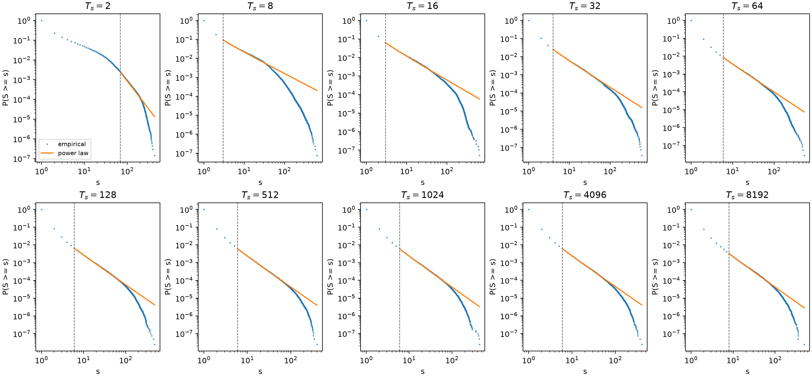

# Distribuições de avalanches em todos os valores de $T_s$

## Análise discreta de Clauset, inferência por fibrilas e modelo de alto $T_s$

**Manuscrito:** ER12738, *Scaling behaviors in simulated collagen fibrils*  
**Spec de revisão:** GitHub issue #1  
**Ticket estatístico:** GitHub issue #5  
**Condições analisadas:** $T_s=2,8,16,32,64,128,512,1024,4096,8192$

## 1. Resultado principal

A reanálise cobre os dez valores de relaxação superficial usando tamanhos
inteiros de avalanche sem binning, máxima verossimilhança discreta e seleção
objetiva do início da cauda. Como as 1.000 realizações de ruptura feitas
sobre uma fibrila compartilham a mesma geometria, a inferência estrutural
reamostra as 50 fibrilas de cada condição como blocos independentes.

Os ajustes de potência pura não fornecem uma descrição robusta do conjunto.
O bootstrap por fibrilas não rejeita essa forma em $T_s=2$, 64, 512 e 4096,
embora o resultado de $T_s=2$ cubra menos de uma década e o de $T_s=64$ seja
limítrofe. Em contraste, o teste iid canônico de Clauset produz zero
excedências em 2.500 réplicas para todas as condições. A compatibilidade da
potência pura é, portanto, sensível à hipótese sobre a unidade independente
e não estabelece uma lei universal ou livre de escala.

As alternativas de potência com corte exponencial simples, lognormal e
exponencial também são rejeitadas pelo teste absoluto por fibrilas em todas as
condições, quando comparadas no suporte selecionado pela potência pura. Uma
vantagem relativa de verossimilhança não supera essa falha de ajuste absoluto.

Uma extensão posterior identifica uma descrição paramétrica mais adequada para
o regime $T_s\geq512$. Nesse subconjunto, as quatro caudas compartilham uma
distribuição discreta com fator de potência e corte exponencial estendido,

$$
p(s\mid s\geq29)\propto
s^{-2.534}\exp[-(s/s_c)^{2.547}],
$$

com $s_c\simeq212$--243. Esse modelo não é rejeitado nem pelo bootstrap de
fibrilas ($p=0.981$) nem pelo diagnóstico paramétrico iid ($p=0.558$). A
conclusão apoiada pelos dados é, assim, uma forma comum de escala finita para
alto $T_s$, e não uma potência pura aplicável aos dez valores.

## 2. Dados e definição do observável

A camada completa `Data_avalanches_all_fibrils` contém 50 geometrias
independentes e 1.000 realizações de ruptura por geometria em cada $T_s$,
totalizando 500 fibrilas, 500.000 realizações e 300.538.797 avalanches locais
pré-terminais. A reconstrução a partir do ZIP recuperou essas contagens e os
2.003 arquivos derivados esperados, sem divergência na partição por condição.

Uma avalanche local é um componente espacialmente conexo removido durante um
único passo de força fixa. Componentes desconectados no mesmo passo são
eventos distintos, os eventos unitários permanecem observações válidas no
corpo da distribuição e o passo terminal é excluído da população primária.
Essa definição espacial não implica um núcleo elástico local de
redistribuição de tensão.

O número de eventos pré-terminais cresce de 6.796.929 em $T_s=2$ para cerca
de 40 milhões nas condições altas. Ao mesmo tempo, a fração de eventos
unitários aumenta de 0.771 para 0.923, de modo que a mudança com $T_s$ envolve
tanto o corpo quanto a cauda da distribuição.

## 3. Protocolo estatístico comum aos dez valores

Para cada $T_s$, a potência discreta

$$
p(s\mid s\geq s_{min})=
\frac{s^{-\alpha}}{\zeta(\alpha,s_{min})}
$$

foi ajustada por máxima verossimilhança. O limite $s_{min}$ foi escolhido pelo
mínimo da distância de Kolmogorov--Smirnov entre todos os candidatos com pelo
menos 1.000 observações na cauda. A incerteza de $\alpha$, a estabilidade de
$s_{min}$ e a qualidade absoluta foram avaliadas reamostrando fibrilas
inteiras. Foram usadas 999 réplicas por condição, exceto em $T_s=64$, cujo
resultado próximo ao limiar foi refinado para 4.999 réplicas.

O teste semiparamétrico iid de Clauset, com reestimação completa de
$s_{min}$ e $\alpha$ em 2.500 réplicas, foi mantido como diagnóstico de
sensibilidade. Ele implementa literalmente a calibração publicada, mas sua
hipótese de eventos independentes não corresponde à hierarquia da simulação.

Potência com corte exponencial simples, lognormal discreta e exponencial
discreta foram ajustadas no mesmo suporte selecionado. Cada alternativa
recebeu um teste absoluto por fibrilas com 199 réplicas. Comparações relativas
usaram contribuições de verossimilhança por fibrila; o teste de Wilks entre a
potência pura e a potência com corte foi mantido apenas como referência
descritiva, pois o modelo nulo está na fronteira do espaço paramétrico.

## 4. Resultados por $T_s$

| $T_s$ | eventos | $s_{min}$ | $\alpha$ (IC 95% por fibrilas) | eventos na cauda | fração da cauda | décadas | $p_{block}$ | $p_{iid}$ |
|---:|---:|---:|---:|---:|---:|---:|---:|---:|
| 2 | 6.796.929 | 69 | 3.822 [3.186, 4.200] | 16.831 | 0.00248 | 0.80 | 0.476 | 0/2500 |
| 8 | 12.890.665 | 3 | 2.108 [2.087, 4.722] | 1.194.887 | 0.09269 | 2.33 | 0.001 | 0/2500 |
| 16 | 18.860.218 | 3 | 2.264 [2.204, 2.550] | 1.179.950 | 0.06256 | 2.33 | 0.002 | 0/2500 |
| 32 | 26.935.855 | 4 | 2.434 [2.387, 2.483] | 671.260 | 0.02492 | 2.17 | 0.047 | 0/2500 |
| 64 | 35.462.519 | 6 | 2.534 [2.484, 3.642] | 296.050 | 0.00835 | 1.95 | 0.1104 | 0/2500 |
| 128 | 39.404.004 | 6 | 2.645 [2.602, 2.677] | 261.887 | 0.00665 | 1.91 | 0.003 | 0/2500 |
| 512 | 39.860.756 | 6 | 2.711 [2.680, 2.751] | 238.867 | 0.00599 | 1.82 | 0.221 | 0/2500 |
| 1024 | 40.302.406 | 6 | 2.716 [2.662, 2.776] | 240.548 | 0.00597 | 1.86 | 0.053 | 0/2500 |
| 4096 | 40.292.638 | 6 | 2.697 [2.651, 2.749] | 243.375 | 0.00604 | 1.83 | 0.348 | 0/2500 |
| 8192 | 39.732.807 | 8 | 2.682 [2.655, 3.882] | 128.586 | 0.00324 | 1.79 | 0.003 | 0/2500 |

*Figura 1 — CCDFs condicionais das caudas selecionadas para os dez valores de
$T_s$. Os ajustes são parâmetros condicionais; a proximidade visual não
substitui os testes absolutos apresentados na tabela.*

O teste por fibrilas rejeita a potência pura em $T_s=8,16,32,128,1024$ e
8192. Para $T_s=2$, a não rejeição ocorre numa cauda com apenas 0,80 década,
o que impede uma interpretação de escala. Em $T_s=64$, a estimativa refinada
$p=0.1104$ tem intervalo de Monte Carlo [0.1017, 0.1192], imediatamente acima
do limiar de 0.10; por isso, ela deve ser descrita como limítrofe. Os casos
$T_s=512$ e 4096 não são rejeitados por blocos, mas continuam rejeitados pelo
diagnóstico iid.

## 5. Distribuições concorrentes

| $T_s$ | corte exponencial | lognormal | exponencial |
|---:|---:|---:|---:|
| 2 | 0.015 | 0.020 | 0.005 |
| 8 | 0.005 | 0.005 | 0.005 |
| 16 | 0.005 | 0.005 | 0.005 |
| 32 | 0.005 | 0.005 | 0.005 |
| 64 | 0.005 | 0.005 | 0.005 |
| 128 | 0.005 | 0.005 | 0.005 |
| 512 | 0.010 | 0.005 | 0.005 |
| 1024 | 0.005 | 0.005 | 0.005 |
| 4096 | 0.005 | 0.005 | 0.005 |
| 8192 | 0.005 | 0.005 | 0.005 |

Os valores da tabela são $p$-valores dos testes absolutos por fibrilas. Como
todos estão abaixo de 0.10, nenhuma dessas três famílias fornece uma descrição
gerativa adequada das dez caudas no suporte herdado da potência pura. Em
particular, a lognormal possui vantagem relativa sobre a potência em alguns
casos, mas essa ordenação entre modelos inadequados não valida a lognormal.

## 6. Forma de escala finita em alto $T_s$

Como os quatro valores $T_s=512,1024,4096,8192$ exibem curvatura semelhante,
foi avaliada separadamente a distribuição

$$
p(s\mid s\geq s_{min})=
\frac{s^{-\alpha}\exp[-(s/s_c)^\beta]}
{\sum_{k=s_{min}}^\infty k^{-\alpha}\exp[-(k/s_c)^\beta]}.
$$

O suporte foi selecionado para esse próprio modelo, reajustando $\alpha$,
$\beta$ e os quatro valores de $s_c$ em cada candidato comum e minimizando o
maior KS entre as condições. O resultado $s_{min}=29$ retém 59.947 eventos e
fornece

$$
\alpha=2.534\;[2.438,2.615],\qquad
\beta=2.547\;[2.128,2.980].
$$

| $T_s$ | eventos $s\geq29$ | $s_c$ (IC 95% por fibrilas) | KS | $p_{block}$ |
|---:|---:|---:|---:|---:|
| 512 | 14.681 | 242.79 [207.60, 269.51] | 0.00728 | 0.610 |
| 1024 | 15.027 | 217.39 [192.98, 239.01] | 0.00657 | 0.700 |
| 4096 | 15.642 | 211.59 [179.67, 240.61] | 0.00726 | 0.643 |
| 8192 | 14.597 | 243.40 [212.73, 270.36] | 0.00687 | 0.711 |

O teste conjunto por fibrilas produz $p=0.981$, enquanto o diagnóstico iid
paramétrico produz $p=0.558$. Os quatro ajustes separados também não são
rejeitados. Assim, o corte estendido resolve a curvatura residual no regime
alto, mas esse resultado não deve ser extrapolado aos seis valores menores sem
uma seleção e validação específicas para eles.

*Figura 2 — CCDFs empíricas e ajuste conjunto no suporte $s\geq29$. O fator
de potência é acompanhado por um corte pronunciado e por uma escala finita
específica de cada condição.*

## 7. Interpretação estatística e física

As estimativas condicionais da potência pura aumentam de aproximadamente
2.11 em $T_s=8$ para valores próximos de 2.7 em alto $T_s$, mas os suportes
selecionados, as frações de cauda e as decisões de ajuste mudam entre as
condições. Consequentemente, essa sequência não constitui uma curva de um
expoente crítico comum nem demonstra um plateau universal.

No regime alto, $\alpha\simeq2.534$ é o parâmetro do fator de potência da
distribuição com corte estendido. Sua proximidade com $5/2$ não identifica,
isoladamente, a classe de compartilhamento de carga ELS, pois o modelo possui
escala característica e a simulação não implementa explicitamente um núcleo
elástico local ou global.

Também não há base para SOC. A fratura é dirigida externamente, irreversível
e sem mecanismo de cura, enquanto as distribuições observadas possuem cortes
finitos. A descrição adequada é estatística de avalanches locais em fratura
desordenada dirigida, limitada ao módulo de Weibull $m=2$ e ao tamanho de
sistema simulado.

## 8. Resposta recomendada aos revisores

### R1-2 — distribuição e método de Clauset

> We reanalyzed the raw, unbinned integer avalanche sizes for all ten values
> of $T_s$, using 50 independent fibril geometries and 1,000 rupture
> realizations per geometry. For each condition, the discrete power-law
> exponent and lower cutoff were estimated by exact maximum likelihood and
> KS minimization. Goodness of fit was evaluated both by resampling fibrils as
> independent blocks and by the original iid Clauset bootstrap. The pure
> power law is rejected for six conditions by the block test and for every
> condition by the iid test. Exponential-cutoff, lognormal, and exponential
> alternatives fitted on the same supports also fail their block absolute-fit
> tests. We therefore do not claim a general pure or scale-free law.
>
> For $T_s\geq512$, we additionally tested a discrete power-law factor with a
> stretched-exponential cutoff and selected the common lower cutoff for that
> model itself. The resulting model has $s_{min}=29$, common
> $\alpha=2.534$ and $\beta=2.547$, and condition-specific
> $s_c\simeq212$--243. It is not rejected by either the fibril-block
> ($p=0.981$) or iid parametric ($p=0.558$) diagnostic. We consequently
> describe only the high-$T_s$ tails as sharing this finite-scale form.

### R1-3 — expoente e compartilhamento de carga

> The condition-wise power-law exponents are reported only as conditional
> fit parameters because model adequacy and selected support vary across
> $T_s$. We do not interpret their apparent high-$T_s$ plateau as a universal
> exponent. Likewise, the prefactor $\alpha\simeq2.534$ of the supported
> finite-cutoff model is not identified with the equal-load-sharing value or
> used to infer a load-sharing universality class. Uncertainty is quantified
> by resampling the 50 fibril geometries as independent blocks, and all
> conclusions remain conditional on Weibull modulus $m=2$.

### R2-3 e R2-4 — observável local e SOC

> A local avalanche is defined operationally as one nearest-neighbor
> connected component removed at a fixed-force step; disconnected components
> at the same force are counted separately. This spatial observable does not
> imply a local elastic redistribution kernel. We have removed the SOC and
> scale-free interpretation because the fracture process is externally
> driven and irreversible and because the supported high-$T_s$ distribution
> contains a pronounced finite cutoff.

## 9. Formulação recomendada para o manuscrito

> Across the ten surface-relaxation conditions, exact discrete power-law fits
> yield condition-dependent lower cutoffs and exponents, but their absolute
> adequacy is not robust to the assumed independent unit. Fibril-block tests
> reject the pure law in six conditions, whereas the original iid Clauset
> test rejects it in all ten. The tested exponential-cutoff, lognormal, and
> exponential alternatives on the power-law-selected supports are likewise
> rejected. Therefore these fits are reported as conditional tail
> descriptors rather than evidence for a universal or scale-free law. For
> $T_s\geq512$, the tails are instead compatible with a common discrete
> finite-scale distribution
> $p(s)\propto s^{-2.534}\exp[-(s/s_c)^{2.547}]$ above the
> model-selected cutoff $s_{min}=29$, with $s_c\simeq212$--243.

## 10. Evidência e reprodutibilidade

- [Resultados consolidados para os dez valores](Issue5_clauset_hierarchical/final_power_law_fits.csv);
- [Ajustes das distribuições concorrentes](Issue5_clauset_hierarchical/model_fits.csv);
- [Testes absolutos das alternativas](Issue5_clauset_hierarchical/model_gof.csv);
- [Comparações relativas por fibrilas](Issue5_clauset_hierarchical/model_comparisons.csv);
- [Diagnóstico iid de Clauset](Issue5_clauset_hierarchical/iid_clauset/iid_clauset_gof.csv);
- [Diagnósticos de representação das caudas](Issue5_clauset_hierarchical/diagnostics/condition_diagnostics.csv);
- [Modelo de corte estendido em alto $T_s$](Issue5_clauset_hierarchical/stretched_cutoff_selected_xmin/README.md);
- [Reprodução independente do corte estendido](../Data_avalanches_all_fibrils/reproduction/stretched_cutoff_selected_xmin/RUN_SUMMARY.md).

O parser `Code/Data_analysis/read_avalanche_runs.py` reconstrói a camada
Parquet e o banco DuckDB a partir dos arquivos brutos. A análise geral é
executada por `run_clauset_hierarchical.py`, o diagnóstico iid por
`run_clauset_iid_database.py` e a extensão de alto $T_s$ por
`run_stretched_cutoff_high_ts.py` e `run_stretched_cutoff_iid.py`.
