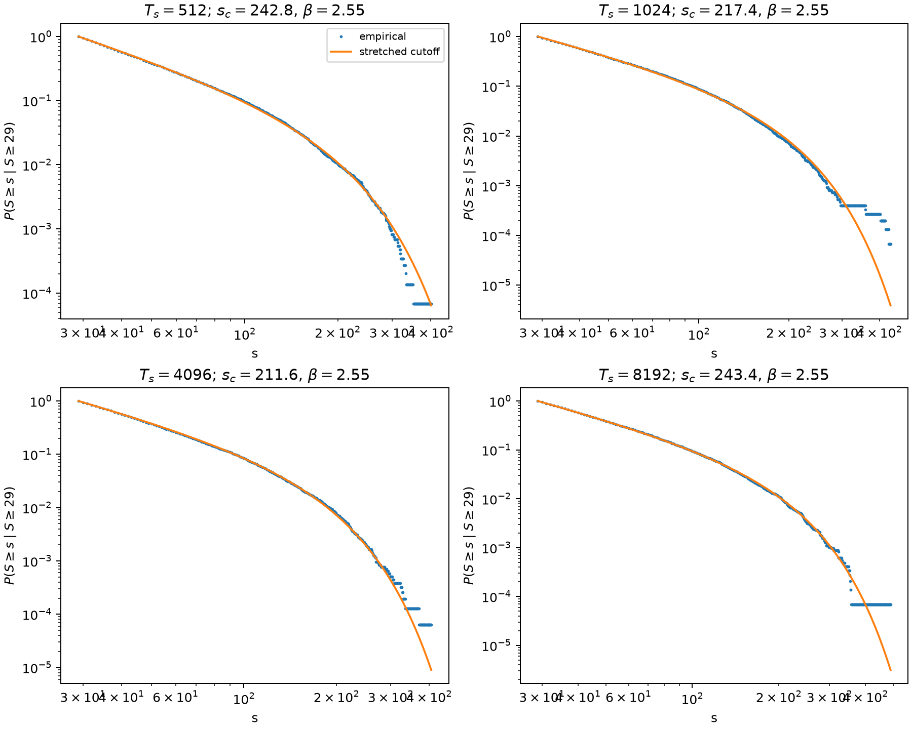
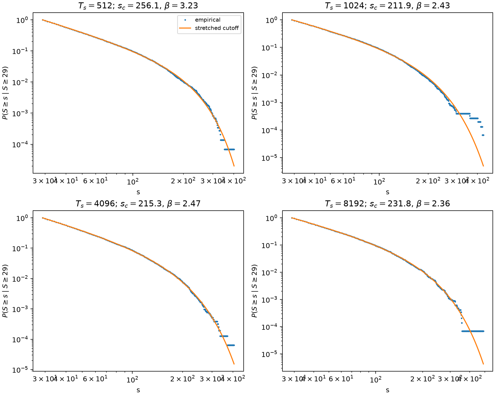

# Distribuição de avalanches em alto $T_s$

## Modelo com corte estendido e seleção de $s_{min}$

**Manuscrito:** ER12738, *Scaling behaviors in simulated collagen fibrils*  
**Spec de revisão:** GitHub issue #1  
**Ticket estatístico:** GitHub issue #5

## 1. Resultado principal

As caudas das avalanches nas quatro condições de maior relaxação superficial
são bem descritas por uma distribuição discreta conjunta com fator de potência
e corte exponencial estendido:

$$
p(s\mid s\geq s_{min})=
\frac{s^{-\alpha}\exp[-(s/s_c)^\beta]}
{\sum_{k=s_{min}}^\infty k^{-\alpha}\exp[-(k/s_c)^\beta]}.
$$

O limite inferior foi estimado para esse próprio modelo, em vez de ser
herdado do ajuste de potência pura. O resultado é

$$
s_{min}=29.
$$

No suporte $s\geq29$, o ajuste conjunto fornece

$$
\alpha=2.534,\qquad \beta=2.547,
$$

com uma escala de corte $s_c$ entre aproximadamente 212 e 243, dependendo de
$T_s$. Condicionado ao suporte selecionado, o modelo não é rejeitado pelo
bootstrap de fibrilas ($p=0.981$) nem pelo diagnóstico paramétrico iid
($p=0.558$).

Esse resultado sustenta uma descrição comum e de escala finita para as caudas
de alto $T_s$. A forma contém um fator de potência bem definido antes do
corte, mas não é uma lei de potência pura: o valor $\beta>2$ representa uma
supressão pronunciada dos eventos maiores.

## 2. Dados e definição de avalanche

A análise utiliza os dados completos de Data_avalanches_all_fibrils:

- 50 geometrias de fibrila independentes por $T_s$;
- 1.000 realizações de ruptura por fibrila;
- eventos de dez condições de relaxação superficial;
- 300.538.797 avalanches locais pré-terminais no total.

Uma avalanche é um componente espacialmente conexo removido durante um único
passo de força fixa. Componentes desconectados no mesmo passo são eventos
distintos. Eventos $s=1$ permanecem válidos no corpo da distribuição, mas
não pertencem à cauda selecionada. Não há agregação temporal, e o passo de
ruptura terminal é excluído da análise primária.

As realizações feitas sobre a mesma fibrila compartilham geometria, e os
eventos de uma mesma realização compartilham o histórico de dano. Por isso, a
fibrila é a unidade independente usada na inferência estrutural.

## 3. Como $s_{min}=29$ foi determinado

O suporte foi escolhido pela mesma ideia central usada por Clauset para
selecionar o início de uma cauda: ajustar o modelo em cada limite candidato e
minimizar a discrepância KS.

Como o modelo é simultâneo para quatro condições, foi necessário definir uma
estatística conjunta. O procedimento foi:

1. considerar todos os valores inteiros comuns de $s_{min}=1$ até 110;
2. exigir pelo menos 1.000 eventos em cada uma das quatro caudas;
3. para cada candidato, reajustar por máxima verossimilhança os seis
   parâmetros do modelo: $\alpha$, $\beta$ e quatro valores de $s_c$;
4. calcular um KS para cada condição;
5. usar como discrepância conjunta o maior dos quatro valores de KS;
6. selecionar o $s_{min}$ que minimiza essa discrepância simultânea.

Formalmente,

$$
\widehat{s}_{min}
=
\underset{s_{min}}{\operatorname{argmin}}\;
\max_{T_s}
D_{KS}(T_s,s_{min}).
$$

Os candidatos mais próximos do mínimo foram:

| $s_{min}$ | maior KS |
|---:|---:|
| 27 | 0.007989 |
| 28 | 0.008071 |
| **29** | **0.007279** |
| 30 | 0.008712 |
| 31 | 0.008886 |

Assim, $s_{min}=29$ não é uma escolha visual nem o máximo dos limites
encontrados para a potência pura. É o limite estimado para a distribuição
efetivamente adotada.

O critério do maior KS foi escolhido porque o modelo só deve ser considerado
comum se descrever adequadamente todas as quatro condições. Uma média dos
quatro KS poderia esconder uma condição com ajuste ruim.

## 4. Relação com a metodologia de Clauset

Clauset, Shalizi e Newman propõem três etapas distintas:

1. estimar os parâmetros e o início da cauda;
2. testar a qualidade absoluta do ajuste;
3. comparar a hipótese com distribuições concorrentes.

Esses princípios foram aplicados da seguinte forma:

- os tamanhos inteiros foram analisados sem binning;
- a distribuição foi normalizada no suporte discreto infinito;
- os parâmetros foram estimados por máxima verossimilhança;
- $s_{min}$ foi escolhido objetivamente por minimização do KS;
- os ajustes foram avaliados por bootstrap com reestimação dos parâmetros;
- um $p$ acima de 0.10 foi interpretado como compatibilidade, não como
  demonstração matemática de que o modelo é único.

Para a potência pura, foi usado o protocolo discreto canônico de Clauset:
normalização por zeta de Hurwitz, escolha de $s_{min}$ e $\alpha$, teste
semiparamétrico e comparação com alternativas. Esse teste mostrou que a
potência pura não é uma descrição robusta das dez condições.

O modelo com corte estendido não é a hipótese canônica de Clauset, mas é
avaliado com a mesma lógica MLE--KS--bootstrap. A adaptação adicional é o
ajuste simultâneo das quatro condições e a inferência por blocos de fibrilas.

Os valores de qualidade de ajuste reportados abaixo são condicionais ao
$s_{min}=29$ selecionado. O bootstrap reajusta os seis parâmetros, mantendo o
suporte. A busca completa de $s_{min}$ está registrada em xmin_scan.csv,
permitindo auditar a seleção e realizar posteriormente uma calibração que
repita também a escolha do suporte em cada réplica.

## 5. Ajuste conjunto

As estimativas e os intervalos de 95% obtidos pelo bootstrap de fibrilas são

$$
\alpha=2.534\;[2.438,2.615],
\qquad
\beta=2.547\;[2.128,2.980].
$$

| $T_s$ | eventos $s\geq29$ | $s_c$ (IC 95% por fibrilas) | KS | $p_{block}$ |
|---:|---:|---:|---:|---:|
| 512 | 14.681 | 242.79 [207.60, 269.51] | 0.00728 | 0.610 |
| 1024 | 15.027 | 217.39 [192.98, 239.01] | 0.00657 | 0.700 |
| 4096 | 15.642 | 211.59 [179.67, 240.61] | 0.00726 | 0.643 |
| 8192 | 14.597 | 243.40 [212.73, 270.36] | 0.00687 | 0.711 |

O teste simultâneo utiliza o maior KS entre as quatro condições e reajusta os
seis parâmetros em cada uma das 999 amostras de fibrilas:

$$
p_{joint,block}=0.981.
$$

*Figura 1 — Ajuste conjunto no suporte $s\geq29$. Os pontos azuis são as
CCDFs empíricas condicionais e as linhas laranjas são o modelo discreto
ajustado. O modelo compartilha $\alpha=2.534$ e $\beta=2.547$ entre as quatro
condições, estimando um $s_c$ específico para cada $T_s$. Os eixos são
logarítmicos.*

O modelo conjunto, portanto, é compatível com a variabilidade observada entre
as 50 geometrias. Além disso, os quatro ajustes separados do corte estendido
também não são rejeitados:

| $T_s$ | $\alpha$ | $\beta$ | $s_c$ | $p_{block}$ |
|---:|---:|---:|---:|---:|
| 512 | 2.591 | 3.234 | 256.13 | 0.645 |
| 1024 | 2.506 | 2.428 | 211.87 | 0.205 |
| 4096 | 2.559 | 2.465 | 215.31 | 0.655 |
| 8192 | 2.484 | 2.359 | 231.81 | 0.810 |

*Figura 2 — Ajustes individuais no suporte comum $s\geq29$. Em cada painel,
$\alpha$, $\beta$ e $s_c$ são estimados independentemente para a condição
correspondente. Os pontos azuis representam as CCDFs empíricas condicionais e
as linhas laranjas representam os ajustes.*

Isso elimina a dificuldade encontrada no suporte anterior $s\geq8$, no qual
os ajustes separados de $T_s=1024$ e 8192 eram rejeitados.

## 6. Sensibilidade iid

Como diagnóstico complementar, foram geradas 999 amostras paramétricas do
modelo conjunto, tratando os 59.947 eventos da cauda como iid. Os seis
parâmetros foram reajustados em cada amostra, com suporte fixo em 29.

O resultado conjunto foi

$$
p_{joint,iid}=0.558.
$$

Os resultados condicionais foram:

| $T_s$ | $p_{iid}$ |
|---:|---:|
| 512 | 0.218 |
| 1024 | 0.304 |
| 4096 | 0.176 |
| 8192 | 0.245 |

Todos permanecem acima do limiar de 0.10. Portanto, o modelo selecionado não
depende exclusivamente da maior tolerância do bootstrap por fibrilas: ele
também é compatível com o diagnóstico iid, muito mais sensível a pequenas
discrepâncias.

## 7. Interpretação estatística e física

O resultado permite afirmar que as caudas de alto $T_s$ compartilham uma
forma estatística comum, composta por:

- decaimento inicial aproximadamente algébrico, controlado por
  $\alpha\simeq2.53$;
- escala característica $s_c\simeq212$--243;
- corte final pronunciado, controlado por $\beta\simeq2.55$.

Essa parametrização é consistente nas quatro condições e nos dois diagnósticos
de qualidade do ajuste. Ela fornece um modelo compacto para comparar como a
morfologia da fibrila se relaciona com a estatística de dano.

O significado de $\alpha$ deve permanecer ligado a essa distribuição com
corte. Ele não é diretamente o expoente $5/2$ de uma lei de potência ELS e
não identifica, isoladamente, uma classe de compartilhamento de carga.

Também não é necessário invocar SOC para interpretar o resultado. A conclusão
estatística é suficientemente forte por si: as avalanches de alto $T_s$
possuem uma cauda comum com prefator de potência e escala máxima característica
na dinâmica de fratura dirigida.

## 8. Resposta recomendada ao revisor

### R1-2 — adequação da distribuição e método de Clauset

> We thank the Referee for requesting a rigorous distributional analysis. We
> reanalyzed the raw, unbinned integer avalanche sizes from 50 independent
> fibril geometries and 1,000 rupture realizations per geometry at each
> $T_s$. A pure discrete power law was evaluated using exact maximum
> likelihood, KS-based lower-cutoff selection, semiparametric goodness-of-fit
> testing, and comparisons with alternative distributions following Clauset,
> Shalizi, and Newman. The pure power law was not supported consistently across
> conditions.
>
> We then evaluated a discrete power-law factor with a
> stretched-exponential cutoff,
> $p(s)\propto s^{-\alpha}\exp[-(s/s_c)^\beta]$, for the four high-$T_s$
> conditions. Importantly, the common lower cutoff was estimated for this
> model itself. We refitted the six-parameter joint model at every common
> integer candidate with at least 1,000 events per condition and selected the
> value minimizing the maximum KS across conditions, obtaining $s_{min}=29$.
> The fitted common parameters are $\alpha=2.534$ and $\beta=2.547$, with
> condition-specific $s_c\simeq212$--243.
>
> Conditional on the selected support, the joint model is compatible with both
> a 999-replicate fibril-block goodness-of-fit test ($p=0.981$) and a
> 999-replicate iid parametric sensitivity test ($p=0.558$). All four
> condition-specific fits are also not rejected. We therefore describe the
> high-$T_s$ tails as a common finite-scale distribution with a power-law
> factor and a pronounced stretched-exponential cutoff, rather than as a pure
> or scale-free power law.

### R1-3 — interpretação do expoente

> We agree that an exponent above the equal-load-sharing value should not be
> interpreted as evidence for increasingly global load sharing. In the revised
> analysis, $\alpha\simeq2.534$ is the prefactor parameter of the fitted
> finite-cutoff distribution on $s\geq29$. We do not identify it as a
> universal critical exponent or use its difference from $5/2$ to infer a
> load-sharing universality class. The enlarged ensemble contains 50
> independent fibril geometries per condition, and uncertainty is quantified
> by resampling those geometries as blocks.

### R2-3 e R2-4 — definição de avalanche e SOC

> We define a local avalanche operationally as one nearest-neighbor connected
> component removed at a fixed force step; disconnected components at the same
> force are counted separately. This spatial damage observable does not imply
> a local elastic stress-redistribution kernel. We also removed the SOC
> interpretation because the fracture process is externally driven,
> irreversible, and has no healing mechanism. The result is described as
> local-avalanche statistics in driven disordered fracture.

## 9. Formulação recomendada para o manuscrito

> For $T_s\geq512$, the preterminal local-avalanche tails are compatible
> with a common discrete finite-scale distribution
> $p(s)\propto s^{-2.534}\exp[-(s/s_c)^{2.547}]$ above the model-selected
> cutoff $s_{min}=29$, with $s_c\simeq212$--243 depending on $T_s$.
> Conditional goodness-of-fit tests do not reject the joint model under either
> fibril-block inference ($p=0.981$) or an iid parametric sensitivity
> analysis ($p=0.558$). The result supports a common power-law factor with a
> pronounced finite cutoff, rather than a pure or scale-free power law.

## 10. Evidência e reprodutibilidade

- [Resumo dos resultados atuais](Issue5_clauset_hierarchical/stretched_cutoff_selected_xmin/README.md);
- [Busca completa de $s_{min}=1,\ldots,110$](Issue5_clauset_hierarchical/stretched_cutoff_selected_xmin/xmin_scan.csv);
- [Ajuste conjunto e bootstrap de fibrilas](Issue5_clauset_hierarchical/stretched_cutoff_selected_xmin/joint_fit.csv);
- [Diagnóstico iid](Issue5_clauset_hierarchical/stretched_cutoff_selected_xmin/iid_fixed_B999/iid_joint_gof.csv);
- [CCDFs condicionais e ajuste conjunto](Issue5_clauset_hierarchical/stretched_cutoff_selected_xmin/joint_ccdf.png);
- [Resumo metodológico de Clauset](Research_Clauset2009_method_summary.md);
- [Fonte metodológica local](../Bibliograph/Clauset2009.md).

O seletor está implementado em
Code/Data_analysis/clauset_hierarchical/stretched_cutoff.py. O programa
run_stretched_cutoff_high_ts.py seleciona $s_{min}$ automaticamente quando
--xmin não é informado e permite reproduzir também análises condicionais em
um suporte fixado.
