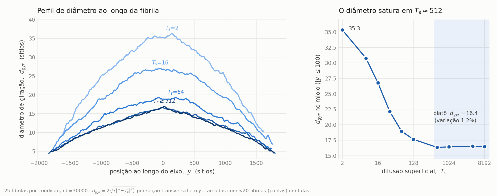
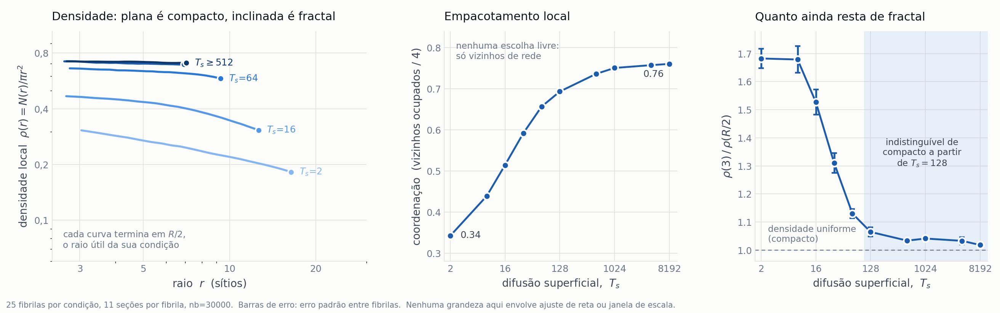
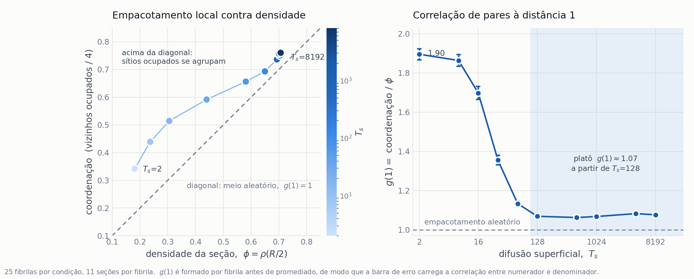
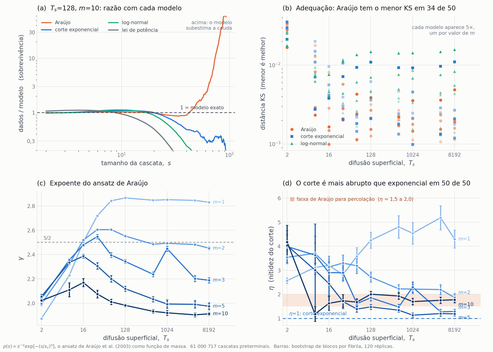
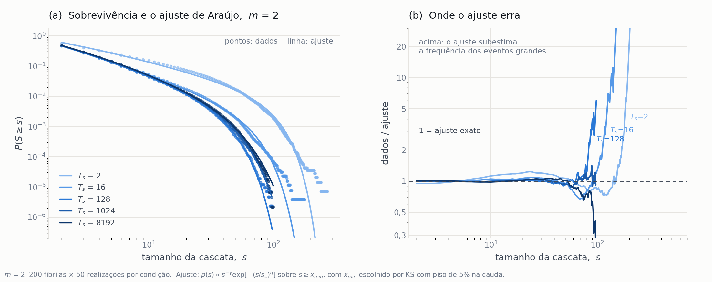

# Relatório — campanha quenched (ER12738)

Resultados do conjunto de dados gerado sob o protocolo de fibra em feixe com desordem congelada, depois da correção do cálculo de $\sigma$ (`a834c53`) e da troca do protocolo de carga (§12 da DAG).

O documento é organizado por **tema**, não por figura. As figuras são numeradas **por seção** — Figura 3.1, 3.2, …, 4.1, 5.1 — de modo que inserir uma figura numa seção não renumera as demais.

| figura | seção | assunto |
|:--|:--|:--|
| 3.1 | 3.1 | perfil de diâmetro ao longo do eixo |
| 3.2 | 3.2 | morfologia da seção central e ordem de incorporação |
| 3.3 | 3.3 | densidade local, coordenação e razão de densidade |
| 3.4 | 3.4 | coordenação contra densidade, e a correlação de pares |
| 4.1 | 4 | $D_f$ e a janela de ajuste que o define |
| 5.1 | 5 | adequação do ansatz de Araújo às cascatas |
| 5.2 | 5.3 | sobrevivência e ajuste, $m$ = 2, ao longo de $T_s$ |

---

## 1. Resumo dos achados

**A difusão superficial compacta a fibrila, e a compactação satura.** O diâmetro cai por um fator 2,15 e o comprimento cresce 9%, de modo que a mesma massa de 30 000 moléculas ocupa um envelope 4,2 vezes menor. A partir de $T_s = 512$ o diâmetro varia 1,2%.

**A seção transversal deixa de ser fractal.** Em $T_s$ baixo é um agregado DLA bidimensional com densidade que decai; em $T_s$ alto é compacta, com densidade uniforme e 94% de preenchimento. A transição é a **perda do regime de escala**, não uma variação contínua de expoente.

**A dimensão fractal publicada depende da janela de ajuste.** As fibrilas oferecem no máximo 0,74 décadas de intervalo utilizável — 0,38 no topo da grade. Sob janela uniforme, $D_f$ satura perto de $T_s = 128$; os pontos publicados só saturam perto de 4096. Fecha a pendência **N7**.

**A distribuição de avalanches não é lei de potência.** Rejeitada em 48 de 50 condições sobre 61 milhões de cascatas. O que a descreve melhor é o ansatz de Araújo — lei de potência com corte mais abrupto que exponencial — mas a leitura que ele faz do expoente em termos de dimensão fractal **não** transfere para cá.

**O empacotamento passa de agrupado a quase aleatório.** A correlação de pares à distância 1 vale 1,90 em $T_s = 2$ — os sítios ocupados têm quase o dobro dos vizinhos que teriam por acaso, que é o que um braço dendrítico é — e cai para 1,07 a partir de $T_s = 128$.

**As medidas não saturam todas no mesmo ponto.** A região é 128–512, e a §6 detalha quem satura onde, incluindo as duas que não saturam dentro da grade.

---

## 2. A campanha

| | |
|:--|:--|
| Fibrilas | 2 000 (10 $T_s$ × 200) |
| Realizações | 500 000 (10 $T_s$ × 200 fibrilas × 5 valores de $m$ × 50) |
| Eventos | 79 719 965, dos quais 19 508 453 selecionados |
| Cascatas preterminais | 61 000 717 |
| Geração | 386 CPU-h em 192 tarefas, concluída em 25/ago 15:42 |
| Fratura | job 576131, 634 CPU-h, 1 h 39 min de parede em 384 núcleos |
| Verificação | 10 000/10 000 por conteúdo; 0 falhas; 0 claims órfãos |
| Dados | `$DLA_PROJECT/campaign/` (1,7 GB de fratura, 21 GB de fibrilas) |

**O que mudou em relação ao conjunto publicado.** Duas coisas, e ambas invalidam os resultados mecânicos anteriores. O cálculo de $\sigma$ tinha um cache com invalidação incompleta, corrigido em `a834c53`. E o protocolo de carga recozido não tem limite quase-estático: a força de ruptura é essencialmente linear em $\log \Delta F$ ao longo de cinco oitavas, e o p99 das avalanches vai de 8 a 89 — a distribuição publicada era propriedade do $\Delta F$ escolhido, não da fibrila. Daí a adoção do protocolo de fibra em feixe com desordem congelada.

**Sementes são novas.** Não há compromisso com as fibrilas publicadas; o requisito é que a geração siga a mesma lógica de etapas. O gerador também teve corrigido um viés azimutal (`irand(0, 2*PI)` truncava para 6, deixando ~4,5% do círculo fora do sorteio).

**A grade de $T_s$ é a publicada** — 2, 8, 16, 32, 64, 128, 512, 1024, 4096, 8192 — mantida porque a Fase A mostrou que nenhuma condição satura por cobertura de difusão superficial, e portanto nenhuma é dispensável (`Reviews/PhaseA_ts_saturation/README.md`).

---

## 3. Como $T_s$ molda a fibrila

Três medidas independentes, nenhuma delas dependente de ajuste de reta, dizem a mesma coisa: a difusão superficial transforma um agregado dendrítico esparso num objeto compacto, e o efeito se esgota.

### 3.1 O perfil ao longo do eixo



***Figura 3.1.*** *Painel esquerdo: diâmetro de giração em função da posição ao longo do eixo, para $T_s$ = 2, 16, 64 e $\geq$ 512. Painel direito: diâmetro na região central em função de $T_s$. 25 fibrilas por condição; camadas sustentadas por menos de 20 fibrilas (as pontas) foram omitidas. As curvas de $T_s$ = 512 a 8192 se sobrepõem e por isso recebem um rótulo único.*

**A fibrila não é um cilindro — é um fuso.** Mais grossa na semente ($y = 0$) e afinando monotonicamente até as pontas, ao longo de ~3 900 sítios de rede. O perfil é simétrico em torno da semente, o que é esperado para agregação por difusão a partir de um germe central: a semente teve todo o tempo de deposição para engrossar, as pontas são recentes.

**A difusão superficial compacta.** Do menor ao maior $T_s$ o diâmetro no miolo cai por um fator de 2,15, enquanto o comprimento cresce apenas 9%. Como o número de moléculas é fixo em 30 000, o volume ocupado cai por um fator de $\approx 4{,}2$ — a mesma massa num envelope quatro vezes menor.

**A queda para.** De $T_s = 512$ a 8192, um fator 16 na difusão superficial, o diâmetro varia 1,2%. As quatro condições do platô são estatisticamente indistinguíveis entre si, separadas por menos de um erro padrão.

Média sobre 25 fibrilas por condição, na região central $|y| \leq 100$. O erro é o erro padrão **entre fibrilas** — a incerteza correta para comparar condições. Todas as grandezas em sítios de rede.

| $T_s$ | $d_{gyr}$ | $d_{max}$ | $d_{max}/d_{gyr}$ | comprimento |
|---:|---:|---:|---:|---:|
| 2 | 35,33 ± 0,35 | 66,29 ± 0,92 | 1,876 | 3 571 |
| 8 | 30,75 ± 0,37 | 57,83 ± 0,84 | 1,881 | 3 668 |
| 16 | 26,78 ± 0,38 | 50,90 ± 0,73 | 1,901 | 3 742 |
| 32 | 22,15 ± 0,23 | 43,21 ± 0,76 | 1,951 | 3 768 |
| 64 | 18,95 ± 0,19 | 37,56 ± 0,69 | 1,982 | 3 839 |
| 128 | 17,63 ± 0,18 | 32,90 ± 0,85 | 1,866 | 3 849 |
| **512** | **16,34 ± 0,08** | **28,02 ± 0,29** | **1,714** | 3 922 |
| **1024** | **16,42 ± 0,09** | **28,01 ± 0,21** | **1,706** | 3 892 |
| **4096** | **16,54 ± 0,18** | **29,36 ± 0,72** | **1,774** | 3 864 |
| **8192** | **16,46 ± 0,05** | **28,59 ± 0,22** | **1,737** | 3 894 |

O comprimento é a extensão total em $y$, incluindo as pontas omitidas do gráfico.

**A razão $d_{max}/d_{gyr}$ não é monotônica.** Ela é um índice de irregularidade da seção: quanto maior, mais a envolvente é ditada por protuberâncias isoladas em vez do corpo da seção. Sobe até 1,98 em $T_s = 64$ e **cai** para $\approx 1{,}72$ no platô. A superfície fica relativamente mais lisa exatamente onde o tamanho para de mudar.

**Algoritmo.** A entrada é a saída *compacta* do gerador, uma linha por molécula (`uid: id x y z`, com $y$ = base da haste). Cada molécula ocupa 18 camadas consecutivas, de $y$ a $y+17$, sempre no mesmo par $(x, z)$; os arquivos estendidos têm a mesma informação com 18× o tamanho — 1,2 GB contra 20 GB — então não há motivo para lê-los. Para cada camada é preciso o centroide e a dispersão das partículas que a ocupam, mas materializar as 540 000 partículas de cada fibrila é desnecessário, porque a variância só depende de somas. O algoritmo faz **18 passagens** — uma por deslocamento dentro da haste — acumulando por camada a contagem e as somas de $x$, $z$, $x^2$ e $z^2$. Daí saem, em forma fechada:

$$
c = (\langle x\rangle,\ \langle z\rangle), \qquad
\langle |r-c|^2 \rangle = \langle x^2\rangle - \langle x\rangle^2
                        + \langle z^2\rangle - \langle z\rangle^2
$$

$$
d_{gyr} = 2\sqrt{\langle |r-c|^2 \rangle}, \qquad
d_{max} = 2\max|r-c|
$$

O $d_{max}$ exige os extremos e não sai de somas, então custa mais 18 passagens de máximo. Toda a acumulação usa indexação dispersa do NumPy (`np.add.at`, `np.maximum.at`), sem laço em Python sobre moléculas.

**Duas definições, de propósito.** O $d_{gyr}$ é um segundo momento: pesa o corpo da seção e é insensível a uma partícula distante. O $d_{max}$ é fixado pela partícula mais distante e é a grandeza que os ajustes massa–raio publicados usam. Para um agregado fractal as duas discordam, e a razão entre elas é informativa por si.

**Agregação entre fibrilas** por coordenada $y$ absoluta. A semente ocupa $y \in [-9, 8]$ em toda fibrila, então $y = 0$ é uma origem comum genuína, não um alinhamento imposto.

**Ressalva.** São 25 fibrilas por condição, não as 200 disponíveis. Suficiente para o gráfico e para o erro padrão da tabela, mas o platô merece o ensemble completo antes de virar afirmação no manuscrito. O custo é trivial: 5 s viram ~40 s.

### 3.2 A transição morfológica


***Figura 3.2.*** *Segmentos centrais ($|y| \leq 25$) projetados no plano $x$–$z$, para $T_s$ = 2, 64, 512 e 8192. Cada sítio ocupado é pintado com o índice da primeira molécula que o ocupou, de modo que a cor lê "quando esta coluna foi construída". **Os quatro painéis compartilham a mesma escala espacial**; a barra no primeiro painel mede 20 sítios de rede. Sementes 100000, 104000, 106000 e 109000.*

Reproduz a Figura 2 **do manuscrito** a partir das fibrilas da campanha nova. A transição descrita no artigo aparece igual: morfologia **esparsa e irregular** em $T_s$ baixo, passando por densa com protuberâncias, até **empacotamento denso e radialmente simétrico** em $T_s$ alto.

| $T_s$ | sítios ocupados | preenchimento |
|---:|---:|---:|
| 2 | 858 | 0,21 |
| 64 | 526 | 0,51 |
| 512 | 436 | 0,82 |
| 8192 | 454 | 0,94 |

O gradiente de cor mostra o mecanismo. Em $T_s = 2$ as moléculas antigas (azul) formam um esqueleto ramificado e as recentes (vermelho) se depositam nas pontas dos braços, sem preencher os vãos — é blindagem difusiva clássica. Em $T_s = 8192$ o núcleo antigo é compacto e as moléculas recentes formam uma **casca externa contínua**: a difusão superficial permite que a molécula desça para os vãos antes de fixar, então o crescimento é camada a camada em vez de dendrítico.

**Diferença deliberada em relação à figura publicada.** Na figura do artigo cada painel parece normalizado ao próprio tamanho, o que faz os quatro aparentarem largura semelhante e **esconde a compactação**. Aqui a escala é comum: $T_s = 2$ preenche o quadro e $T_s = 8192$ ocupa cerca de um terço dele. Isso mantém a figura consistente com a §3.1, que mede a mesma compactação como número; com escala independente por painel, as duas diriam coisas diferentes sobre o mesmo fenômeno.

**Algoritmo.** Molécula entra no painel se a base da haste satisfaz $|y| \leq 25$, e guarda o seu índice de chegada — a ordem em que o gerador a ligou ao agregado, de 0 (semente) a 30 000. Uma coluna $(x, z)$ pode ser ocupada por várias moléculas em alturas diferentes; o sítio recebe o índice da **primeira** a ocupá-lo (na implementação os índices são ordenados de forma decrescente antes da escrita na grade, de modo que o menor é o último a ser gravado e vence). O preenchimento é a razão entre sítios ocupados e a área da caixa envolvente da fatia, $(\Delta x + 1)(\Delta z + 1)$.

**Escolhas que precisam ser declaradas se a figura for para o manuscrito:**

1. **A espessura da fatia não é neutra.** A legenda original diz "segmento central" sem quantificar. Em $|y| \leq 25$ o preenchimento vai de 0,21 a 0,94; em $|y| \leq 400$ vai de 0,52 a 0,90 e os braços dendríticos desaparecem — uma fatia grossa empasta a projeção e destrói justamente o contraste que a figura existe para mostrar.
2. **As sementes são as primeiras de cada condição, não escolhidas.** Convém verificar se são representativas do ensemble antes da publicação; se forem selecionadas, a seleção precisa ser declarada.
3. **Mapa de cores.** Usa-se `turbo` em vez de `jet` — mesma aparência azul→vermelho, sem as bandas falsas que o `jet` introduz.

### 3.3 Compactação sem parâmetro livre



***Figura 3.3.*** *Painel (a): densidade local $\rho(r)=N(r)/\pi r^2$ das seções transversais; cada curva termina em $R/2$, o maior raio ainda dentro do corpo da sua condição. Painel (b): coordenação — fração dos 4 vizinhos de rede ocupados. Painel (c): razão $\rho(3)/\rho(R/2)$, que vale 1 para densidade uniforme. 25 fibrilas por condição, 11 seções por fibrila. Barras de erro: erro padrão entre fibrilas.*

**Nenhuma grandeza desta figura envolve ajuste de reta ou janela de escala.** Essa é a razão de ela existir — ver a §4.

**Painel (a) é o mecanismo.** Um objeto compacto tem densidade uniforme: $\rho(r)$ é uma reta horizontal. Um fractal de dimensão $D$ tem $\rho \sim r^{D-2}$, isto é, densidade que **cai** conforme se olha mais longe, porque há buracos em toda escala. Em $T_s = 2$ a curva desce de 0,31 a 0,18; em $T_s \geq 512$ ela é plana. A transição de fractal para compacto se lê direto, sem ajustar nada.

**Painel (b) é o empacotamento local.** A coordenação não usa centroide, raio nem janela — só conta quantos dos 4 vizinhos de rede estão ocupados. Vai de 0,34 a 0,76: em $T_s$ baixo uma molécula tem em média 1,4 vizinhos, em $T_s$ alto tem 3,0.
- *Por que o platô converge para 0,76 e não 1,0?* A coordenação só atingiria 1,0 (4/4 vizinhos) no limite de raio infinito ($R \to \infty$). Como a seção transversal da fibrila tem tamanho finito ($R \approx 14$ sítios de rede), a razão superfície/volume é considerável: entre $20\%$ e $25\%$ de todas as moléculas residem na borda externa exposta ou na rugosidade superficial (tendo apenas 2 ou 3 vizinhos). Enquanto o miolo interno atinge empacotamento completo (4 vizinhos), a média ponderada com a casca externa resulta no platô de $\approx 0{,}76$.

**Painel (c) mede quanto ainda resta de fractal.** A razão $\rho(3)/\rho(R/2)$ vale 1 se a densidade for uniforme e cresce conforme a estrutura fica rarefeita para fora. Cai de 1,68 para 1,02 e fica **indistinguível de compacto a partir de $T_s = 128$**.

| $T_s$ | $R$ | coordenação | $\rho(3)/\rho(R/2)$ | $D$ implícito |
|---:|---:|---:|---:|---:|
| 2 | 33,1 | 0,342 ± 0,001 | 1,683 ± 0,034 | 1,695 |
| 8 | 29,0 | 0,439 ± 0,001 | 1,679 ± 0,047 | 1,671 |
| 16 | 25,5 | 0,514 ± 0,002 | 1,527 ± 0,045 | 1,707 |
| 32 | 21,6 | 0,591 ± 0,002 | 1,311 ± 0,035 | 1,789 |
| 64 | 18,8 | 0,656 ± 0,001 | 1,130 ± 0,016 | 1,893 |
| 128 | 16,5 | 0,693 ± 0,001 | 1,065 ± 0,016 | 1,938 |
| 512 | 14,0 | 0,736 ± 0,001 | 1,034 ± 0,008 | 1,961 |
| 1024 | 14,0 | 0,750 ± 0,001 | 1,041 ± 0,005 | 1,952 |
| 4096 | 14,7 | 0,757 ± 0,001 | 1,033 ± 0,013 | 1,964 |
| 8192 | 14,3 | 0,760 ± 0,001 | 1,018 ± 0,007 | 1,979 |

A coluna final não é um ajuste. Como $\rho \sim r^{D-2}$, a razão de duas densidades medidas implica

$$ D = 2 + \frac{\ln\left[\rho(3)/\rho(R/2)\right]}{\ln\left(6/R\right)} $$

**E o resultado bate com o ajuste.** O $D$ implícito dá 1,695 em $T_s = 2$ e 1,979 em 8192, contra 1,722 e 1,964 obtidos por regressão sobre a janela fixa. Ou seja: ao trocar $D_f$ por compactação **não se está abandonando a física, e sim medindo-a sem a escolha livre**. É um argumento bem mais forte perante um revisor do que mudar de assunto.

**Algoritmo.** A coordenação monta, para cada seção, o conjunto de sítios $(x,z)$ ocupados e conta quantos dos 4 vizinhos de rede estão no conjunto, dividido por $4N$; uma partícula isolada dá 0, uma no interior de um sólido dá 1, e não há parâmetro algum. A densidade local vem da curva massa–raio $N(r)$ de cada seção, $\rho(r) = N(r)/\pi r^2$, com os perfis interpolados em $r/R$ antes de promediados para que condições de tamanhos diferentes sejam comparáveis. A razão é avaliada entre $r = 3$ — o corte de rede, abaixo do qual se contam pixels e não estrutura — e $r = R/2$, o maior raio cujo círculo ainda está dentro do corpo da seção; acima de $R/2$ o círculo começa a sair do objeto e $\rho$ cai por motivo geométrico trivial, não por fractalidade.

**Ressalvas.**

1. **A razão não é totalmente livre de escolhas.** Ela usa $r=3$ e $r=R/2$. A diferença em relação ao ajuste de $D_f$ é que ambas são principiadas (corte de rede; metade do objeto), aplicadas uniformemente, e o resultado é uma razão entre duas densidades **medidas** — não a inclinação de uma reta ajustada onde não há lei de potência. A coordenação, essa sim, não tem escolha nenhuma.
2. **A coordenação é sensível à rede.** Ela é natural aqui porque o modelo é de rede, mas não tem análogo direto em dados experimentais.

### 3.4 Correlação de pares



***Figura 3.4.*** *Painel esquerdo: coordenação contra a densidade da seção $\phi = \rho(R/2)$, uma condição por ponto, cor pelo $T_s$; a diagonal é o que um meio aleatório daria. Painel direito: $g(1) = $ coordenação$/\phi$ contra $T_s$. 25 fibrilas por condição, 11 seções por fibrila.*

Coordenação e densidade **não são independentes**. Num meio aleatório de densidade $\phi$, um sítio ocupado tem em média $4\phi$ vizinhos ocupados, ou seja **coordenação $= \phi$** — a diagonal do painel esquerdo. A distância até essa diagonal é a função de correlação de pares à distância unitária,

$$ g(1) = \frac{\text{coordenação}}{\phi} $$

que vale 1 por construção para um meio sem correlação espacial.

| $T_s$ | $\phi = \rho(R/2)$ | coordenação | $g(1)$ |
|---:|---:|---:|---:|
| 2 | 0,181 ± 0,003 | 0,342 ± 0,001 | **1,896 ± 0,029** |
| 8 | 0,237 ± 0,004 | 0,439 ± 0,001 | 1,864 ± 0,030 |
| 16 | 0,305 ± 0,006 | 0,514 ± 0,002 | 1,698 ± 0,033 |
| 32 | 0,440 ± 0,008 | 0,591 ± 0,002 | 1,355 ± 0,024 |
| 64 | 0,581 ± 0,008 | 0,656 ± 0,001 | 1,134 ± 0,014 |
| 128 | 0,650 ± 0,006 | 0,693 ± 0,001 | **1,069 ± 0,010** |
| 512 | 0,693 ± 0,002 | 0,736 ± 0,001 | **1,063 ± 0,003** |
| 1024 | 0,703 ± 0,002 | 0,750 ± 0,001 | **1,068 ± 0,004** |
| 4096 | 0,701 ± 0,006 | 0,757 ± 0,001 | **1,083 ± 0,011** |
| 8192 | 0,706 ± 0,002 | 0,760 ± 0,001 | **1,077 ± 0,004** |

**Em $T_s = 2$ os sítios ocupados têm quase o dobro dos vizinhos que teriam por acaso.** É a assinatura quantitativa do braço dendrítico: localmente denso, globalmente esparso. Conforme $T_s$ cresce, $g(1)$ cai para $\approx 1{,}07$ e **satura em $T_s = 128$** — o empacotamento passa a ser quase o de um meio aleatório na mesma densidade.

**Isto resolve uma exceção aparente.** A §3.3 registra que a coordenação continua subindo até o topo da grade, ao contrário das outras medidas estruturais. A figura mostra por quê: o que continua subindo é a **densidade**, não a correlação. Normalizada por ela, a correlação satura em 128, junto com a razão de densidade, o $D_f$ sob janela uniforme e o expoente das cascatas.

**Algoritmo.** $\phi$ é a densidade local já calculada na §3.3, avaliada em $r = R/2$. O $g(1)$ é formado **por fibrila** antes de promediado, de modo que a barra de erro carrega a correlação entre numerador e denominador — se fosse a razão das médias, a incerteza estaria errada.

**Ressalva.** $g(1)$ herda a escolha de $R/2$ como raio de referência. É a mesma escolha declarada na §3.3, aplicada uniformemente a todas as condições, mas não é liberdade nula. A coordenação sozinha continua sendo a única grandeza do relatório sem escolha alguma.

---

## 4. Dimensão fractal: o problema da janela


***Figura 4.1.*** *Material de apoio, mantido como evidência da pendência N7. Painel (a): $D_f$ contra $\log_{10} T_s$ sob duas regras de janela, contra os pontos publicados. Painel (b): inclinação local da curva massa–raio.*

Esta seção é **metodológica**, não um resultado sobre fibrilas: trata do que se pode e do que não se pode extrair de um ajuste de dimensão fractal em objetos deste tamanho.

A dimensão fractal só existe se a inclinação de $\log N$ contra $\log r$ for constante ao longo de um intervalo de $r$. Essa constância **é** a definição. Toda medida tem dois cortes: embaixo a rede ($r \gtrsim 3$), em cima o próprio objeto ($r \lesssim R/2$). O que sobra nas nossas fibrilas:

| $T_s$ | $R$ | intervalo utilizável | décadas |
|---:|---:|:--|---:|
| 2 | 33 | 3 → 17 | 0,74 |
| 64 | 19 | 3 → 9 | 0,50 |
| 8192 | 14 | 3 → 7 | 0,38 |

Ajustar uma reta de lei de potência em um intervalo tão estreito (onde o raio varia apenas por um fator 2,4, em vez de ao menos uma década / fator 10 como manda o padrão da literatura) gera estimativas pouco confiáveis.

A consequência prática é mensurável ao recalcular $D_f$ com critérios objetivos:
- **Nos extremos** ($T_s = 2$ e $8192$), o resultado reproduz com precisão o publicado (1,722 contra 1,708; 1,964 contra 1,965).
- **Na região intermediária** ($T_s = 64$ e $128$), surge uma discrepância grave: enquanto o artigo publicou valores em torno de 1,76 e 1,79, qualquer regra padronizada de ajuste resulta em 1,92 e 1,95. A diferença chega a **0,16 — dezesseis vezes a barra de erro ($\pm 0{,}01$)**, e duas regras de janela uniformes concordam entre si enquanto discordam fortemente da publicada no mesmo ponto.

| $T_s$ | publicado | janela fixa $4\leq r\leq 8$ | janela relativa $0{,}15R\leq r\leq 0{,}5R$ |
|---:|---:|---:|---:|
| 2 | 1,708 | 1,722 ± 0,018 | 1,676 ± 0,014 |
| 32 | 1,739 | 1,834 ± 0,018 | 1,797 ± 0,021 |
| 64 | 1,761 | **1,920 ± 0,011** | **1,913 ± 0,011** |
| 128 | 1,790 | **1,959 ± 0,010** | **1,953 ± 0,011** |
| 512 | 1,901 | 1,968 ± 0,007 | 1,961 ± 0,008 |
| 8192 | 1,965 | 1,964 ± 0,007 | 1,981 ± 0,008 |

Isso desloca o **ponto de saturação**: sob janela uniforme $D_f$ satura perto de $T_s = 128$, contra ~4096 nos pontos publicados. Fecha a pendência **N7** com medição em vez de suspeita.

Os pontos publicados intermediários foram lidos da imagem da Figura 3 **do manuscrito**, com incerteza de transcrição de ~0,005; apenas os extremos (1,708 ± 0,005 e 1,963 ± 0,001) vêm da legenda. A discrepância de 0,16 é grande demais para ser transcrição, mas os valores merecem conferência contra a fonte antes de entrarem na carta-resposta.

**Por que valores intermediários de $D_f$ não sustentam uma transição contínua.** Poder-se-ia supor que, adicionando mais valores de $T_s$ entre 2 e 128, obter-se-ia uma curva suave de $D_f(T_s)$, sugerindo uma variação contínua de dimensão fractal. No entanto, esses valores intermediários são um **artefato de *crossover* geométrico**, e não uma nova família de fractais autossimilares:
1. **Perda da autossimilaridade:** Um fractal genuíno exige que a densidade decaia com a mesma regra em todas as escalas (uma linha reta em $\log N$ vs. $\log r$). Conforme $T_s$ cresce, a difusão preenche as cavidades de dentro para fora: a fibrila passa a ter um **núcleo central compacto** ($D=2$) cercado por uma **borda irregular**. A curva $\log N$ vs. $\log r$ dobra e deixa de ser reta; ajustar uma linha sobre essa curva produz apenas uma média geométrica entre o miolo sólido e a borda rala.
2. **Sensibilidade à janela:** Se a estrutura fosse um fractal autossimilar com dimensão $1{,}83$, qualquer intervalo de medida devolveria $1{,}83$. Mas nos estados intermediários, medições mais próximas do centro devolvem $D \approx 1{,}95$ (quase sólido) e medições externas devolvem valores menores.
3. ***Crossover* entre duas fases bem definidas:** A continuidade observável é a do processo de compactação física (densidade local e preenchimento aumentam continuamente), e não de uma dimensão fractal. Trata-se de uma transição entre dois estados bem definidos: um **agregado DLA puro** ($D_f \approx 1{,}71$) em $T_s$ baixo e um **sólido euclidiano compacto** ($D = 2{,}0$) a partir de $T_s \approx 128$.

**O que fica no lugar da afirmação atual.** Não "$D_f$ cresce de 1,71 a 1,96", que sugere um expoente variando continuamente, e sim: em $T_s$ baixo a seção é um agregado DLA bidimensional com $D_f \approx 1{,}71$ sobre um intervalo de escala real — o valor que a geometria de crescimento prevê, sem ajuste de nada; conforme $T_s$ cresce, **o intervalo de escala encolhe até desaparecer** e a seção passa a ser compacta. A transição é a perda do regime fractal, e é isso que a §3.3 mede.

**O teste de tamanho: medido, e o resultado dispensa o teste.** A versão anterior desta seção propunha gerar fibrilas com $R \approx 100$ e estimava "cerca de 7× mais moléculas". **A estimativa estava errada por uma a três ordens de grandeza**, porque supunha que a fibrila engorda em proporção à massa acrescentada. Ela não engorda: cresce sobretudo em comprimento.

Medindo `nb` de 3 750 a 120 000 em duas condições (job 580370, semente única):

$$ R \sim nb^{0,29}, \qquad t_{\text{geração}} \sim nb^{1,49} $$

| | $T_s = 2$ | $T_s = 8192$ |
|:--|--:|--:|
| $R$ em `nb`=30 000 | 30,3 | 14,4 |
| `nb` para $R = 100$ | **1,6 milhão** (53×) | **28 milhões** (930×) |
| tempo por fibrila | **43 h** | **155 dias** |
| 25 fibrilas | ~1 100 CPU-h | ~93 000 CPU-h |

Para $T_s = 2$ é caro mas viável (três vezes o custo de toda a geração da campanha). Para $T_s$ alto é proibitivo — e a razão é física, não computacional: a difusão superficial **afina** a fibrila, então condições compactas precisam de massa desproporcional para alargar a seção.

**Mas o teste não é necessário**, porque a série de tamanhos já mostra convergência sobre um fator 32 em `nb` e 2,8 em $R$:

| $T_s$ | `nb` | $R$ | décadas | $D_f$ (janela relativa) |
|---:|---:|---:|---:|---:|
| 2 | 3 750 | 17,0 | 0,45 | 1,757 |
| 2 | 15 000 | 25,3 | 0,62 | 1,664 |
| 2 | 30 000 | 30,3 | 0,70 | 1,676 |
| 2 | 120 000 | 47,4 | 0,90 | 1,686 |
| 8192 | 3 750 | 7,9 | 0,12 | 2,113 |
| 8192 | 15 000 | 11,3 | 0,28 | 2,094 |
| 8192 | 30 000 | 14,4 | 0,38 | 2,012 |
| 8192 | 60 000 | 17,4 | 0,46 | 2,025 |

Em $T_s = 2$, $D_f$ flutua em torno de **1,68 sem tendência** enquanto o intervalo de escala dobra — é o valor de DLA bidimensional, já convergido. Em $T_s = 8192$ ele sobe e **estaciona em 2,0**, o limite euclidiano; valores ligeiramente acima de 2 são ruído, já que uma seção plana não pode excedê-lo.

Ou seja: os dois extremos da grade já respondem. Em $T_s$ baixo há fractal com $D_f \approx 1{,}68$; em $T_s$ alto não há fractal, há um sólido. Fibrilas maiores mediriam com mais precisão o que já está decidido. **A releitura da §4 é conclusão, não alternativa.**

*Ressalva: uma semente por ponto, sem barra de erro. A ausência de tendência em $T_s = 2$ é clara ante a dispersão observada (±0,05), mas um ensemble tornaria a afirmação quantitativa.*

---

## 5. Fratura: estatística das cascatas



***Figura 5.1.*** *Painel (a): razão entre a sobrevivência observada e a de cada modelo em $T_s$=128, $m$=10; o valor 1 significa modelo exato. Painel (b): distância KS das três famílias competitivas nas 50 condições, cinco pontos por modelo (um por $m$), com opacidade crescente em $m$. Painéis (c) e (d): expoente e nitidez do corte do ansatz de Araújo, com bootstrap de blocos por fibrila (120 réplicas). 61 000 717 cascatas preterminais.*

### 5.1 As definições adotadas

#### O protocolo de falha

**O que é carregado.** Não a fibrila inteira, e sim o **corpo de prova extraído do miolo** — os sítios com $|x| \leq 8$, $|y| \leq 100$ e $|z| \leq 8$, um prisma de 17 × 201 × 17 sítios de rede em torno da semente. É o análogo direto do *core sample* de Parkinson1997 (200 × 16 × 16), e existe pela mesma razão: a fibrila é um fuso (§3.1), então tracioná-la inteira mediria a ponta mais fina, não o material.

**O elemento que quebra é a molécula, não a partícula.** A haste inteira é removida de uma vez — as suas 18 partículas, ou menos, se a janela de $|y| \leq 100$ cortar uma das pontas. Dois elementos estão em contato quando têm partículas **na mesma camada** $y$ a distância de rede $\leq 1$ em $(x,z)$ — ou seja, os contatos são **laterais**, entre moléculas vizinhas. A fratura é intermolecular e nunca intramolecular, que é a premissa física de Parkinson: a tripla hélice não rompe, o que rompe é a interação entre hélices.

**Só o esqueleto ativo carrega.** Antes de cada avaliação, duas varreduras de conectividade ao longo de $y$ — uma de cada extremidade — marcam os elementos ligados de forma contínua às duas pontas. Quem sobrevive às duas passagens está num caminho de carga; o resto não transmite nada e é retirado. É o mesmo filtro de dupla direção do artigo original.

**A tensão é equipartida por camada.** O equilíbrio impõe carga constante ao longo do eixo, então cada camada $l$ com $N(l)$ partículas ativas atribui $\sigma(l) = F/N(l)$ a cada uma. O elemento $i$ atravessa até 18 camadas, e a tensão que ele vê é a média sobre as que ocupa:

$$ \sigma_i(F) = F\,a_i, \qquad a_i = \left\langle \frac{1}{N(l)} \right\rangle_{l \,\in\, i} $$

**O limiar de quebra combina desordem intrínseca e suporte dos vizinhos.** A força necessária para romper uma molécula depende de sua resistência própria e de quantas moléculas vizinhas a estão apoiando:
- **Resistência intrínseca ($X_i$, congelada):** No início ($t=0$), cada molécula sorteia uma resistência fixa $X_i \in [0,1]$ com distribuição $P(X \leq x) = x^m$ (com média $\langle X \rangle = m/(m+1)$). Essa qualidade individual não muda durante o ensaio mecânico.
- **Suporte local ($K_i(t)$, dinâmico):** $K_i(t)$ é o número de contatos laterais com moléculas ativas naquele instante. Conforme vizinhos quebram, $K_i(t)$ diminui e a molécula enfraquece por perder sustentação.
- **Unidade de força ($\sigma_c = 1$):** Fixa a escala padrão de uma ligação lateral (apenas o produto $K_i \sigma_c X_i$ é observável).

Assim, o limiar de tensão $\sigma^{\rm th}_i(t)$ e a força externa global $F^*_i(t)$ necessária para romper a molécula $i$ são:

$$ \sigma^{\rm th}_i(t) = K_i(t)\,\sigma_c\,X_i, \qquad F^*_i(t) = \frac{K_i(t)\,\sigma_c\,X_i}{a_i(t)} $$

onde $a_i(t)$ é a fatia da carga total que passa por essa molécula. Quando uma molécula quebra, as vizinhas perdem apoio ($K_i$ cai) e recebem mais carga ($a_i$ sobe), o que derruba seus $F^*_i$ e dispara as avalanches em cadeia.

**A carga sobe até o próximo evento, e só até ele.** Não há incremento $\Delta F$, nem varredura, nem critério de parada: $F$ é elevada exatamente ao menor $F^*_i$ do sistema. É esta a diferença que elimina a dependência de protocolo do regime recozido (§2), em que a estatística era propriedade do $\Delta F$ escolhido.

**A cascata a $F$ fixo é determinística.** Com a força parada, remove-se todo elemento com $F^*_i \leq F$; recalculam-se $N(l)$, $K_i$, $a_i$ e o esqueleto ativo; repete-se até que nada mais falhe. Cada rodada retira por **dois canais**: os que passaram do limiar e os que perderam o caminho de carga por consequência. A cascata termina sozinha, sem parâmetro.

**A ruptura é o esvaziamento de uma camada.** Quando alguma camada fica sem nenhuma partícula ativa, o caminho de carga foi cortado e todo o restante sai de uma vez. É a cascata terminal, uma por realização.

**Dois canais de redistribuição, e por isso não é ELS puro.** Remover um elemento aumenta $\sigma$ de todos os que dividem suas camadas (canal **global**, via $a_i$) e derruba o limiar apenas dos seus vizinhos laterais (canal **local**, via $K_i$). O modelo fica entre a partilha igualitária e a partilha local, o que importa para a leitura dos expoentes (§5.4).

**Validação.** O mesmo motor de carga extremal, alimentado com um feixe de partilha igualitária e limiares uniformes, reproduz a distribuição de rajadas $D(s) \sim s^{-5/2}$ de Hemmer & Hansen — um dos quatro testes de `test_fiber_bundle_ava.py`, junto da fórmula de $F^*$, da monotonicidade da ruptura e da aderência de $X$ à Eq. (4).

#### A cascata como observável

**A cascata é o observável primário**: tudo que é removido numa mesma elevação quase-estática de carga, até o sistema reestabilizar, incluindo as hastes que perdem o caminho de carga por consequência. É `total_deleted_rods` no esquema legado.

Ela é **livre de parâmetro** — determinada pelo modelo, não por escolha do operador, ao contrário do protocolo recozido, em que a avalanche era definida por $\Delta F$ e a estatística era propriedade do $\Delta F$ e não da fibrila (§2). É a **unidade causal**: partes espacialmente separadas de uma mesma cascata foram causalmente ligadas, e particioná-las por geometria descarta esse vínculo. E é o que **"avalanche" significa na literatura de fiber bundle**.

A decomposição em aglomerados conexos permanece nos dados como diagnóstico de localização do dano — 12% a 25% das cascatas se partem em mais de um aglomerado — mas não é o estimando primário. **A cascata terminal é excluída**: é a ruptura catastrófica final, uma por realização, com tamanho de centenas contra a média de ~11 das preterminais.

### 5.2 A lei de potência pura é rejeitada

Pelo procedimento de `Bibliography/Clauset2009.md` (Box 1), com 2500 réplicas semiparamétricas e o limiar $p > 0{,}1$:

| | de 50 condições |
|:--|--:|
| Lei de potência pura **rejeitada** | **48** |
| Plausível | 2 (no fio: $p$ = 0,106 e 0,123) |

Em 47 das 48, $p = 0{,}000$: **nenhuma** das 2500 amostras sintéticas alcançou o KS observado. Comparada às quatro alternativas da Tabela 1 de Clauset pela razão normalizada de Vuong, a lei pura perde para log-normal e esticada em 49 de 50, e só vence a exponencial simples.

### 5.3 O ansatz de Araújo é o melhor dos quatro

Araújo, Moreira, Costa Filho e Andrade (Phys. Rev. E **67**, 027102) descrevem a massa do esqueleto de percolação por

$$ F(M) \sim M^{-\alpha} \exp\left[-\left(\frac{M}{M_0}\right)^{\eta}\right] $$

uma lei de potência cujo corte tem **nitidez livre** em vez de fixada em exponencial. Escrito como função de massa, $p(s) \propto s^{-\gamma}\exp[-(s/s_c)^{\eta}]$. Esta família **contém** o corte exponencial em $\eta = 1$, então o parâmetro extra é testável por razão de verossimilhança com um grau de liberdade.

**O corte é mais abrupto que exponencial em 50 de 50 condições.** Mediana $\eta$ = 2,30, faixa 1,13 a 5,19; em 46 das 50, $\eta - 2\,\mathrm{SE} > 1$. Contra $\eta = 1$, $p < 0{,}001$ em 49 das 50.

| menor KS | condições |
|:--|--:|
| **Araújo** | **34** |
| corte exponencial | 9 |
| log-normal | 7 |
| esticada pura | 0 |

Isto **desfaz a degenerescência** que uma análise anterior encontrara. Log-normal, esticada e corte exponencial pareciam equivalentes porque nenhuma delas tem a forma certa de corte; com $\eta$ livre, a diferença aparece. Em $T_s$=128, $m$=10 o KS cai de 0,0109 (exponencial) e 0,0148 (log-normal) para **0,0039**.

**Onde o ansatz falha.** O painel (a) da Figura 5.1 mostra o limite. Até $s \approx 30$ a razão dados/modelo é 1 para Araújo — descrição exata. Além disso ela **sobe até 30**: o modelo **subestima os maiores eventos**. O corte exponencial erra na direção oposta, superestimando-os por um fator 3. Nenhuma das famílias acerta a cauda extrema; Araújo vence porque acerta o corpo e a região de corte, que é onde está a massa de probabilidade e o que o KS mede. **Não se trata de um modelo exato, e sim do melhor entre os disponíveis.**



***Figura 5.2.*** *Painel (a): sobrevivência do tamanho de cascata para $m = 2$ em cinco valores de $T_s$; pontos são os dados, linhas o ajuste de Araújo sobre $s \geq x_{min}$. Painel (b): razão entre os dois. 200 fibrilas × 50 realizações por condição.*

A Figura 5.2 mostra o ajuste condição a condição, com $m$ fixo. Três leituras:

**As distribuições colapsam acima de $T_s = 16$.** As curvas de $T_s$ = 16, 128, 1024 e 8192 quase coincidem, enquanto a de $T_s = 2$ se destaca com cauda visivelmente mais longa. Os parâmetros confirmam: $s_c$ cai de 124,8 ($T_s$=2) para 84,6 ($T_s$=16) e depois estabiliza em ~51 de 128 a 8192, e $\gamma$ vai de 1,995 a ~2,45–2,55 e para. A mudança na estatística de fratura acontece quase toda entre $T_s = 2$ e 16.

**O ajuste é exato no corpo.** No painel (b) a razão fica em 1 por quase duas décadas em $s$, com desvios abaixo de 20% até $s \approx 50$ — que é onde reside praticamente toda a massa de probabilidade.

**A direção do erro se inverte com $T_s$.** Na cauda extrema, o ajuste **subestima** a frequência dos eventos grandes em $T_s$ baixo (razão sobe acima de 20 para $T_s$ = 2, 16 e 128) e **superestima** em $T_s$ alto (razão cai a ~0,3 em $T_s$ = 1024 e 8192). Não é um viés sistemático de uma direção só: o valor de $\eta$ que melhor descreve o corpo produz um corte alto demais num extremo da grade e baixo demais no outro. É outra forma de ver que $\eta$ não é universal (§5.4).

### 5.4 Parâmetros medidos

Expoente $\gamma$:

| $T_s$ | $m$=1 | $m$=2 | $m$=3 | $m$=5 | $m$=10 |
|---:|---:|---:|---:|---:|---:|
| 2 | 1.874 ± 0.008 | 1.995 ± 0.013 | 2.037 ± 0.018 | 2.055 ± 0.019 | 2.022 ± 0.021 |
| 8 | 2.229 ± 0.007 | 2.322 ± 0.011 | 2.356 ± 0.013 | 2.335 ± 0.018 | 2.110 ± 0.058 |
| 16 | 2.503 ± 0.008 | 2.519 ± 0.010 | 2.479 ± 0.013 | 2.387 ± 0.016 | 2.169 ± 0.034 |
| 32 | 2.719 ± 0.008 | 2.605 ± 0.009 | 2.547 ± 0.019 | 2.306 ± 0.028 | 2.075 ± 0.032 |
| 64 | 2.842 ± 0.006 | 2.605 ± 0.009 | 2.396 ± 0.021 | 2.201 ± 0.028 | 2.011 ± 0.023 |
| 128 | 2.865 ± 0.007 | 2.552 ± 0.008 | 2.343 ± 0.015 | 2.119 ± 0.021 | 1.982 ± 0.012 |
| 512 | 2.846 ± 0.009 | 2.485 ± 0.011 | 2.238 ± 0.020 | 2.033 ± 0.022 | 1.933 ± 0.015 |
| 1024 | 2.851 ± 0.005 | 2.493 ± 0.009 | 2.449 ± 0.021 | 1.993 ± 0.035 | 1.921 ± 0.021 |
| 4096 | 2.845 ± 0.006 | 2.482 ± 0.012 | 2.202 ± 0.025 | 1.990 ± 0.031 | 1.904 ± 0.017 |
| 8192 | 2.830 ± 0.005 | 2.452 ± 0.013 | 2.188 ± 0.022 | 1.975 ± 0.028 | 1.912 ± 0.013 |

Nitidez do corte $\eta$ ($\eta = 1$ seria corte exponencial):

| $T_s$ | $m$=1 | $m$=2 | $m$=3 | $m$=5 | $m$=10 |
|---:|---:|---:|---:|---:|---:|
| 2 | 2.57 ± 0.11 | 3.54 ± 0.27 | 3.99 ± 0.66 | 4.03 ± 0.46 | 4.18 ± 0.69 |
| 8 | 3.12 ± 0.18 | 3.71 ± 0.43 | 3.63 ± 0.79 | 3.01 ± 1.92 | 1.18 ± 0.31 |
| 16 | 3.20 ± 0.24 | 3.14 ± 0.46 | 2.90 ± 0.45 | 2.44 ± 0.49 | 1.63 ± 0.29 |
| 32 | 2.81 ± 0.29 | 3.30 ± 0.34 | 2.90 ± 0.33 | 1.71 ± 0.29 | 1.73 ± 0.26 |
| 64 | 3.58 ± 0.36 | 3.19 ± 0.32 | 1.62 ± 0.15 | 1.39 ± 0.13 | 1.68 ± 0.15 |
| 128 | 4.25 ± 0.33 | 2.72 ± 0.21 | 1.86 ± 0.13 | 1.48 ± 0.10 | 2.01 ± 0.12 |
| 512 | 4.81 ± 0.47 | 2.23 ± 0.18 | 1.47 ± 0.12 | 1.34 ± 0.08 | 1.93 ± 0.14 |
| 1024 | 4.54 ± 0.45 | 2.22 ± 0.18 | 2.30 ± 0.22 | 1.13 ± 0.10 | 1.70 ± 0.14 |
| 4096 | 5.19 ± 0.50 | 2.20 ± 0.21 | 1.27 ± 0.11 | 1.20 ± 0.10 | 1.75 ± 0.13 |
| 8192 | 4.30 ± 0.37 | 1.87 ± 0.16 | 1.29 ± 0.09 | 1.19 ± 0.09 | 1.77 ± 0.13 |

Escala de corte $s_c$:

| $T_s$ | $m$=1 | $m$=2 | $m$=3 | $m$=5 | $m$=10 |
|---:|---:|---:|---:|---:|---:|
| 2 | 135.8 ± 4.3 | 124.8 ± 5.7 | 118.1 ± 6.1 | 116.2 ± 7.3 | 105.0 ± 7.6 |
| 8 | 128.0 ± 4.3 | 108.0 ± 6.7 | 103.7 ± 7.8 | 91.7 ± 10.2 | 52.6 ± 12.3 |
| 16 | 111.5 ± 5.6 | 84.6 ± 5.2 | 75.4 ± 5.5 | 62.3 ± 5.6 | 44.2 ± 4.7 |
| 32 | 82.6 ± 4.7 | 61.6 ± 3.3 | 56.5 ± 3.1 | 38.0 ± 3.1 | 30.0 ± 2.2 |
| 64 | 65.3 ± 1.9 | 53.5 ± 1.6 | 38.9 ± 2.3 | 29.4 ± 2.1 | 27.9 ± 1.3 |
| 128 | 67.1 ± 1.6 | 51.6 ± 1.5 | 38.3 ± 1.7 | 28.4 ± 1.6 | 31.1 ± 0.9 |
| 512 | 70.0 ± 1.7 | 49.4 ± 1.5 | 34.6 ± 2.2 | 26.9 ± 1.8 | 32.6 ± 1.1 |
| 1024 | 73.4 ± 2.0 | 52.4 ± 1.8 | 49.9 ± 2.1 | 23.9 ± 2.6 | 31.4 ± 1.5 |
| 4096 | 73.9 ± 1.7 | 52.7 ± 2.3 | 33.7 ± 2.9 | 25.9 ± 2.4 | 32.5 ± 1.3 |
| 8192 | 72.8 ± 1.9 | 51.2 ± 2.3 | 32.8 ± 2.4 | 25.1 ± 2.1 | 33.5 ± 1.1 |

**$\gamma$ decresce com $m$** em $T_s$ alto, de 2,83 ($m$=1) a 1,91 ($m$=10): desordem mais estreita dá cauda mais pesada, o que é o esperado, pois limiares próximos rompem juntos.

**O 5/2 de campo médio cai entre $m$=1 e $m$=2.** Isso **não** autoriza dizer que se encontrou campo médio: $m$ é parâmetro livre da desordem, e escolher o $m$ que cruza 5/2 seria ajuste a posteriori. Além disso o modelo não é ELS puro — o limiar $F^*_i = K_i \sigma_c X_i / a_i$ tem canal global (ocupação de camada, via $a_i$) **e** canal local (vizinhos ativos, via $K_i$).

**$\eta$ não é universal.** Varia por um fator 4,6 na grade e depende sistematicamente de $m$ e $T_s$: cresce com $T_s$ em $m$=1, decresce em $m$=5. Araújo tem dois valores fixos, um por grau de correlação. Apenas 11 das nossas 50 condições caem na faixa 1,5–2,0 dele. Um $\eta$ que varia assim é parâmetro de ajuste, não assinatura de classe de universalidade.

### 5.5 O que NÃO transfere: a leitura do expoente

Araújo liga $\alpha$ à dimensão fractal do esqueleto por $\alpha = d/d_B - 1$, o que dá o expoente da função de massa $\tau = d/d_B$, e para eles fecha: $\tau = 1{,}26$ implica $d_B = 1{,}59$, contra a estimativa independente de 1,64.

Para nós **não fecha**:

| | Araújo | esta campanha |
|:--|--:|--:|
| expoente da função de massa | 1,26 | 1,87 a 2,87 |
| $d_B$ implícito ($d=2$) | **1,59** ✓ | **0,70 a 1,07** ✗ |
| condições com $d_B < 1$ | — | **40 de 50** |

Um $d_B$ menor que 1 é impossível para um aglomerado conexo, e incompatível com o $D_f$ estrutural da §3.3 (1,7 a 2,0). A razão é física: o $M_B$ de Araújo é um **objeto geométrico estático** — o esqueleto de percolação — e a relação vem da estatística de *blobs*; a nossa cascata é um **evento dinâmico** num processo de carga.

**A forma funcional transfere; a interpretação do expoente não.** Isso importa para N12: seria tentador usar Araújo para ligar o expoente de avalanche a $D_f$ e responder R1-5 — os números não permitem.

### 5.6 Algoritmo

**Redução.** Cada arquivo vira uma matriz esparsa com uma linha por realização e uma coluna por tamanho de cascata, mais o índice da fibrila de cada linha — que é o que o bootstrap reamostra. Verificado contra o parser: 61 000 717 preterminais + 500 000 terminais + 500 000 linhas de abertura $f=0$ = 62 000 717 passos de força.

**Seleção de $x_{\min}$.** Minimização da distância KS discreta, **com piso de 5% dos eventos na cauda**. Sem o piso, a minimização cai numa cauda distante em 4 de 50 condições (todas $m$=10), devolvendo $x_{\min} \approx 30$ e $\gamma \approx 5$ sobre 0,15% dos eventos, com condições vizinhas discordando por um fator 2,3. O piso é uniforme e as colunas sem piso ficam no CSV. A instabilidade é sintoma do mesmo fato que o teste de aderência estabelece: não há cauda de lei de potência estável a ser encontrada.

**Estimativa.** MLE discreto exato via zeta de Hurwitz, não a aproximação contínua: Clauset avisa que a aproximação só é boa para $x_{\min} \gtrsim 6$, e os nossos são quase todos 2. Para o ansatz de Araújo a normalização é uma soma explícita sobre o suporte inteiro, truncada onde o corte já matou a massa, e a otimização parte de três pontos distintos.

**Aderência.** Bootstrap semiparamétrico com **2500 réplicas**, seguindo $n \geq \frac{1}{4}\epsilon^{-2}$ para $\epsilon = 0{,}01$; cada réplica sintética resseleciona o próprio $x_{\min}$, como o §4 de Clauset exige.

**Comparação de modelos.** Para as três alternativas não aninhadas, a razão normalizada da equação (C.6). Para o corte exponencial e para o ansatz de Araújo, que são aninhados, razão de verossimilhança — bootstrap paramétrico no primeiro caso, $\chi^2$ com um grau de liberdade no segundo.

**Incerteza.** Bootstrap de blocos, **bloco = fibrila**: realizações da mesma fibrila compartilham topologia e não são independentes.

---

## 6. A região de transição

Quatro grandezas independentes mudam de comportamento na mesma faixa de $T_s$, mas **não no mesmo ponto** — e duas não saturam dentro da grade. Registrar isso é mais informativo do que afirmar uma transição única.

| observável | seção | satura em |
|:--|:--|:--|
| razão de densidade $\rho(3)/\rho(R/2)$ | 3.3 | $T_s = 128$ |
| $D_f$ sob janela uniforme | 4 | $T_s \approx 128$ |
| expoente $\gamma$ das cascatas | 5.4 | $T_s \approx 128$ |
| diâmetro $d_{gyr}$ | 3.1 | $T_s = 512$ |
| correlação de pares $g(1)$ | 3.4 | $T_s = 128$ |
| coordenação bruta | 3.3 | **não satura**: mas o que sobe é a densidade, não a correlação (§3.4) |
| fração de preenchimento | 3.2 | **não satura**: 0,82 em 512, 0,94 em 8192 |

A leitura consistente é que **o regime fractal acaba em $T_s \approx 128$** — é onde a densidade deixa de decair, onde a correlação de pares chega ao valor de empacotamento aleatório, onde $D_f$ para de crescer e onde o expoente de avalanche estabiliza. Quatro grandezas, o mesmo ponto. O **tamanho** do objeto só para de encolher em 512, e o **empacotamento local** continua melhorando devagar até o fim da grade.

Ou seja: perder a fractalidade e terminar de compactar não são o mesmo evento. O primeiro é uma transição de regime de escala; o segundo é um processo contínuo que ainda não terminou em $T_s = 8192$.

Isso é relevante para a revisão porque o manuscrito situa o platô de $D_f$ em $T_s \approx 512$. A Fase A mostrou que a cobertura de difusão superficial **não** satura ali — apenas 9,8% das moléculas cobrem o componente acessível em 512, contra 82,9% em 8192 — de modo que o mecanismo de cobertura não explica o platô, o que enfraquecia a resposta a R1-5 / N12. As medidas desta campanha situam a transição de regime **em 128**, e a de tamanho em 512, ambas sem depender de janela de ajuste.

**Por que relacionar $\gamma$ à compactação e a $m$ — e não a $D_f$.** Seria tentador buscar uma relação funcional direta $\gamma(D_f)$ ou $\gamma(D_f, m)$ para associar a geometria à quebra mecânica. No entanto, essa formulação falha conceitual e matematicamente por três razões:
1. **Separação física de parâmetros:** A geometria da fibrila depende unicamente de $T_s$ durante o crescimento ($D_f = D_f(T_s)$). A fratura depende da geometria **e** da distribuição de Weibull dos limiares moleculares de ruptura ($\gamma = \gamma(T_s, m)$). Como $m$ varia independentemente da geometria, para uma mesma fibrila com $D_f$ fixo existem múltiplos valores de $\gamma$ (ex.: em $T_s=2$, $\gamma$ varia de 1,87 a 2,05 conforme $m$ vai de 1 a 5).
2. **Perda de poder discriminatório de $D_f$ ($T_s \geq 128$):** A partir de $T_s = 128$, a seção atinge o limite euclidiano compacto ($D_f = 2{,}0$) e não varia mais. Uma função $\gamma(D_f, m)$ não pode ser invertida nessa região, pois múltiplos estados estruturais ($T_s = 128, 512, \dots, 8192$) compartilham o mesmo $D_f$.
3. **Mecanismo microscópico de fratura:** A transferência de carga e a dinâmica das avalanches não "enxergam" um expoente de autossimilaridade fractal (que nem existe mais no sólido), mas sim as conexões mecânicas locais (coordenação de vizinhos) e a ocupação da seção (preenchimento).

Portanto, a associação física legítima entre estrutura e mecânica é dupla:
- **No regime geral:** $\gamma$ é governado pela desordem intrínseca $m$ e pelas métricas diretas de densificação (coordenação local e preenchimento), $\gamma = \gamma(\text{coordenação}, m)$.
- **Na transição:** A perda do regime fractal ($D_f \to 2{,}0$) e a estabilização do expoente de avalanche ($\gamma \to \text{const}$ para cada $m$) ocorrem **simultaneamente em $T_s \approx 128$**, estabelecendo uma assinatura comum e robusta entre a física de crescimento e a física de ruptura.

---

## 7. Reprodução

| arquivo | papel | seção |
|:--|:--|:--|
| `Code/Data_analysis/fibril_diameter_profile.py` | perfil de diâmetro por camada, a partir dos compactos | 3.1 |
| `Code/Data_analysis/plot_fibril_diameter.py` | desenha a Figura 3.1 | 3.1 |
| `Code/Data_analysis/test_fibril_diameter_profile.py` | quatro verificações de geometria | 3.1 |
| `Code/Data_analysis/plot_central_sections.py` | recorta a fatia central e desenha a Figura 3.2 | 3.2 |
| `Code/Data_analysis/fibril_compaction.py` | coordenação, perfil de densidade e razão | 3.3 |
| `Code/Data_analysis/plot_fibril_compaction.py` | desenha a Figura 3.3 | 3.3 |
| `Code/Data_analysis/plot_pair_correlation.py` | desenha a Figura 3.4 | 3.4 |
| `Code/Data_analysis/df_fit_windows.py` | $D_f$ sob três regras de janela | 4 |
| `Code/Data_analysis/plot_df_vs_ts.py` | desenha a Figura 4.1 | 4 |
| `Code/Fracture_fibril/fiber_bundle_ava.py` | protocolo de falha: carga extremal, limiares e cascatas | 5.1 |
| `Code/Fracture_fibril/stress_strain_ava.py` | corpo de prova, contatos laterais e filtro de caminho de carga | 5.1 |
| `Code/Fracture_fibril/test_fiber_bundle_ava.py` | quatro verificações do protocolo, incluindo o $s^{-5/2}$ de ELS | 5.1 |
| `Code/Data_analysis/extract_cascades.py` | reduz os 10 000 arquivos a histogramas de cascata | 5 |
| `Code/Data_analysis/run_cascade_statistics.py` | procedimento de Clauset por condição | 5 |
| `Code/Data_analysis/run_araujo_fits.py` | ajusta o ansatz de Araújo e testa $\eta=1$ | 5 |
| `Code/Data_analysis/plot_araujo_adequacy.py` | desenha a Figura 5.1 | 5 |
| `Code/Data_analysis/plot_survival_by_ts.py` | desenha a Figura 5.2 | 5.3 |
| `Code/Data_analysis/avalanche_statistics.py` | núcleo de ajuste; recebeu `fit_generalized_cutoff`, `fit_stretched_exponential` e `vuong_likelihood_ratio` | 5 |
| `Code/Data_analysis/test_generalized_cutoff.py` | cinco verificações do ansatz de Araújo | 5 |
| `Code/Data_analysis/test_stretched_exponential.py` | cinco verificações da esticada e da razão de Vuong | 5 |

```bash
# estrutura (secoes 3 e 4)
python3 Code/Data_analysis/fibril_diameter_profile.py \
    --compact-dir $DLA_PROJECT/campaign/fibrils/compact \
    --out-csv     $DLA_PROJECT/campaign/analysis/diameter/profile.csv --fibrils 25
python3 Code/Data_analysis/plot_fibril_diameter.py
python3 Code/Data_analysis/plot_central_sections.py
python3 Code/Data_analysis/fibril_compaction.py 25
python3 Code/Data_analysis/plot_fibril_compaction.py
python3 Code/Data_analysis/plot_pair_correlation.py
python3 Code/Data_analysis/df_fit_windows.py 25
python3 Code/Data_analysis/plot_df_vs_ts.py

# fratura (secao 5)
python3 Code/Data_analysis/extract_cascades.py \
    --runs-dir $DLA_PROJECT/campaign/avalanches/runs \
    --out      $DLA_PROJECT/campaign/analysis/cascades --workers 48
python3 Code/Data_analysis/run_cascade_statistics.py \
    --cascades $DLA_PROJECT/campaign/analysis/cascades \
    --out      $DLA_PROJECT/campaign/analysis/cascades/cascade_stats_clauset.csv \
    --replicates 400 --gof-replicates 2500 --lr-replicates 500 --workers 48
python3 Code/Data_analysis/run_araujo_fits.py \
    --cascades $DLA_PROJECT/campaign/analysis/cascades \
    --stats    $DLA_PROJECT/campaign/analysis/cascades/cascade_stats_clauset.csv \
    --out      $DLA_PROJECT/campaign/analysis/cascades/araujo_fits.csv --replicates 120
python3 Code/Data_analysis/plot_araujo_adequacy.py
python3 Code/Data_analysis/plot_survival_by_ts.py
```

Custos: diâmetro 5 s, compactação 12 s, janelas de $D_f$ 7 s, extração de cascatas 12 s em 48 núcleos, Clauset 11 min, ajustes de Araújo 4 min.

A tabela completa dos ajustes de Araújo está aqui, em `fig5-1_araujo_ajustes.csv`; a dos testes de Clauset — aderência, razões de Vuong e as colunas sem piso de cauda — fica em `$DLA_PROJECT/campaign/analysis/cascades/cascade_stats_clauset.csv`, junto dos dados. O código das seções 3 a 5 está coberto por 133 testes.

---

## 8. Pendências

**N7 — janela de ajuste de $D_f$: fechada.** A §4 quantifica a dependência e mostra que ela desloca o ponto de saturação de ~128 para ~4096. Falta apenas conferir os pontos publicados intermediários contra a fonte, em vez da leitura da imagem.

**N11 — interpretação dos expoentes: parcialmente atendida.** $\gamma$ existe e é bem determinado dentro do ansatz de Araújo, e o 5/2 de campo médio não é reivindicável. Falta decidir o que se afirma no manuscrito sobre $\eta$, que não é universal.

**N12 — associação entre $D_f$ e a estatística: em aberto, e uma porta se fechou.** A ponte de Araújo entre expoente de avalanche e dimensão do esqueleto não é utilizável aqui (§5.5). A §6 oferece uma associação mais fraca mas defensável: a transição de regime fractal e a estabilização do expoente de avalanche ocorrem ambas em $T_s \approx 128$.

**Ensemble completo.** As §§3.1 e 3.3 usam 25 fibrilas das 200 disponíveis. O custo de refazer com todas é de segundos.

**Teste de tamanho: resolvido, e negativamente.** Medido em §4: $R \sim nb^{0,29}$, de modo que $R = 100$ exigiria 53× a massa em $T_s = 2$ e 930× em $T_s$ alto — inviável neste último. Desnecessário, porém: sobre um fator 32 em `nb`, $D_f$ já converge a 1,68 em $T_s = 2$ e a 2,0 em $T_s = 8192$. Falta apenas repetir com ensemble em vez de semente única.

---

*Novas figuras entram no tema a que pertencem e recebem o próximo número daquela seção — o que renumera, no máximo, as figuras da mesma seção. Se a figura não couber em nenhum tema, abre-se um tema novo.*
